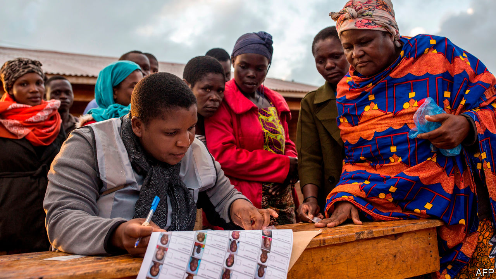

## A tale of two elections

# A rigged vote is overturned in Malawi. Why not in Congo?

> Outsiders bet on Félix Tshisekedi to stabilise Congo. He is failing

> Feb 6th 2020

IN THE PAST 13 months Congo and Malawi have both held rotten elections. In Malawi tally sheets arrived at a central vote-counting station having been altered with Tipp-Ex, a correction fluid. The incumbent president, Peter Mutharika, narrowly “won”. In the Democratic Republic of Congo an independent tally organised by Catholic bishops has suggested that an opposition leader, Martin Fayulu, won about 60% of the vote, three times as many as Félix Tshisekedi. But Mr Tshisekedi was declared the winner and sworn in as president in January 2019.

What happened after these two pilfered polls was very different, however (see [here](https://www.economist.com//middle-east-and-africa/2020/02/08/felix-tshisekedi-has-accomplished-little-in-congo) & [here](https://www.economist.com//middle-east-and-africa/2020/02/06/a-historic-day-for-malawis-democracy)). In Malawi this week the constitutional court overturned the result and ordered a new vote to be held within 150 days. This is only the second time in African history that a court has nullified a dodgy general election. It is a triumph for the rule of law. It shows that local judges can be stricter than foreign election monitors. And it gives Malawians hope that they can choose their own rulers.

No such luck in Congo. The top court there rubber-stamped the brazen ballot burglary a year ago. And the American government, among many others, followed suit. The administration’s Africa experts wanted to denounce Congo’s stolen poll, but were overruled by others closer to President Donald Trump.

The argument for pretending to believe Congo’s result was never openly stated, but goes like this: Congo is strategically important, a huge land mass at the centre of the continent with vast mineral reserves and enough hydroelectric potential to light up southern Africa. China and Russia are vying for influence there, and do not care a plate of fufu for democracy. If America makes a fuss about respecting the will of the Congolese people, Congo’s ruthless rulers will cosy up to Beijing. Vocally supporting Mr Tshisekedi is therefore the best way to preserve both stability and American influence in Congo.

One year later, this argument is not holding up well. American fears of Chinese influence in Congo were always overblown. The country is almost roadless. It needs more Chinese infrastructure investment, not less. And there is little sign that, in backing Mr Tshisekedi, America has made a wise long-term bet.

Granted, the new president has released political prisoners and allowed more open criticism than his despotic predecessor, Joseph Kabila, ever did. He has also toured foreign capitals declaring that Congo is open for business. But he has failed to curb corruption or improve lives. He promised free primary education and hired 40,000 new teachers, but they have not been paid and many have gone on strike. He vowed to improve security, but the fighting between mass-raping militias in eastern Congo is as bad as ever. He has floated the idea that neighbouring Burundi, Rwanda and Uganda might help pacify the east. This is risky: their previous incursions led to plunder and slaughter.

Not only is Mr Tshisekedi illegitimate, he is also weak. The backroom deal that brought him to office left Mr Kabila pulling many of the strings. The two men’s supporters squabble energetically over the spoils of power but barely bother governing. None of this is a recipe for stability, as the bloodshed in the east and protests in Congolese cities attest.

Reforming Congo will take decades, and is a job for the Congolese themselves. However, outsiders can help—with trade, know-how and a willingness to call a coup a coup. If a future American administration wants long-term influence in Congo or anywhere else in Africa, it should be more engaged and less cynical. Those who bless stolen elections share responsibility for what the thieves do with power. Those who press for the rule of law are not always disappointed—as Malawi shows.■

## URL

https://www.economist.com/leaders/2020/02/06/a-rigged-vote-is-overturned-in-malawi-why-not-in-congo
