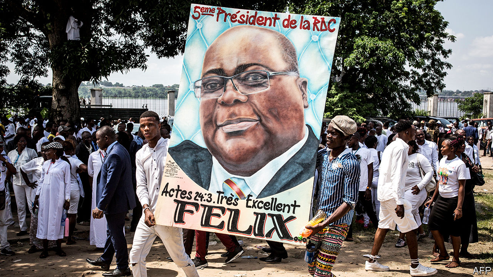

## Not much to celebrate

# Félix Tshisekedi has accomplished little in Congo

> The president is still stuck in a struggle for power with his predecessor

> Feb 8th 2020KINSHASA

THERE WAS supposed to be a big party on January 24th. It was going to cost $6m and celebrate the first anniversary of Félix Tshisekedi’s inauguration as president of the Democratic Republic of Congo. The government presents this as Congo’s first ever peaceful handover of power. But the idea of the party enraged many Congolese, most of whom live on less than $2 a day. Their situation has hardly improved under Mr Tshisekedi, who took over after a rigged election, and whose powerful predecessor, Joseph Kabila, still looms in the background. In the end the party was cancelled.

Mr Tshisekedi (pictured) made three big campaign promises, and is struggling to keep any of them. He vowed to spend $2.6bn, or 40% of last year’s budget, on free primary education for all Congolese. The government hired over 40,000 new teachers in 2019. None, however, was paid. Some have already gone on strike. This year the government should have more to spend thanks to the IMF and World Bank, which have agreed to big loans (contingent on more transparency). But Mr Tshisekedi’s budget of $10.2bn (63% higher than last year’s) is also unrealistic. It assumes that domestic revenue will rise by 56%, mainly as a result of less fraud and tax evasion. Good luck with that.

Stamping out corruption was Mr Tshisekedi’s second big promise. Congo has more than half the world’s cobalt—a metal used in laptops, mobile phones and electric cars. But total recorded exports (which are mostly minerals) represent less than a dollar a day per citizen, and hardly any of this reaches ordinary people. The IMF ended its previous lending programme in 2012, concerned about dirty dealing in the mining industry. Its return appears to be based more on hope than progress. The Public Expenditure Observatory, a watchdog, claims that 21 public construction contracts totalling $2.3bn were handed out illegally.

The third area where Mr Tshisekedi vowed to make progress was in eastern Congo, where dozens of armed groups are wreaking havoc. The army has launched an offensive against one of the most brutal, the Allied Democratic Forces (ADF), which is alleged to have links to Islamic State. The government claims to have captured the group’s headquarters and killed five of its leaders. But attacks by the ADF and others continue. In 2019 over 500 people were killed in the region. On January 28th at least 36 people died in a suspected ADF attack in Beni. They were hacked to death, said Donat Kibwana, the region’s governor. More than 16,000 UN peacekeepers provide uncertain protection. Angry locals call them “the body collectors” and set fire to the UN office in Beni during protests in November. Millions have fled the fighting.

Mr Tshisekedi is beholden to his predecessor, who has not gone away. After 18 years of misruling Congo, Mr Kabila said he would step down after the election in 2018. But he rigged the vote to hold on to power. The effort did not go smoothly: his chosen successor proved so unpopular that he had to settle for Mr Tshisekedi, who came second with just 20% of the vote, according to impartial estimates. The real winner, with 60%, was a businessman called Martin Fayulu, who had promised to hold Congo’s corrupt leaders accountable. Mr Kabila also rigged the parliamentary election, which saw his party win 70% of the seats in the national assembly. It controls the senate and most ministries, too.

Messrs Kabila and Tshisekedi are now locked in a murky power-sharing deal. They bickered for months over who should be in the cabinet. In January Mr Tshisekedi threatened to dissolve the national assembly, which was thwarting him. They have also tussled over Gécamines, the state mining company, which is being investigated over a €200m line of credit it received from an Israeli billionaire, Dan Gertler, who is under American sanctions—and who is Mr Kabila’s friend. Most of these disputes seem to have been resolved to Mr Kabila’s liking. “Everything that Tshisekedi does first needs a green light from Kabila,” says a political analyst in Kinshasa, the capital.

Mr Tshisekedi has been more active abroad. In 2019 he wooed the IMF and World Bank and visited 20 countries. He began 2020 with a whirlwind tour of Europe. Western countries have debated whether to embrace him, given the way he came to power. But Congo is a vast and strategically important country. Many have followed the lead of America, which first called the election “deeply flawed and troubling”, then endorsed the result. In November the administration of Donald Trump agreed to give Congo $600m in aid over three years as part of what it calls a “privileged partnership”. Mr Tshisekedi visited Washington in April and spoke at the UN in New York in September.

Mr Trump has little interest in Africa. His administration has threatened to cut funds for the UN peacekeeping mission in Congo. But his advisers also view the country as a battleground for influence. In 2018 John Bolton, then Mr Trump’s national security adviser, condemned the “predatory practices” of China and Russia in the region. America seems willing to overlook Congo’s democratic shortcomings so long as Mr Tshisekedi stays close.

That is bad news for the people of Congo. Granted, in 2019 Mr Tshisekedi unmuzzled the media, allowed peaceful protests and released some 700 political prisoners. But as criticism of his presidency grows, he is looking less tolerant. A rally to be led by Mr Fayulu was banned. Thousands of people took to the streets of Kinshasa anyway on January 26th. Few believe Mr Tshisekedi when he says that this year is “the time to act”. “Tshisekedi is scared of Kabila,” says Firmin Yangambi, a former political prisoner. “A president who is scared can’t do anything for his country.” ■

## URL

https://www.economist.com/middle-east-and-africa/2020/02/08/felix-tshisekedi-has-accomplished-little-in-congo
