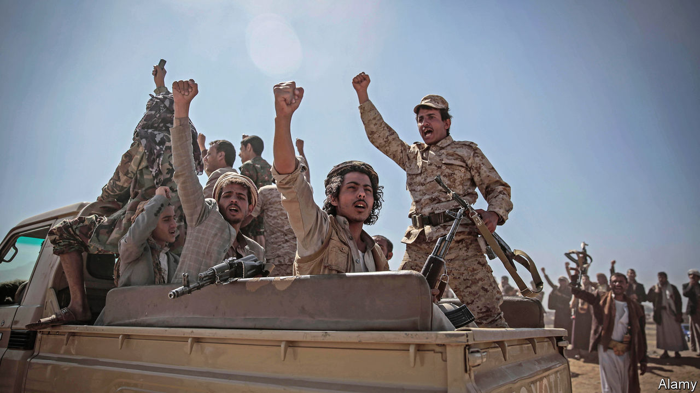
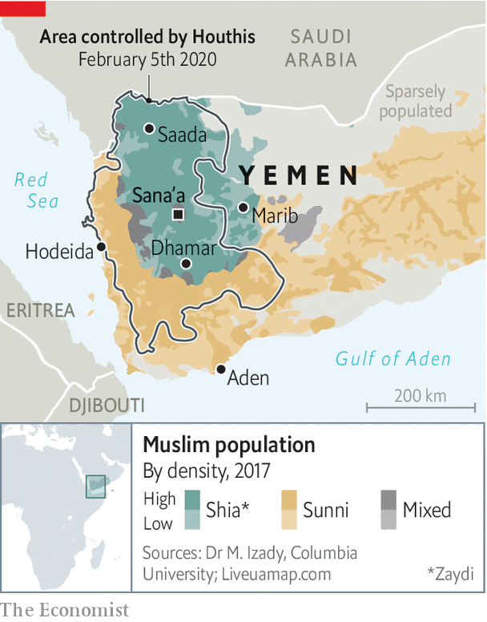

## Mimicking the mullahs

# The Houthi model of government

> It looks a lot like that of Iran

> Feb 6th 2020

THE WAR in Yemen escalated last month when a missile hit a mosque at a military training camp near Marib, killing over 100 soldiers. The government blamed the Houthi rebels, who control much of the country (see map). Fierce fighting broke out in the days that followed, with the Saudi-led coalition that backs the government striking rebel-held territory from the air. The Houthis, in turn, fired rockets at targets inside Saudi Arabia.

Before the flare-up the conflict appeared to be winding down. The government and the rebels are mulling UN proposals to share power and allow the president, Abd Rabbo Mansour Hadi, to return from exile. Saudi Arabia has carried out fewer air strikes since October. It now seems less concerned with restoring the government-in-exile to the capital, Sana’a, than with reaching an agreement that safeguards its borders from Houthi attacks.

The Houthis (who prefer to call themselves Ansar Allah, or the Partisans of God) are “behaving like they’ve already won”, says an international official in Yemen. After five years of fighting more powerful armies, they still control land on which 70% of Yemen’s 30m people live. Now they are consolidating their grip and establishing a state modelled on the theocracy in Iran, which arms them.

The Houthis belong to a small branch of Shiism called Zaydism, which is closer to Sunnism than most other branches. For decades Saudi missionaries crossed into Saada, the Houthis’ home province, converting Zaydis into Sunnis. But Abdel-Malik al-Houthi, the 41-year-old leader of the rebels, has tried to stem Saudi influence and has embellished Zaydism with symbols of Shia resistance. The Houthis’ flag, like that of Hizbullah, the Lebanese armed movement backed by Iran, features a clenched fist, a Kalashnikov and the words “Death to America” and “Death to Israel”.

After taking control of Sana’a in 2014, the Houthis shared power with Ali Abdullah Saleh, Yemen’s ex-dictator. But in 2017 they killed him, purged his loyalists and monopolised the state. They appointed mushrifeen, or supervisors, at every level of government. On Wednesday afternoons civil servants, university lecturers and policemen must attend dourat thiqafiya, or cultural sessions, where they swear allegiance to Mr Houthi. (The least convincing are sent to indoctrination camps.) The rebels have preserved parliament and the army, but created a parallel tier of government which wields ultimate power. The Supreme Political Council runs day-to-day affairs and a new security force acts as the regime’s Praetorian guard. Mr Houthi has adopted the title of wali al-alam, which loosely translates as supreme leader.

Sana’a is changing under Houthi rule. The rebels have closed cafés where men and women once mixed. They have ordered private primary schools to segregate boys and girls (public ones already did). Austere fighters back from the front enforce the new rules. The city increasingly resembles Baghdad or parts of Beirut run by Hizbullah, say visitors. Huge billboards honouring “martyrs” loom over its thoroughfares. Schools have been infused with anti-Western thought. “The trajectory is towards a Zaydi version of the Taliban,” says Abdul-Ghani al-Iryani, a Yemeni analyst.

The Houthis say they are leading a Zaydi revival, but they are also changing the way Zaydism is practised, bringing it more in line with mainstream Shiism. They have opened husseiniyas, halls to mourn the Prophet Muhammad’s grandson, Hussein, and organised large marches for Ashura and Eid al-Ghadir, holidays ostentatiously marked by Shias elsewhere. Unlike in the past, they adorn the capital with green and black flags and splash green paint on cars to mark the Prophet’s birthday.

Many northern Yemenis initially backed the Houthis in their struggle against the government. The group’s anti-Saudi rhetoric and appeals for resistance echoed past calls to combat Sunni empires, such as the Ottomans, that attacked from the north. But as the Houthis’ rule has grown more predatory and paranoid, people appear increasingly unhappy.

Some predict that the Houthis will relax once the war subsides. But even if the Saudis retreat, the fighting may not stop. Yemen’s civil war is now multi-sided, with several groups vying for control of parts of the country. Last month America reportedly launched an (unsuccessful) air strike on a senior member of Iran’s Revolutionary Guard Corps inside Houthi territory. Mr Houthi, for his part, says he is leading a massira quraniya, or Koranic march. His followers say he will next take Islam’s holiest cities—Mecca, Medina and Jerusalem—from the infidels and their lackeys. ■

## URL

https://www.economist.com/middle-east-and-africa/2020/02/06/the-houthi-model-of-government
