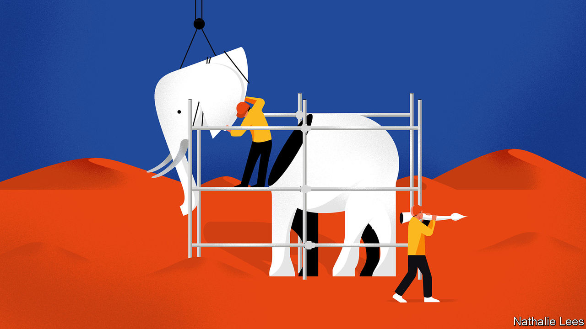
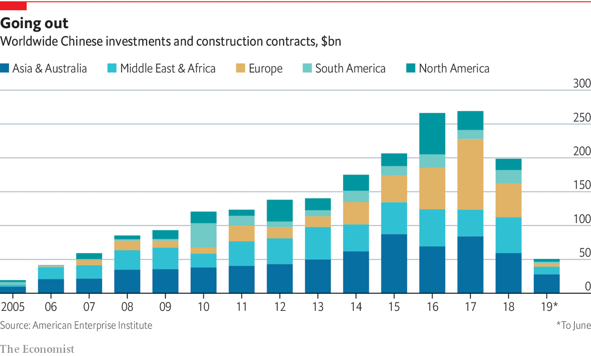

## The belt

# Chinese investment in Eurasia is not always smooth

> Problems with investments under the Belt and Road Initiative show some of China’s weaknesses abroad

> Feb 6th 2020

 IF ANYWHERE ALONG the belt and road should be benefiting from Chinese largesse, it is Pakistan. The country counts as China’s only real ally, as a partner on China’s vulnerable western flank and a balancer against India. China gave Pakistani scientists the know-how and materials to build a nuclear bomb. A joint-venture slogan factory had long churned out declarations of a friendship “higher than the Himalayas”. So, although financing for BRI projects everywhere has slowed over the past year (see chart), Pakistan seems like a place where it should naturally have taken hold.

Yet, in Karachi’s expo centre, staff from 120 Chinese firms are having little success as they stand, brochures and electronic translation devices in hand, touting everything from hoses to pumps to window frames. Alex Hou, from a firm in Zhejiang province that sells PVC film to factories, says Pakistani officials could have done a lot more to promote the event. More broadly, Pakistan is a lesson in how China can fumble the politics of its prime foreign policy.

When the initiative emerged in 2013 it needed a signature project. The answer was the China-Pakistan Economic Corridor (CPEC)—what China’s prime minister, Li Keqiang, called a transformative economic programme that “could wean the populace from fundamentalism”.

The timing seemed fortuitous. In 2013 a civilian government came to power with a yen for big infrastructure projects and a promise to fix Pakistan’s notorious electricity blackouts. The price tag attached to CPEC grew from $46bn to over $60bn. Plans were drawn up for power plants, roads, railways and the development of a port at Gwadar, a fleapit on the Arabian Sea, that would, as the Pakistani planning minister boasted, “benchmark” Singapore.

Yet as China was helping lay the ground for a boom in Pakistan, it failed to lay the political ground in the region. India in particular was touchy. (It still has not joined the BRI.) Meanwhile, all the talk of a new “corridor” brought opposition from hawks in Washington, DC. Since 2017, the administration of President Donald Trump has developed a pointed narrative: CPEC, it says, is driven above all by China’s long-term strategic objective to link its far western regions to the Arabian Sea, so as to have new energy routes and to project power into the western Indian Ocean. The scheme, the Americans say, will leave Pakistan in debt, littered with white elephants, internally divided and under Chinese sway.

The Chinese government also misread Pakistan’s internal politics, as Imran Khan and his Pakistan Tehreek-e-Insaf (PTI) swept to power having campaigned against corruption, including that in CPEC projects. Soon, the inexperienced PTI faced a full-blown balance-of-payments crisis to which the CPEC frenzy had contributed by pumping up domestic demand, pushing up the value of the currency and sucking in imports. In 2018 the bubble burst, the Pakistani rupee slid and the economy slowed sharply. Mr Khan, cap in hand, garnered help from China with conditions attached.

In truth, CPEC was always a corridor only in name, says Andrew Small of the German Marshall Fund of the United States, a Washington think-tank. Pumping oil or gas over high-altitude passes would cost too much and was never seriously considered. And Gwadar port has future strategic value to China regardless of the hinterland behind it. Rather, CPEC can better be understood as an investment package of roads, rail and power plants, some of which were useful but much of which will never come to pass.

Too much is at stake for China to abandon CPEC. But ambitions have been pared right back. Only already agreed projects are likely to proceed, notably an $8bn railway from Karachi to Peshawar that the government can ill afford. The all-weather friendship will carry on, but where CPEC promised to take it to new heights, it has merely defined its limitations.

South-East Asia has long been important to China’s economy—not least because of its 30m “overseas Chinese”, many with capital and management nous. In electronics and other sectors, the ten-country Association of South-East Asian Nations (ASEAN) is enmeshed in China-centred supply chains. Three-fifths of China’s computer imports come from the region, along with a third of its integrated circuits. In the 12 years to 2017, Chinese investment in South-East Asia grew almost 30-fold, to nearly $40bn.

Historically China’s intercourse with South-East Asia has been by sea. That, now, is changing. In recent years China’s industrial centre of gravity has shifted away from the coast towards the south-west, centred around Chongqing and Kunming, capital of Yunnan province. A priority of China’s belt is to improve cross-border transport. It squares with ASEAN’s desire for regional integration. As elsewhere, the soft infrastructure lags the hard, particularly at borders. Hence a new body called the Chongqing Connectivity Initiative, set up with Singapore, to seek a single electronic platform for speeding up customs clearance.

Yet China’s growing presence in South-East Asia comes at a price. Its grand projects, such as the high-speed railway under construction from Kunming to Singapore, and hydroelectric schemes along the Mekong river for exporting power, are of enormous importance to the leadership in Beijing. But an obsession with corridors does not always mesh with the interests of those who live along them. In tiny Laos, many villagers have been displaced by the railway and dams that bring little benefit to them.

And, though they rarely say so in public, most ASEAN states have long viewed their big northern neighbour with wary caution. By contrast, Cambodia, under its long-serving strongman, Hun Sen, opened the door to China. In return for goodies, it has proved a staunch ally, frustrating ASEAN’s efforts to resist China’s assertive maritime claims in the South China Sea.

The impact on Cambodia of Chinese involvement has been immense and baneful. Dam-building threatens the once-abundant fish stocks of the Tonle Sap, Cambodia’s giant, seasonably expanding lake on which 1m fishermen’s livelihoods depend. The haunting ruins of Angkor Wat now have the feel of a Chinese theme park. Chinese land grabs for forestry concessions are threatening biodiversity. Corruption and Chinese development in the capital, Phnom Penh, go hand in hand. Chinese plans will up Cambodia’s carbon emissions by a tenth. And Cambodia’s (dollar-based) economy helps to get cash out of China: of its ten airlines, most are Chinese-owned and several reckoned to be laundering fronts.

How this all plays out in Cambodia can be seen in the seaside town of Sihanoukville. It was once a sleepy, beach-flanked city beloved of holidaying Cambodian families and Western backpackers. Then the Chinese came. In 2015 Hun Sen’s government designated the city as one of Cambodia’s flagship BRI projects. Gambling for foreigners (though not Cambodians) was legalised in Sihanoukville, both online and in new casinos. Firms from China were welcomed. Some 80,000 Chinese—construction workers, investors, casino operators and tourists—arrived.

More buildings are in a state of hasty construction than are completed—last year a high-rise collapsed, killing 28 workers. The city’s drains cannot cope. Maggie Eno, who runs the M’Lop Tapang school for street children, shows how monsoon floods turned the ground floor and playground into seas of raw sewage. Brothels operate out of plyboard shanties on construction sites. Thugs murder rivals in gangland killings, dumping victims’ bodies out of cars in the middle of town. And Sihanoukville’s beaches are piled high with plastic detritus from the Chinese invasion.

Perhaps the worst is over. Last year the Cambodian government, reacting to the chaos at last, banned most gambling. In one of the town’s casinos recently, a Chinese construction foreman said he was having one last fling before heading home. The bubble has burst. But it will be many years before the city recovers. ■