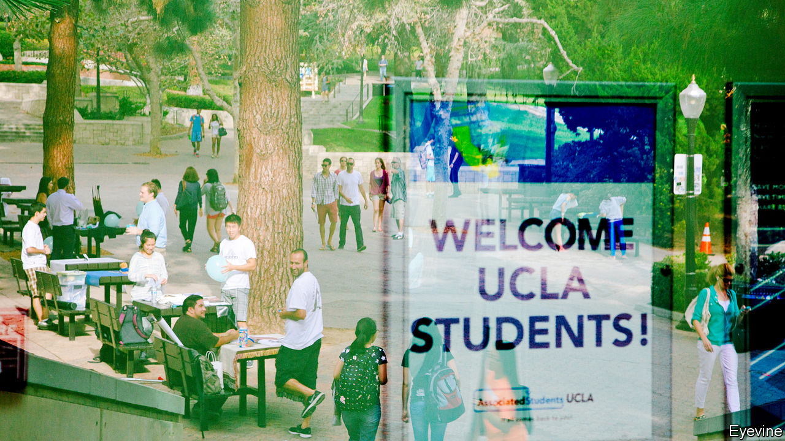

## What’s SAT

# Are test scores the backbone of meritocracy or the nexus of privilege?

> University of California’s review of its admissions procedures smiles on SATs

> Feb 8th 2020BERKELEY

LIKE ANY hotbed of scholarly activity, the University of California (UC) is no stranger to rows. Recently a debate over the use of SATs and ACTs, tests used in college admissions, has spilled out from campus and into the courtroom. In December a lawsuit denouncing UC’s use of the tests was filed in the Alameda County court. On February 3rd a commission reviewing admissions procedures recommended that UC should resist calls to abandon tests. More than 1,000 colleges across America have made submitting test scores optional for many students, though hardly any are completely “test blind”. UC is by far the largest institution to consider abandoning them. UC’s size (it has about 220,000 undergraduates) and prestige means others will watch what it does carefully.

First administered in 1926, SATs have faced criticism for favouring the wealthy since the 1940s—an irony, since they were originally adopted by Harvard to expand its intake beyond the boarding schools of the north-east. While the College Board, which owns the SATs, has worked hard to eliminate egregious advantages for children from wealthy families—gone are the questions about oarsmen and regattas—there has been a persistent correlation between test scores and both socioeconomic status and race. The College Board acknowledges these correlations, but argues that they reflect “learning gaps that result from educational and societal inequities”, not bias in the test itself. All measures of college preparedness are affected by societal inequity, and it is unsurprising, if unfortunate, that students from poor backgrounds perform worse. Using test scores, the College Board argues, helps colleges to select those students most likely to thrive.

Academics have reached no consensus on how well the tests predict student success at university. Most agree on two things: that high-school grade point average (HSGPA) is the best predictor of college success and that the tests, when combined with grade averages, make predictions more accurate. How much tests add is disputed. The College Board claims that the additional predictive power offered by the SATs is significant. Many disagree.

Even if the question of predictive power were resolved, another question arises about how good the tests would have to be at predicting college outcomes to justify their use. If they significantly decreased the number of successful applicants from already disadvantaged groups, such a sacrifice would presumably not be justified by a minor gain in predictive power. How institutions judge this trade-off depends on their mission, circumstances and the cohort they want to attract. This goes to the heart of an age-old question. Should universities consider themselves primarily as centres of academic excellence, and therefore strive to accept the students most likely to excel academically? Or should they accept a broader mission to improve society, which could mean sacrificing some academic excellence in the pursuit of a different definition of equality?

The plaintiffs’ arguments imply that no amount of predictive validity justifies the use of the tests in admissions. They allege that UC’s use of tests that are “demonstrably discriminatory” against “talented and qualified students” from poor families, under-represented minorities and students with disabilities is illegal under California law. “Use of the SAT and ACT is not just indefensible policy,” argues Mark Rosenbaum, counsel for the plaintiffs; “it is illegal wealth- and race-discrimination.”

In January 2019, long before the lawsuit, UC commissioned a task-force to review its admissions procedures. It found that the tests are as good as or better than high-school grades at predicting student outcomes. For under-represented minority students, students from poor families and students who were the first in their family to go to college, tests were better predictors of success, as measured by subsequent undergraduate grades, than for other candidates. What is more, because tests and high-school grades are only two of 14 factors used in admissions decisions, students in these less fortunate groups were often admitted at a higher rate for any given test score. Admissions officers took into account factors such as inequality of school resources and access to test preparation, and decided accordingly.

The report expressed concern that whereas 59% of high-school graduates in California were under-represented minorities in 2019, only 37% of Californian students in the admitted freshman class came from these groups. However, it concluded that the tests were not the main culprit. Three-quarters of the opportunity gap was attributed to factors that preceded admission, most notably failure to complete required courses. Test scores were thought to play some role in explaining the remaining quarter, though they were “not the primary barrier to admission”. The report concluded by suggesting that UC should “study the development” for a new approach to assessing students, suggesting that this could be implemented in nine years.

Far from exonerating UC, the report validates the decision to file suit, according to Mr Rosenbaum. He argues that the report merely shifts the blame for the inequalities in the UC system away from the “unlawful use of discriminatory and meaningless tests” and onto the California public school system. Given the sensitivity of the issue, the suit will be controversial and closely followed. It is unlikely to produce a satisfactory outcome. After decades of debate, experts are still unable to agree on either the facts or the morality of the matter. Given this, what hope have the courts?■

## URL

https://www.economist.com/united-states/2020/02/08/are-test-scores-the-backbone-of-meritocracy-or-the-nexus-of-privilege
