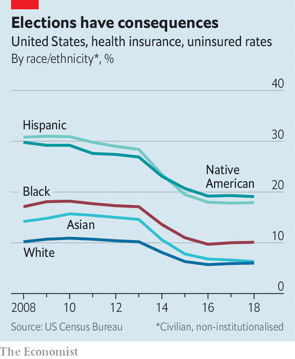

## What he did, not what he said

# What Donald Trump has done with the biggest budget in Washington

> In the first of a series on the president’s record, we look at HHS

> Feb 8th 2020WASHINGTON, DC

IF YOUR only source of information on Donald Trump’s record on health care was his state-of-the-union address, you would conclude that the president is hellbent on three things. The first is protecting patients with pre-existing medical conditions from insurers who would like to be rid of them. The second is making sure that illegal immigrants do not have access to subsidised health care. The third is bringing down the cost of prescription drugs.

But the president’s own words are not always the best guide to what the president does. He came to office promising to repeal Obamacare but failed to do so, and then lost control of the House of Representatives, and with it the opportunity to have another go. That does not mean his administration has done nothing, though. Presidents can have a lot of influence over American health care through the Department of Health and Human Services (HHS), an organisation that is much more interesting than it sounds.

Observers of American politics often forget that the distinction of having the biggest budget in Washington goes not to the defence department, but to HHS. In 2019, America spent a mere $685bn on defence compared to the $1.2trn spent at HHS—most of it on Medicare, the government health-insurance programme for the elderly, and Medicaid, the programme for the very poor. In addition to covering 109m Americans through these schemes, HHS has a sprawling mandate—to regulate the safety of food and drugs, to monitor epidemics, combat opioid addiction, provide direct health care for Native Americans living on reservations and take care of unaccompanied migrant children when they arrive at the border.

The first health secretary Mr Trump appointed to carry out these weighty tasks, Tom Price, had to leave after eight months, when a scandal about his use of private planes at taxpayer expense earned him the sack. His successor at the department, Alex Azar—who had been both an executive at Eli Lilly, a pharmaceutical giant, and a deputy secretary of the department in previous lives—has kept the job since and avoided much public notice or outrage. That is the result both of his better judgment and his rather ineffectual tenure. The sensible policies that Mr Azar has pushed—those aimed at reducing the price of prescription drugs—have gone nowhere.

Those changes that the department has successfully pushed through point in a different direction. HHS has set about destabilising the insurance markets set up under the Affordable Care Act (ACA), formally known as Obamacare, after Republicans failed to repeal it in Congress. It has also set about paring back Medicaid, the safety-net health-insurance programme. And it has tried to curb the work of abortion clinics.

The first of these tasks illustrates the strangeness of the Trump administration as it actually exists. Though unable to repeal the law, Congress got rid of the tax penalty for those who refuse to buy health insurance. The law used sticks and carrots to induce people to buy health insurance and Congress threw the main stick away. That development led Republican state attorneys-general to sue, arguing that the effective elimination of the individual mandate made the rest of the law invalid.

At first the Department of Justice declined to defend the main provisions of the law, leading one of its senior lawyers to resign. Later it hardened its position, and announced that the department agreed that the ACA had to go in its entirety. In a remarkable bit of up-is-downism, the president claims to be keeping the popular bits of Obamacare, such as the protections for patients with pre-existing conditions, safe from Democrats—at the same time as his justice department is pushing to eliminate those very protections.

This has put HHS in a bind—duty-bound to implement a law that the president desperately wishes to overturn. One way it has circumvented the law’s spirit, if not its letter, has been to make it possible for organisations to offer health-insurance plans exempt from ACA rules that are cheap but prone to break down when they are most needed. These include faith-based medical plans that offer “Christian health care” with discretionary payouts. HHS has done a few other things to undermine Obamacare without actually flouting it. “I think there is a continued effort to—either by regulation, incompetence or intentional effort—undermine outreach and enrolment, which ultimately undermines the market,” says Kathleen Sebelius, Barack Obama’s first health secretary. The share of Americans who are uninsured fell steadily in Mr Obama’s second term. After 2016 that improvement ceased (see chart).

Perhaps the most consequential official at HHS now is Seema Verma, who runs the Centre for Medicare and Medicaid Services. Though Mr Azar is her boss, they do not get on. In December Mike Pence, the vice-president, and Mick Mulvaney, the president’s chief-of-staff, had to act as peacemakers between them. Ms Verma has pushed sweeping changes to Medicaid. The most significant was to allow states to implement work requirements for the first time in the history of the programme. Twenty states, mostly Republican led, have since announced plans to incorporate work requirements with health care for the poorest Americans. The fullest implementation to date, in Arkansas, resulted in 18,000 people (or 25% of those affected) losing coverage for a few months before a judge suspended the programme. Ms Verma has also proposed giving states a fixed grant to spend on Medicaid, which many wonks fear may augur future spending cuts.

Unlike Mr Azar, her boss and rival, Ms Verma has raised a few eyebrows and ethics reviews. One was for spending $3m in taxpayer funds on communications consultants to boost her personal image. A second was over a reimbursement claim she filed for $47,000 for jewellery—including an Ivanka Trump-brand pendant—and other personal effects stolen out of a hired car while she gave a speech. (She ended up receiving less than $3,000.) But Ms Verma, who was previously a health-care consultant in Indiana, is unlikely to go.

Most of the controversy over access to contraception and abortion has been focused on states, many of which have been passing laws that are almost outright bans in an attempt to bait the Supreme Court into taking a case and overturning Roe v Wade. Meanwhile, edicts from HHS attract less notice. In the name of expanding religious freedom, the administration finalised a regulation that would let employers claim a conscientious objection to paying for contraception—a requirement of the ACA. It has been held up in litigation since. Because of the so-called Hyde Amendment, the federal government does not pay for abortions except for cases of incest, rape or life-threatening complications to the mother. But HHS has also issued a rule banning any groups that take federal funding for family planning from referring patients to abortion providers.

All of these are traditional goals of past Republican administrations. Mr Azar’s heterodox efforts to use that authority to reduce drugs prices have stalled, even though there should be a bipartisan consensus there. In July 2019 the administration abandoned a plan to end the rebates that manufacturers pay to middlemen in the drug distribution system, known as pharmacy benefit managers, which critics claim inflate prices for consumers. Efforts to cap drug prices according to an international price index have been stuck in internal deliberations since October 2018. Plans to allow drugs to be imported from Canada into two test states—Vermont and Florida—look unlikely to materialise this year. New transparency rules, requiring drugs companies to include prices in advertisements and hospitals to publish their closely guarded price lists, are sensible but have been stalled by lawsuits.

Much of the administration’s health-care agenda has thus been delayed. These cases will eventually be resolved, though. Even if Republicans fail to win back Congress, with another four years Mr Trump could quietly reshape health care, without the need for any legislation at all.■

Dig deeper:Sign up and listen to Checks and Balance, our new [newsletter](https://www.economist.com//checksandbalance/) and [podcast](https://www.economist.com//podcasts/2020/04/24/checks-and-balance-our-weekly-podcast-on-american-politics) on American politics

## URL

https://www.economist.com/united-states/2020/02/08/what-donald-trump-has-done-with-the-biggest-budget-in-washington
