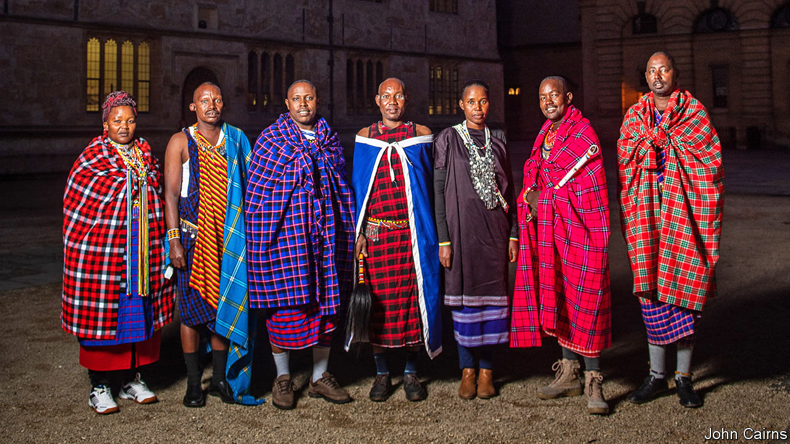

## Restitution

# Oxford University restores Maasai artefacts

> Men with spears come to the dreaming spires

> Feb 13th 2020OXFORD

IN THE OAK-PANELLED Bookbinders Ale House, a group of Maasai tribespeople gathers the day before returning to Tanzania and Kenya, to sip cappuccinos and bitter and to chew over the results of a two-week visit to Oxford. Despite the vile February weather, they are satisfied with their trip, for they are closer to getting back sacred objects that are held by Oxford’s Pitt Rivers Museum.

Former colonial powers have tended to take a defensive attitude to requests from formerly subject peoples for the return of objects that may have been stolen. In Britain, France and elsewhere, laws prevent museums from letting stuff go.

But in 2017, Emmanuel Macron, the French president, said that he wanted to see the return of pilfered artefacts to Africa within five years. Since then, the movement for restitution has gathered steam. Universities are not constrained by the legislation that binds national collections, and several have started to return objects.

The Pitt Rivers, which holds the university’s archaeological and anthropological collections, is in the vanguard. It has returned 28 objects, all of them human remains. But Dan Hicks, curator of archaeology at the museum, believes that the movement needs to accelerate, for “museums are sites of colonial violence”.

Rather than deal with national governments, which can make for tricky politics, the Pitt Rivers is engaging directly with indigenous peoples. The Maasai visit came about after Samwel Nangira, a Maasai from Tanzania, visited the Pitt Rivers when he was at a conference. He questioned the labelling of some of the objects in the museum: “what does ‘collected’ mean? Like when you find something in a forest, so not donated, and not robbed?”

One of the problems with restitution claims is establishing provenance. The Maasai have come at the invitation of Laura van Broekhoven, director of the Pitt Rivers, and InsightShare, an NGO, to establish where and when the objects were taken. To that end, they have brought Lemaron ole Parit, a laibon—a spiritual leader with mystical powers. His family has been providing spiritual leadership for generations. The most famous of his forebears is Mbatian, his great-great-grandfather, who is remembered for foretelling the British arrival. Nick Lunch, InsightShare’s organiser, is impressed that Mr ole Parit has been talking with his father, Mokompo ole Simel, who holds ultimate spiritual power in the tribe but stayed at home, “not just on WhatsApp, but also through his dreams.”

Sitting on the floor of Mrs van Broekhoven’s office, Mr ole Parit breathes into an enkidong vessel packed with stones and snuff tobacco. He then shakes out the stones, whose patterns reveal the artefacts’ history to him. “I’ve identified the circumstances under which objects were taken,” he explains. “The times when they were taken, and how many hands they went through.” Out of the 188 artefacts Mr ole Parit viewed, he has identified only five he thinks are culturally sensitive enough to warrant a return.

Artefacts matter to the Maasai, in part because they represent the continuation of a dead person’s life. Mr ole Parit says an isurutia—a necklace—was taken from a woman who was killed while she was carrying her baby. “If somebody dies, we treat the artefacts as equally as important as a dead body,” says Amos Leuka, a member of the delegation. If an object has been taken violently from somebody, their spirit cannot rest. The Maasai’s ancestors are therefore said to be joining the negotiations.

So is Oxford’s vice-chancellor, Louise Richardson: once the Pitt Rivers has approved a claim, it is sent to her. Her attitude to this unusual method of establishing provenance has not yet been divined. But Mrs van Broekhoven says that the way knowledge systems are judged needs to be liberated. “Real decoloniality is to see each other’s knowledge systems as equal.” British colonial catalogues, she points out, are not models of accuracy. “All we have are labels with question-marks. It would be quite disingenuous to say, ‘Your knowledge system is inferior to ours’.” ■