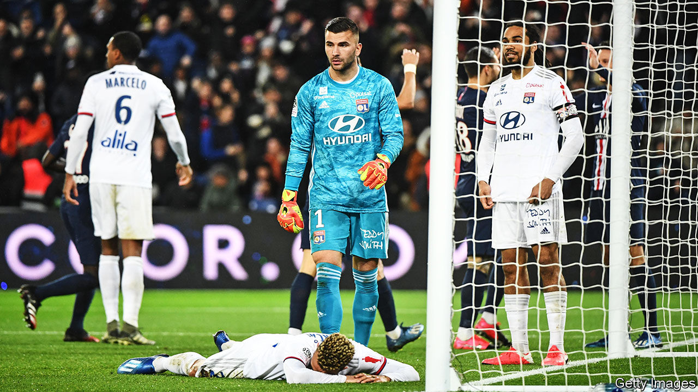

## Hoarding cash

# Admen have a clever new way to trick sports fans

> Stadium ads need no longer be one-size-fits-all

> Feb 15th 2020

WHEN FERNANDO MARÇAL scored a risible own goal in a match against Paris Saint-Germain on February 9th, his Lyon football team’s supporters watching on television screens prayed their eyes had deceived them. And deceive them they did—just not in the way that would answer their prayers. The advertising hoardings they saw around the pitch’s perimeter were not those seen by Lyon fans unlucky enough to witness Mr Marçal’s howler in person at the stadium. The televised versions were conjured up virtually.

Virtual advertising works by placing invisible infrared signals in signs to distinguish them from other objects in the foreground. Images can then be superimposed onto them in a live TV broadcast. Viewers in Tianjin might see the logo of a local bank behind the penalty area, while those in Tijuana are tempted by a Mexican beer.

Football clubs are understandably keen. Commercial income, made up mostly of sponsorships and advertising, earned Europe’s top 20 teams €3.6bn ($3.9bn) last year. Allowing companies to tailor their pitch-side messages to specific audiences could boost this by 40%, reckons the boss of one sports-marketing company.

Last month Real Madrid appointed IMG, a sports-management company, to sell this unreal estate on its behalf. Teams elsewhere in Europe have begun to use the technology in recent seasons. So, too, have top-flight ice-hockey and basketball leagues in North America.

Tailoring ads to all tastes has limits. Too many sponsors may hurt a team’s brand, says Jean-Paul Petranca of the Boston Consulting Group. Manchester United, which raked in £173m ($224m) in sponsorships last year, has been mocked in the past for endorsing everything from bedding to instant noodles.

Still, virtual hoardings are here to stay. In the future, says James Gambrell, boss of Supponor, a supplier of the technology, sponsors could target an audience based on its demographic profile or the device or platform of choice (owners of Apple’s gadgets are generally better-off than those using Android devices).

For the time being, it can help clubs keep controversial partners while placating an irate public. Last week British bookmakers, which bankroll half of the teams in the Premier League, announced that they are considering withdrawing from advertising on the side of the pitch after vocal criticism from anti-gambling campaigners. In France Lovebet, a big gambling company that sponsors Paris Saint-Germain, uses virtual advertising to reach viewers in Asia, where placing bets is legal and popular, but not in Europe, where it is restricted in some markets. This can spare clubs plenty of jurisdictional headaches—if not blushes for blunders like Mr Marçal’s.■