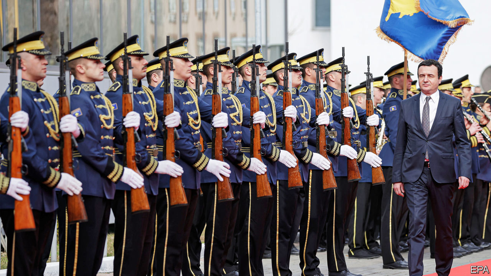

## New face, old grudges

# Albin Kurti’s new start in Kosovo

> Can the new prime minister end the stand-off with Serbia?

> Feb 13th 2020PRISTINA

THINGS ARE stirring in Kosovo. Since February 3rd this tiny new country has had a dynamic new prime minister, who wants to drive out of politics the guerrillas who fought for independence in the 1990s but then, he says, took to looting the state. Albin Kurti, 44, says his government’s task is to “liberate our state from within”.

Many hope he will also be flexible enough to end the stand-off with Serbia, which is one of Europe’s last remaining territorial disputes. Kosovo, most of whose people are ethnic Albanians, has been independent since 2008. Most other countries recognise it, but Serbia, its old master, as well as Russia and five EU countries, does not.

America and the EU are keen to revive the stalled dialogue between the two countries. In 2018 Serbia’s diplomats successfully thwarted Kosovo’s third attempt to join Interpol, the international police organisation. Serbia has also persuaded a dozen countries to rescind their earlier recognition of Kosovo. In revenge Kosovo imposed a 100% tariff on the import of Serbian produce, which Serbia’s president says has cost it €435m ($480m). He says it will not resume dialogue until the tariff is revoked.

Mr Kurti was a student leader in the twilight years of Serbian rule. After the war between Serbia and NATO over Kosovo ended in 1999, he was a political prisoner in Serbia for almost three years. On his return he led a ferocious campaign against what he regarded as the colonial presence of the United Nations, which administered the country from 1999 to 2008, and against the EU’s law-and-justice mission there after that. He also resolutely rejected any negotiations with Serbia.

During 23 years in opposition Mr Kurti earned a reputation for being intelligent and principled, but also a dogmatic leftist and an advocate of Kosovo uniting with Albania. That demand terrifies many international policymakers, who believe that changing Balkan borders is a recipe for war. In October 2019 Mr Kurti’s party won enough votes to prise the former guerrilla politicians of the Kosovo Liberation Army (KLA) from power. He wooed voters by trading in his usual T-shirts for suits and by tempering his language. Today he says union with Albania can wait, adding that a strong Kosovo needs to be built first.

Foreign diplomats are increasing the pressure on Mr Kurti to lift the 100% tariff in order to restart the dialogue. He is reluctant to be pushed into a one-sided move. More important for him are education reform, the economy, the environment and rooting out what he says is a small and corrupt clan that has captured the state. He is willing to drop the tariff only if Serbia will reciprocate, which is unlikely as it would amount to a form of recognition. Currently, goods with paperwork marked “Republic of Kosovo” cannot be sold in Serbia. But the Trump administration, eager for a foreign-policy success before America’s presidential election, is thought to be pressing Mr Kurti to make a deal.

His domestic challenges are huge, too. For years, civil-service jobs have been doled out to supporters of the parties that grew out of the KLA. One incoming minister says he is only mildly worried that resentful officials will sabotage his plans. A bigger problem, he says, is that vast numbers of people in his ministry are unqualified, having been hired nepotistically. Mr Kurti’s honeymoon will not last long. ■