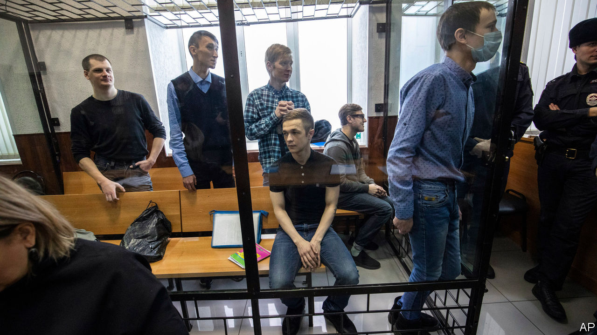

## Network of nothing

# How Russian show trials expose imaginary plots

> Vladimir Putin’s tactics are getting crueller

> Feb 13th 2020

SIX OR SEVEN men in balaclavas walked into a prison cell in Penza, a provincial Russian town 400 miles (650km) south-east of Moscow. They told their 25-year-old prisoner to undress. They gagged him, tied his legs to a bench and connected wires to his big toes. Then they started to electrocute him. “My muscles started to contract, causing a paralysing pain,” he recalled. “I started to scream and hit my head against the wall, but they carried on. Ten seconds seems like an eternity.” The masked men then tried to connect more wires to his genitals. Terrified and in pain, he repeated what his torturers told him to say: “Yes, I am the ringleader. Yes, we were preparing terrorist attacks.”

This is not a story from the Soviet Union in the 1930s, when Stalin’s secret police, the NKVD, tortured and killed millions of innocents while uncovering imaginary plots. It is the testimony of Dmitry Pchelintsev, one of 11 men who were arrested in October 2017 in Penza and St Petersburg and charged with forming a terrorist group to disrupt Vladimir Putin’s presidential re-election and the football World Cup in 2018. On February 10th seven of them were sentenced to between six and 18 years in prison camps.

Just as in the trials of that earlier time, the entire case was fabricated. There was no act of terrorism and no plan for one. The case rests on confessions obtained through torture and later retracted in court. According to prosecutors, these men “in an unidentified place proposed to unidentified anarchists to take part in the inter-regional terrorist organisation ‘Network’ with the aim of forcibly changing Russia’s constitutional order.” The organisation’s “charter”, which the prosecution cited in evidence, mysteriously appeared on the hard drives of the “terrorists” after they had been seized by security services.

According to Memorial, Russia’s most eminent human-rights organisation, there is no evidence that Network ever existed. In fact, some of the members of the made-up network did not know each other until the arrests. What linked them were their anarchist views, their anti-fascist activism and their penchant for airgun combat games, which the FSB, a successor to the NKVD, said was training for terrorism. Living in a provincial backwater, unprotected by money, status or the Moscow-centred media, they were easy targets.

The case (and the torture) were the work of the FSB’s notorious “service for the protection of constitutional order and the fight against terrorism”. In a bitter irony, the sentencing coincided with an assault on Russia’s constitution from Mr Putin himself, who is rewriting it to suit his goals of staying in power indefinitely and isolating Russia from international laws and conventions that buttress human rights.

Neither draconian sentences nor torture are new in Russia. What is new about this case, says Kirill Rogov, a political analyst, is its political logic. “Putin has appropriated Stalin’s method of engineering cases to impose terror, particularly among young people, to criminalise political activism,” he says. The Network case was launched soon after tens of thousands of youngsters took to the streets in some 80 Russian cities, protesting against the Kremlin and corruption. The Kremlin took notice; the FSB took what they call “prophylactic” measures to strike fear. In a similar case, its provocateurs and informers trapped ten young people, including two teenage girls, in an engineered extremist organisation called “New Greatness”.

It is unclear whether these tactics will deter or radicalise the protesters. The big difference with the Stalinist era, however, is the public reaction. Russians on social media are seething. Young people in Moscow are coming out one by one to stand in front of the FSB headquarters holding protest placards. There are collective open letters of support. To be effective, repression must either be so widespread that it is hard to avoid or so cruel that it strikes fear into dissident hearts. Mr Putin’s regime is not totalitarian and cannot snoop on the same scale as China’s government; perhaps that is why he is getting crueller. ■