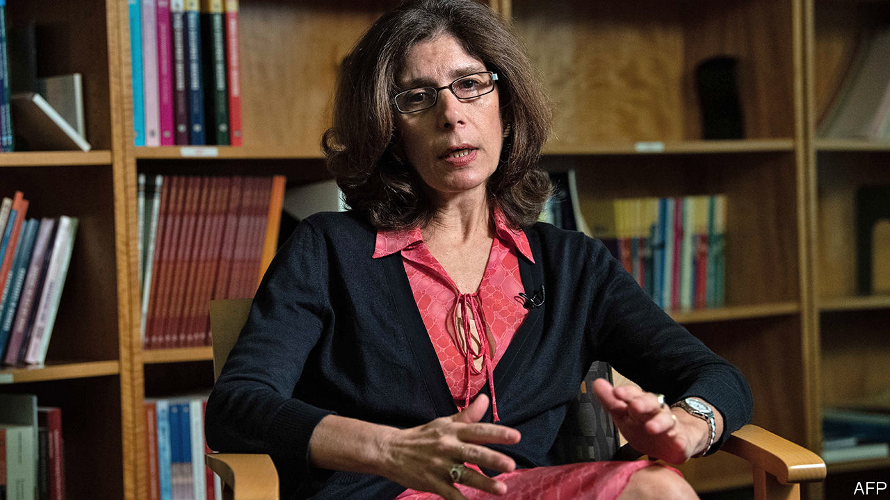

## The Goldberg variations

# The World Bank loses another chief economist

> Penny Goldberg leaves after only 15 months in the job

> Feb 13th 2020HONG KONG

WHEN AUTOCRATIC, oil-rich nations enjoy a windfall from higher crude prices, where does the money go? One place to look is Swiss bank accounts. Sure enough, an increase in oil prices is followed by a spike in deposits held by these countries in financial havens, according to a 2017 paper by Jorgen Juel Andersen of BI Norwegian Business School, Niels Johannesen of the University of Copenhagen and their co-authors.

When Mr Johannesen presented this result at the World Bank in 2015, the audience included Bob Rijkers, a member of the bank’s research group. The two of them joined forces with Mr Andersen to investigate if something similar happened after another kind of windfall: infusions of aid from foreign donors. Their conclusion was dispiriting. World Bank payouts to 22 aid-dependent countries during 1990-2010 were followed by a jump in their deposits in foreign financial havens. The leaks averaged about 5% of the bank’s aid to these countries.

Mr Rijkers is part of a unit that reports to the bank’s chief economist, Pinelopi (Penny) Goldberg. The team publishes working papers on the understanding that their views do not represent the bank’s. But Mr Rijkers’s collaborative effort, which was leaked to The Economist, is not yet among them. It passed an exacting internal review by other researchers in November. But, according to informed sources, publication was blocked by higher officials. They may have been worried about how it would look if the bank’s own researchers said that a chunk of its aid ended up in Swiss bank accounts and the like.

The bank insists a final decision on publication has not been made and that it still has legitimate concerns about the paper. A correlation between aid disbursements and offshore deposits is not proof of causation. And the 5% of “leaks” might include some innocent money, earned by aid contractors who just happen to prefer offshore havens to other financial centres. But the paper had already answered similar objections in the review process.

The integrity of the bank’s research is meant to be safeguarded by its chief economist. The position is typically filled by a well-regarded academic, who has both an external reputation to protect and the internal clout to defend their turf. The job was, however, split in 2017 when Paul Romer, a star economist with little managerial finesse, was relieved of his bureaucratic duties. (He then left the job altogether after only 15 months in the role.) Ms Goldberg was given more managerial power than Mr Romer ended up with, but less than he started with.

This month she said she would be returning to Yale in March, after only 15 months in the job. Her reasons were unclear. A reorganisation of the bank may have been a factor, including the imminent arrival of Mari Pangestu, who will assume oversight of Ms Goldberg’s unit, in an effort to align research more closely with the bank’s country operations. Ms Goldberg may have come to feel that the position carried too much of a managerial burden, but too little power to rule her fief.

But it is also possible that the bank’s decision to block one of her team’s papers grated on her. After aid to a country spikes, money departs for offshore havens. And after a sensitive paper is spiked, Penny departs for New Haven. In both cases, correlation is easier to prove than causation.■