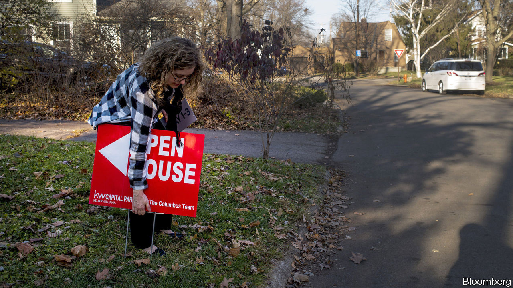

## Time for disruption in the property market

# The cost of buying and selling homes is too high

> Ending America’s real-estate racket

> Feb 13th 2020

THE STAKES are high. Along with getting married and choosing a career, buying or selling a home is one of the biggest decisions most people make. In America, especially, the sums are vast. In total the country’s residential property is worth $34trn—as much as the value of all its publicly listed firms—and last year people traded properties worth $1.5trn. Yet compared with other industries and other countries, buying and selling property in America is cumbersome—and extraordinarily expensive. In an industry crying out for technological disruption, the only revolutionary change over the past decade has been the rise of celebrity estate agents who star in reality TV shows including “Million Dollar Listing” and “Flip or Flop”.

The scale of the commissions extracted by the real-estate industry in America is jaw-dropping. Fees run at 5-6% of the value of a property, three times the average level in other developed countries (see [article](https://www.economist.com//finance-and-economics/2020/02/15/technology-is-poised-to-upend-americas-property-market)). In total they amounted to $75bn last year, or 0.4% of GDP. Other marketplaces—for shares, groceries, advertising and romance—have been transformed by technology. But in property the old ways persist. America still has 2m realtors.

Although online platforms such as Zillow and Redfin have made some inroads, allowing buyers to do much of the searching themselves, fees have not budged. An inefficient property market has knock-on effects on the economy. In the 1950s, 20% of households moved each year; today only 9% do. The slowdown in labour mobility has many causes, but in a country where most people own homes, high fees do not help.

At the heart of the problem is a knot of obsolete practices that seem to favour insiders rather than the buyers and sellers of property. Unlike the practice in most countries, the seller usually pays fees to both their own agent and the buyer’s. Agents acting on behalf of buyers thus have an incentive to steer their clients away from properties with low fees—one study has found that such homes are 5% less likely to sell, the opposite of what you would expect in a healthy market. Most transactions are listed on 800-odd common industry databases, known as multiple listing services (MLS). The government worries that their rules and tacit codes of behaviour might muffle competition, by prompting agents to search for homes based on how high fees are, or by restricting the distribution, sale or licensing of data. (The National Association of Realtors, a lobbying group, argues that the industry is competitive and MLSs benefit consumers.)

What to do? America’s trust-busters last looked into the industry in depth in 2008, when they tried to ensure MLSs were open to internet-based firms. Now, after a decade in which fees have not fallen materially, they are investigating again. The Department of Justice has subpoenaed some of the private firms that help run MLSs to establish whether agents operating on them are puffing up fees or steering clients towards properties with higher fees, and whether access to MLS data is being unfairly restricted. Two big class-action lawsuits are under way against the industry.

Boosting competition is a complex problem, but the antitrust policemen are right to intervene. They should seek to enforce two principles. First, that agents are genuinely free to compete by lowering commissions—or by abandoning the practice of requiring sellers to pay two sets of fees. Second, that any firm which wants to gain access to industry data can do so freely at reasonable prices. The best tests of whether regulators succeed are whether commissions fall towards levels in the rest of the rich world and the market share of new entrants rises.

Plenty of entrepreneurs are keen to get involved. Some $6bn of venture capital flowed into “prop tech” firms in 2019. Opendoor and Zillow have algorithms that crunch data to determine the value of a home, and allow them to make “instant offers” to sellers that are all cash and can be paid within days. Other firms have developed tools to lift agents’ productivity, such as automatic home-tour booking systems. Competition can make America’s property market work better. If regulators lower the barriers to entry, they will be knocking on an open door.■

## URL

https://www.economist.com/leaders/2020/02/13/the-cost-of-buying-and-selling-homes-is-too-high
