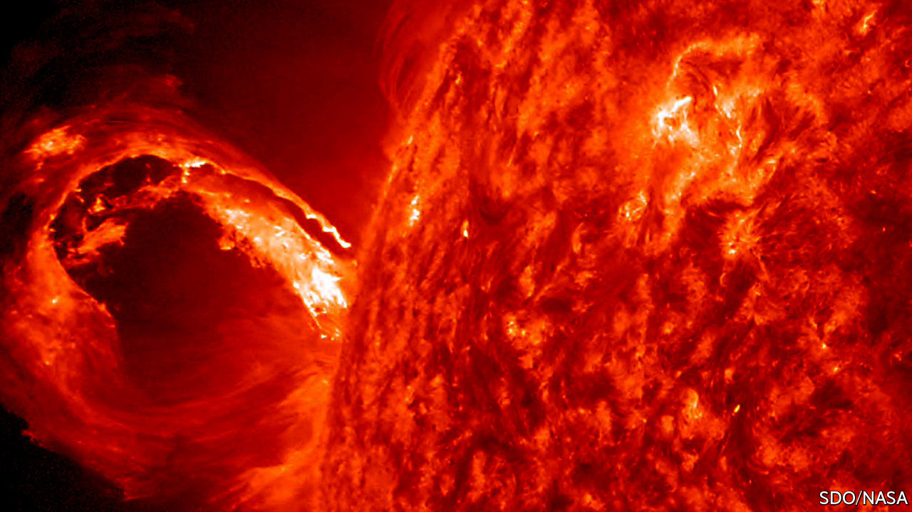

## Solar Orbiter’s launch

# A new spacecraft will examine the sun close up

> Solar physics is a hot topic

> Feb 13th 2020

THE SUN is one of the most-studied objects in the sky, but plenty of mysteries remain. On February 10th a rocket blasted off from Florida carrying Solar Orbiter, a European space probe designed to solve some of them. This craft will spend the next two years performing fly-bys of Venus and Earth, using the gravity of both planets to kick itself into an unusual orbit that will take it well above the ecliptic, the plane in which all of the sun’s planets orbit.

From that vantage Solar Orbiter will peer at the sun’s poles, something no spacecraft has managed before, and do so from close up. At its nearest, it will be just 42m km from the sun—closer than Mercury, the innermost planet, gets. One of its features is, therefore, a heat shield coated with charcoal made from cooked animal bone and designed to endure temperatures up to 500°C. Tiny windows within this will illuminate the probe’s various instruments.

Those instruments are designed to shed light, as it were, on several questions. One concerns the solar wind, a flow of charged particles that streams from the sun at a rate of more than 1m tonnes a second. The solar wind blows at an average speed of 400km a second, but physicists do not know exactly what accelerates those particles to such a velocity. Another mystery is the sun’s magnetic field. Every 11 years or so, for reasons only partly understood, this flips its north and south poles around. Solar Orbiter’s masters hope their charge will observe such a reversal, which is expected to happen within the next few years.

They also hope that Solar Orbiter will advance the nascent science of solar-weather forecasting. The entire solar system is bathed in the solar wind, which means that what happens on the sun can affect conditions around the planets. Solar flares—sudden spikes in the sun’s brightness—boost radiation levels in the neighbourhood of Earth, which can interfere with satellites’ electronics, alter their orbits and pose health risks to astronauts. Coronal mass ejections (CMEs), which are occasional burps of superheated plasma that the sun releases into space, can disrupt radio communications and induce large, potentially damaging electric currents in power grids, communication lines and the like.

These risks are not hypothetical. In 1859 a massive CME caused auroras as far south as the Caribbean and damaged telegraph systems all over America and Europe. Another, in 1989, caused nine-hour blackouts across large parts of north-eastern Canada. Britain’s government lists a direct hit from a big CME on its National Risk Register of potential disasters, alongside floods, pandemic diseases and big terrorist attacks. Early warning of such space-going storms would help resist their effects.

Solar Orbiter is not the only craft soon to endure a close encounter with the sun. In 2018 NASA, America’s space agency, launched the Parker Solar Probe. This will orbit even closer, at a distance of just 6.2m km. Researchers see the missions as complementary. Parker will fly through the corona, a tenuous atmosphere that stretches far out from the sun’s luminous sphere, allowing it to sample the gas there directly. But that is much too close for any kind of direct optical observation, says Richard Harrison, chief scientist at the Rutherford Appleton Laboratory in Britain, and one of Solar Orbiter’s designers. Parker, in other words, suffers from the same limitation as Earthbound human astronomers: it cannot look directly at the blinding light emitted by the object it is studying. ■

## URL

https://www.economist.com/science-and-technology/2020/02/13/a-new-spacecraft-will-examine-the-sun-close-up
