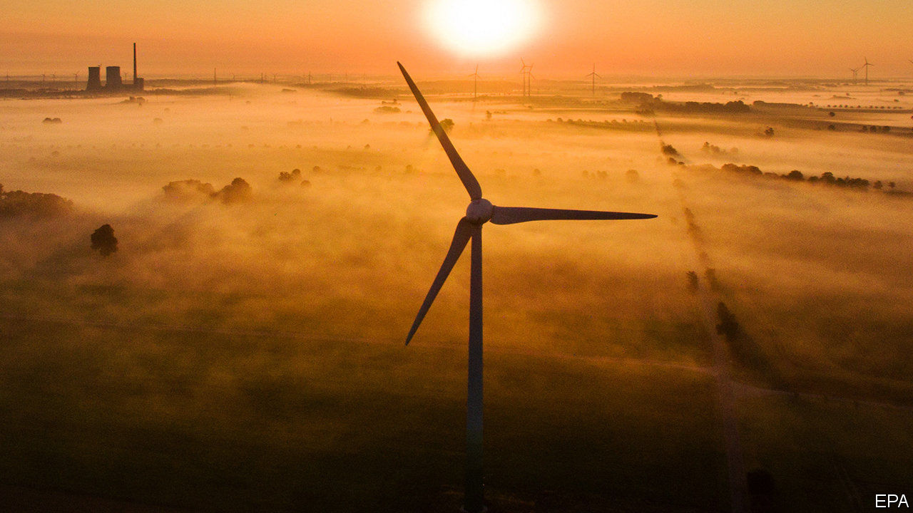
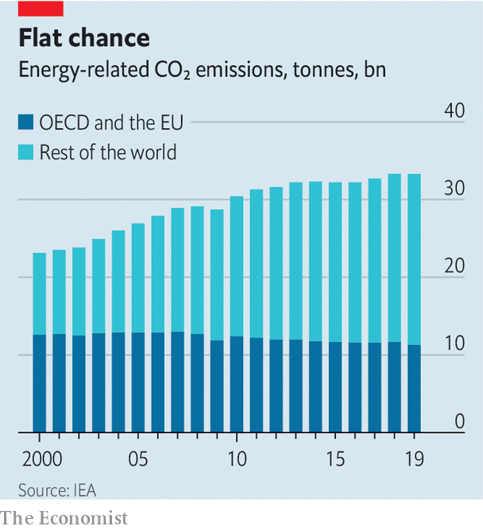

## Climate change

# Energy-related emissions of carbon dioxide have stabilised, for now

> But the capacity of the Amazon to absorb the gas is falling

> Feb 15th 2020

IS IT A peak, a stutter or just a brief pause? Time will tell. But whatever it is, on February 11th the International Energy Agency (IEA), an intergovernmental organisation which collects such data, announced that emissions of carbon dioxide in 2019 which were related to energy had remained the same (33.3bn tonnes) as the previous year’s.

Energy-related emissions, which include those produced by electricity generation, heating and transport, account for more than 70% of the world’s industrial CO2 pollution. The stall seems to have been caused by a decline in coal use, particularly in rich countries, combined with an increase in the use of renewable power.

As a result of this the CO2-intensity of electricity generation—a measure of how much of the gas is emitted per kilowatt-hour of juice produced—fell by nearly 6.5%, to 340 grams of CO2 per kilowatt-hour. It had already been falling, but this is three times the average for the past decade. Such declines more than offset the effect of increased electricity production. The average emission-intensity of power generation in 2019 was “lower than all but the most efficient gas-fired power plants”, according to the IEA.

This is not the first time energy-related emissions have plateaued. Between 2013 and 2016 they hovered around 32.2bn tonnes a year, before rising again in 2017 as the use of coal to fuel developing economies increased. This previous plateau was accompanied by excited declarations that such emissions had peaked. Similar comments have been made this week, perhaps also prematurely. In addition to changes in coal use, a sluggish economy may have played a part and the data show that milder than usual weather caused a perceptible drop in emissions from several countries with large, carbon-hungry economies.

The news is also tempered by the latest data from the Amazon rainforest. This, one of the world’s largest woodlands, has acted historically as an absorbing sponge for CO2 by removing it from the atmosphere through photosynthesis. Researchers at Brazil’s National Institute for Space Research have shown that a vast part of the south-east of the Amazon, about one fifth of its area, has lost its ability to soak up the gas and is now a net source of emissions into the atmosphere instead. This land has been widely deforested, so the result is little surprise. But it is disappointing.

Sign up to our fortnightly climate-change newsletter [here](https://www.economist.com//theclimateissue/)