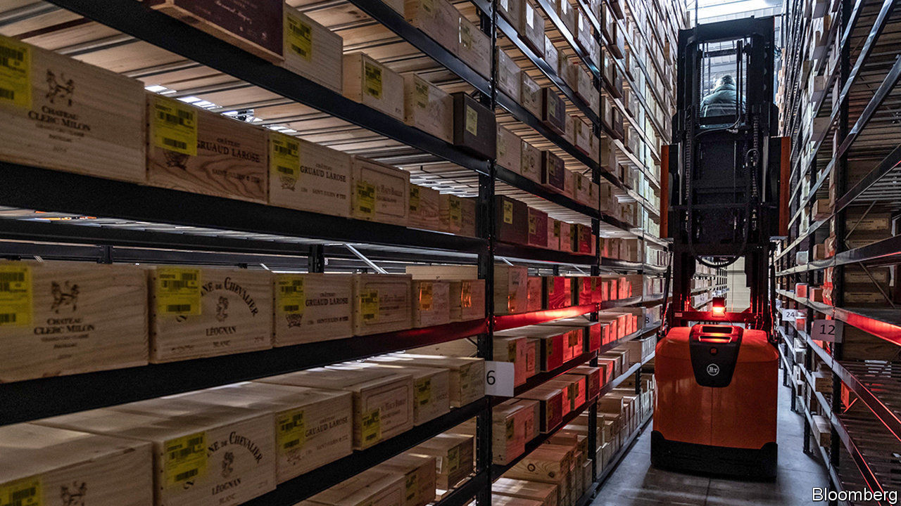

## Vin-dictive

# American drinkers of European wine face mounting tariff bills

> Mounting the barricades for Barolo

> Feb 13th 2020WASHINGTON, DC

“TARIFFS COST American jobs” is a sobering chant. And for the 30 marchers (with 200 signs and marshalled by six police vehicles) in Washington, DC, that was the point. On February 9th they met to protest against the looming threat of tariffs of up to 100% on wine imported from the European Union. Kevin Rapp, an importer of Italian wines and the march organiser, got involved because, if tariffs happen, they would close his business. In vino veritas.

It all started on October 18th, when as part of a long-running dispute over subsidies for Airbus, a European aircraft manufacturer, the Trump administration hit wine from France, Spain, Germany and Britain with tariffs of 25%. In a normal year wine imports fall by 10-20% from October to November, as retailers stop stocking up for the holiday season. In November 2019 purchases fell by over 30% once the duties were in place.

Regulations require many middlemen between makers and drinkers of wine, which means that the industry has both low margins and lots of markups. Christopher Lombardo of IBISWorld, a market-research firm, reports that so far many distributors have opted to swallow the tariffs at the expense of their profit margins. For smaller businesses, he warns, this is unsustainable.

If the tariff of 25% has stained balance sheets red, a jump to 100% would put many out of business. “We would be done,” says Andrea Wallace, who works for a wine importer that has already paid $40,000 in duties. When the tariffs were applied her company had two containers of wine “on the water”, which suddenly became 25% more expensive than they had planned for. Now, she says, “we’re all gun-shy” about putting wine on the water, in case they get hit.

Hard-nosed officials may discount this. At a hearing to discuss a tariff threat on French champagne, United States Trade Representative officials quizzed merchants about whether drinkers could switch to different sorts of wines—perhaps even the American sort? The suggestion is an affront to sommeliers, who see the quality or character of a wine as intrinsically linked to its origin.

Thus far winesellers have avoided passing the full cost of the tariffs on to drinkers. But according to Chris Bitter of Vintage Economics, a market-research company, the most extreme scenario would see tariffs covering almost all imported European wine, more than a quarter of American consumption by value, and around one in every six bottles sold. If that happens, expect Barolo- drinkers to mount the barricades.

## URL

https://www.economist.com/united-states/2020/02/13/american-drinkers-of-european-wine-face-mounting-tariff-bills
