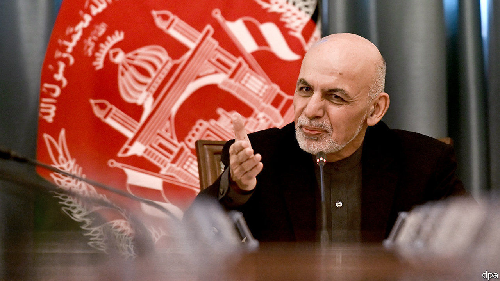

## To the victor the toils

# Afghanistan’s disputed presidential election comes at a tricky time

> The winner needs a strong mandate to negotiate with the Taliban

> Feb 20th 2020KANDAHAR

ELECTIONS ARE supposed to bring stability to politics and legitimacy to the victor. Afghanistan’s recent presidential poll, alas, has provided neither. For one thing, only a small proportion of Afghans voted. Worse, it has taken the election commission an agonising five months to count the ballots, adjudicate disputes and declare a winner: Ashraf Ghani, the incumbent, with 50.6% of the vote. What is more, his closest rival, Abdullah Abdullah, rejects the result and has declared himself president, despite winning only 39.5% by the official tally. It does not help that there would have been a run-off had Mr Ghani not scraped above 50%, lending weight to Mr Abdullah’s complaints. And the whole election has anyway been overshadowed by America’s continuing negotiations with the insurgents of the Taliban, which threaten to turn Afghanistan’s already tumultuous politics upside down.

This is not Afghanistan’s first disputed election. Mr Abdullah claimed the previous vote, in 2014, was also rigged. He lost then to Mr Ghani, too, and was only persuaded to abide by the result when Mr Ghani agreed to create a special job for him—chief executive—in a power-sharing government. Their joint administration was unhappy and the rivals are said barely to speak. Mr Ghani explicitly and emphatically ruled out any extension of the current arrangement before the election.

Even if Mr Abdullah can be mollified, Mr Ghani cannot claim much of a mandate. Only about 10% of the voting-age population actually turned out. That means a mere 5% of adult Afghans plumped for him. Voters were scared away from polling stations by the risk of being murdered, and disillusioned by the familiar choice.

The stand-off comes at an awkward time. Eighteen months of talks between America and the Taliban in Qatar appear to be on the verge of bearing fruit. The two sides say they are close to resurrecting a deal called off by President Donald Trump last year. Any agreement is likely to require the government to start negotiating very quickly with the Taliban to decide how the country should be run.

That will be hard if there are two competing governments. Political heavyweights are already jockeying to be part of the negotiating team. A weakened Mr Ghani will struggle to adjudicate. It will be hard for the government to negotiate forcefully with the Taliban if it does not have the backing of most of the political class. “The challenge is to get a united and inclusive negotiating team together,” explains a foreign diplomat. “It would be a very poor situation if the Taliban and the US sign their agreement, only for the Afghans to fail.”

In the meantime, the economy is faltering. Poverty is on the rise. Some 9.4m Afghans will need charitable food and shelter this year, the United Nations warns, up from 6.5m in 2019. In the southern city of Kandahar, an economy once super-charged by vast injections of aid is now subdued. Residents bemoan a lawlessness epitomised by assassinations of businessmen and government officials. The disputed election result compounds the problems, says Muhammad Naim Kharakhi, a shopkeeper at the main bus station, who sells biscuits and drinks to passengers. “It will cause big problems for ordinary people because businessmen who want to invest will wait. The economic situation was already bad enough because of the delayed result. This will only make it worse.” ■

## URL

https://www.economist.com/asia/2020/02/20/afghanistans-disputed-presidential-election-comes-at-a-tricky-time
