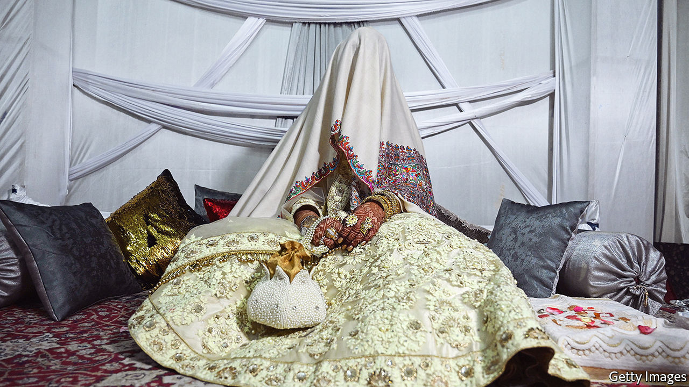

## Clawless clauses

# How Pakistani brides inadvertently sign away their rights

> Mandatory contracts intended to protect them often do nothing of the sort

> Feb 20th 2020

HOURS BEFORE her wedding ceremony, Aisha Sarwari, then a recent graduate of an American university, was called into a room full of men: her brother, her uncle, a marriage registrar and her fiancé. The registrar asked three times if she consented to marry the groom. She said yes. Then he told her to sign a contract she had never seen, with her name and a thumb-print. She said yes to that, too. “It didn’t even occur to me that I should look at the document,” she says now. That document, known as a nikah nama, is a marriage registration and a pre-nuptial agreement all in one. It determines all sorts of things that may end up being of critical importance to the bride, in particular, from the way in which she may seek a divorce to the division of property if the marriage comes to an end.

Yet many wives-to-be in Pakistan sign their nikah namas without reading them. Plenty do not know what they are signing. In Peshawar, a city in the north-west, nearly three-quarters of women, many of them illiterate, say they were not consulted on their marriage contracts. But asking for a say in the drafting would be fraught, anyway. At best, women who do will be accused of bad manners (for not trusting their new husband) or of courting disaster (because it is unlucky to talk of divorce before the marriage has even started). At worst, it would be seen as inexcusable uppitiness that might put the wedding in jeopardy. In some cases, marriage registrars, who are often imams, take matters into their own hands, simply crossing out bride-friendly clauses on the contracts. Even though such changes are illegal, an analysis of about 14,000 nikah namas in Punjab province found that 35% had been amended in this way, according to Kate Vyborny, one of the researchers involved. “It’s ludicrous,” says Ms Sarwari.

Yet when the nikah nama, an Islamic tradition, was incorporated into Pakistani law in 1961, the government’s intention was to “secure to our female citizens the enjoyment of their rights under Qur’anic laws”. In fact, the ordinance in question did not just enshrine Islamic practice in law; it modernised it, modestly circumscribing a man’s rights and codifying those of women. Men are still free to marry up to four women, but have to tell new wives about existing ones. Men can still divorce at will, but have to register the divorce in writing, and so on. Husbands are also required to state at the time of marriage, in the nikah nama, whether they concede their wives the same right they have, to end the marriage whenever they want, without having to go to court.

These rules are not as favourable to women as those in many Muslim countries. Wives who have not obtained the right to divorce at will can still seek one in court but, by doing so, usually forfeit their dowry, which they would normally be entitled to keep in case of divorce as a form of financial compensation. That is not the case in Malaysia and Morocco. Nonetheless, the reforms were controversial from the start. Boosters, such as Ayub Khan, the president at the time, said they could “liberate Islam from the debris of wrong superstition and prejudice”. Religious leaders denounced them as unIslamic.

Nearly 60 years later, the tension still festers. Feminists would like women to get more of the family’s assets after a divorce. But Zubair Abbasi of the Shaikh Ahmad Hassan School of Law, in Lahore, doubts that will happen. “This is such a sensitive issue,” he says, “no political party wants to take it on.” Instead, most activists are focusing on securing the freedoms already on the books. Fauzia Viqar, former head of the Punjab Commission on the Status of Women, says there should be mandatory training for marriage registrars, most of whom, surveys suggest, have none. When the commission helped sponsor a pilot training scheme, they found it reduced the illegal meddling with nikah namas by about a third. There should also be a public-awareness campaign aimed at both men and women, Ms Viqar argues.

Punjab, Pakistan’s most populous province, has already made it a criminal offence for registrars to fill out the nikah nama incorrectly. But the bigger obstacle to securing brides’ rights may be cultural. Ms Sarwari was lucky. Her husband had given her the right of unilateral divorce. The dowry was generous. And the imam had not tampered with the document. But her own relatives had urged her husband not to be too liberal, telling him: “Don’t give her any ideas.” At the reception, an older female guest yelled at her for being too chatty, since the ideal bride is shy and demure. Whatever the legal niceties, such entrenched expectations, Ms Sarwari says, make it difficult for brides even to ask about their rights. ■

## URL

https://www.economist.com/asia/2020/02/20/how-pakistani-brides-inadvertently-sign-away-their-rights
