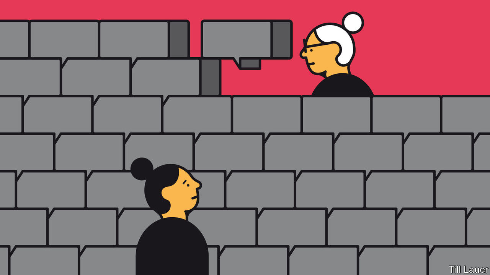

## Banyan

# Singapore has almost wiped out its mother tongues

> Elderly speakers of Cantonese, Hakka and Hokkien sometimes cannot talk to their own grandchildren

> Feb 22nd 2020

WHEN SANDY, a young Chinese Singaporean, learned that her grandmother was terminally ill, she signed up for a workshop in the Hokkien language run by LearnDialect.sg, a social enterprise founded to help Singaporeans communicate with the city-state’s older Chinese residents—including within their own families. Sandy is fluent in English and Mandarin, the official “mother tongue” of Chinese Singaporeans. Her grandmother spoke little of either. Before she died, Sandy thrilled her by asking in Hokkien, “What was your childhood like?” She was even able to understand some of the answer.

Their language barrier was the product of decades of linguistic engineering. English has been the language of instruction in nearly all schools since 1987, to reinforce Singapore’s global competitive edge. But, depending on ethnicity, pupils study a second language—typically Mandarin, Malay or Tamil. These are intended, as Lisa Lim of the University of Sydney puts it, to add “cultural ballast” vis-a-vis English. In the case of Mandarin, its acquisition has been reinforced by the government’s annual “Speak Mandarin Campaign”, started in 1979.

Mandarin is a standardised version of the language spoken by the people of the vast plains of northern China. Yet hardly any of the Chinese from whom Singaporeans are descended hailed from there. They came instead from the southern provinces of Fujian, Guangdong and Hainan, and so spoke different languages: Hokkien, Cantonese and Hakka, along with two Hokkien-related tongues, Teochew and Hainanese.

The Speak Mandarin Campaign sought to destroy Chinese Singaporeans’ real mother tongues, first by demeaning them as provincial “dialects” of Mandarin when they are in fact mutually unintelligible languages as different as English, German and Danish. Lee Kuan Yew, Singapore’s founding father, who started learning Chinese in his 30s, promoted the now discredited notion that humans have a tightly limited capacity for language: Hokkien and all the rest undermined the official bilingualism by hogging chunks of children’s memories. Further, the great tidier disliked the diversity embodied in these languages and wanted to forge a single Chinese identity—reason enough to foist on Chinese Singaporeans an alien language. Lee also thought that China’s opening promised riches to those who could speak its official language.

So dialects were disparaged. In the early 1980s television and radio programming in these languages all but disappeared, cutting many people adrift. “To speak dialect with your child,” the government warned, “is to ruin his future.” By the campaign’s own yardsticks, the success is striking. The use of Chinese vernaculars at home has collapsed, from 76% of Chinese households in 1980 to 16% in 2015. Over the same period, the use of Mandarin rose, from 13% of Chinese households to 46%. But the linguistic engineering has had an unintended consequence: the use of English is now increasing faster, especially among younger families: over 70% of households with children at primary school use it as their main language, undermining Mandarin and vernaculars.

And so a debate about the costs of language policies has grown since Lee’s death in 2015. The same year, the 50th anniversary of the nation’s founding was accompanied by an outpouring of sentimentality over Singapore’s roots. These days officials are a bit readier to tolerate Singapore’s linguistic variety. Lee Kuan Yew once called Singlish, the country’s vibrant mash-up of English, Malay and Chinese vernaculars, a “handicap”. Lee’s son, the prime minister, Lee Hsien Loong, claims to be proud of Singapore’s unique form of Mandarin. For instance, the Malay for “market”, pasar, has been imported as ba sha. That would be unintelligible to a mainland Chinese. Yet that only highlights a paradox Mr Lee does not acknowledge. On the one hand, he praises Singaporean Mandarin because it supposedly reinforces a Chinese Singaporean identity. On the other, he frets about others stealing a march in China because of their more fluent Mandarin.

Meanwhile, younger Singaporeans are embracing former mother tongues. Ski Yeo and Eugene Lee were motivated to found LearnDialect.sg upon seeing an elderly Cantonese-speaker in a nursing home struggle to communicate that she was cold. Health workers have signed up to their courses, while others want to say the right things at family gatherings over the lunar new year. There is an uptick in Hokkien television programming. And everyone admits that effete Mandarin is useless for swearing.