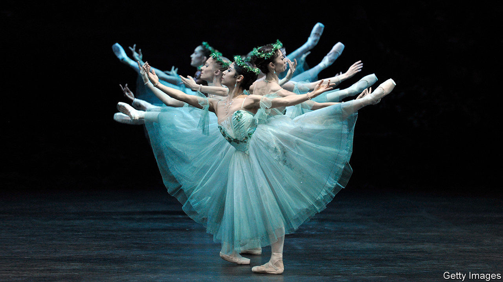

## Points mean prizes

# Britain’s post-Brexit immigration rules worry business

> Ballerina with a PhD? Come on in

> Feb 20th 2020

BRITAIN NEEDS more ballerinas, biochemists and welders—but only “high integrity pipe welders” with at least three years’ experience. These are among the occupations which appear on the official “shortage occupation list” (SOL), which is central to the government’s planned new immigration rules.

The new system will treat migrants equally, regardless of where they hail from. Europeans will no longer benefit from freedom of movement, but the bar to entry from the rest of the world will fall: prospective migrants will require the equivalent of A-levels, not degrees. The government claims it will let in more talented folks while reducing total numbers.

The plan was billed as a “points-based system”, but it is not as flexible as that implies. Most migrants will need to speak English and have a job offer with a prospective salary of more than £25,600 ($33,245). Exceptions to the threshold will only be made for brainiacs with PhDs and those with jobs on the SOL. English-speaking ballerinas with a doctorate are in luck.

Firms have welcomed the removal of a cap on migrant numbers, the opening up of routes for skilled workers and the lowering of the £30,000 salary threshold initially mooted. But they fret about shortages in some industries. The unemployment rate is just 3.8% and there are more than 800,000 unfilled job vacancies in Britain. Firms worry about cutting off the flow of lower-skilled European migrants at a time of what looks like full employment.

A recent report by The UK in a Changing Europe, a think-tank, estimated that the combination of nixing freedom of movement and adopting a relatively liberal scheme for skilled workers would cut overall net migration by only around 35,000, from the current 212,000. Work by the government’s own Migration Advisory Committee (MAC) found that the new rules would slightly reduce overall GDP but marginally increase GDP per head. Fewer unskilled workers might put some upward pressure on wages but the minimum wage, which is now the seventh highest out of the 27 members of the OECD that have minimum wages, has more effect.

Those who employ a lot of low-paid EU workers are troubled. The IPPR, a think-tank, reckons that 66% of the current EU workers in health and social care and 85% in hotels and hospitality would be ineligible for visas under the new system. The government hopes to encourage British people back into the labour market to meet the need. Priti Patel, the home secretary, argues that “we have over 8.45m people in the UK aged between 16 and 64 who are economically inactive”. But most of them are studying, retired, sick or looking after family. Only 1.9m say they want a job.

Britain’s farmers are concerned for next year’s harvest. Although the government announced that this year’s seasonal worker scheme will be expanded from 2,500 to 10,000 places, no commitment has been given for 2021. Picking soft fruits such as strawberries is tricky to automate.

But the impact of the changes will spread beyond low-skilled, low-productivity sectors. Manufacturing bosses in the north and the Midlands, where skilled technicians often earn below the £25,600 threshold, worry that the new rules will make it easier for firms in the south-east, where technicians tend to earn over the threshold, to expand. That is hardly what a government committed to “levelling up” wants to see. Businesses also worry about the costs of becoming registered as employment-sponsors, which firms that only employ EU workers are not currently required to do.

Under the new system an A-level qualified entrant with good English and job offer at £21,000 would score only 50 points, but if their role was on the SOL they would hit the required 70. So many businesses are now likely to start lobbying the MAC to get themselves covered. A liberalising measure risks generating more bureaucracy. ■