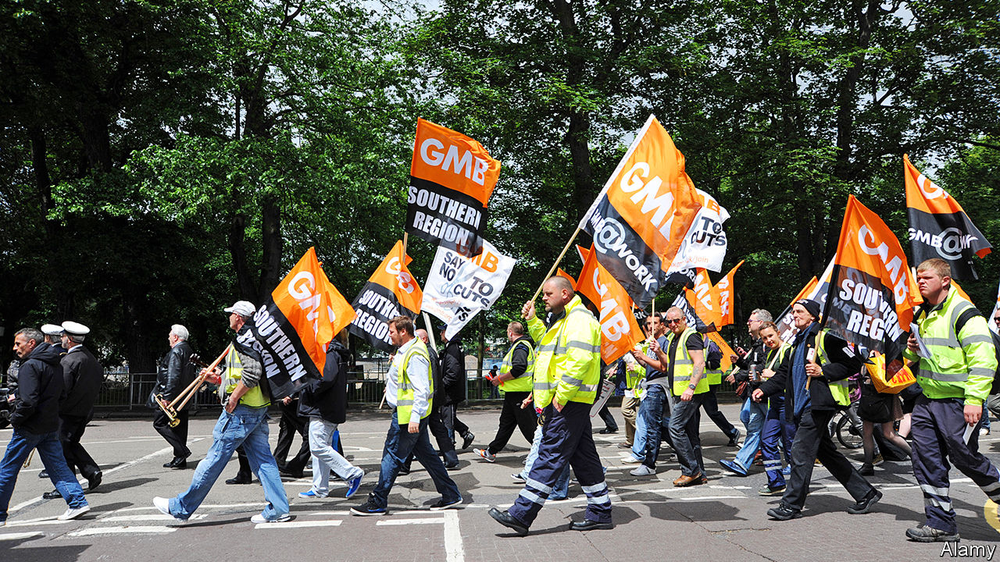

## Uncomradely behaviour

# With money tight, competition between Britain’s unions is getting dirty

> Why attract new workers when you can just poach your rivals’ members?

> Feb 20th 2020

IN A NORTH LONDON supermarket, rival trade-union officials are caught in a bitter feud. A representative from Usdaw, the shopworkers’ union, has been running up against Unite organisers, whose desperation for members has reached boiling point. “I was recently asked by a Unite rep to not come into ‘their’ store to help out an Usdaw member,” says the Usdaw shop steward. “I just laughed and gave out a load of membership forms—apparently we got about 50 people to sign up!”

For a sector that prides itself on solidarity, competition between trade unions has become downright uncomradely. There are now 6.4m union members in Britain, representing less than a quarter of all workers, and down from a peak of 12m in the early 1980s. Tougher rules on organising—including a 50% turnout requirement for strike ballots—make it harder to win the goodies that attract new members. Many workers do not see the benefits of unionising, and competition for those that do has become increasingly fierce.

Feuds usually remain behind closed doors. When one goes public, it can take longer to resolve. Last year, Unite-backed bin workers in Birmingham went on strike over allegations that secret payments had been made to non-striking staff represented by GMB, a rival outfit. As rubbish piled on the streets, the unions did battle through frantically typed press releases. GMB argued that the accusations about payments were “nothing short of a grotesque slur”.

GMB, the country’s third-biggest union, faces competition on numerous fronts. It claims the National Education Union (NEU) is poaching teaching assistants which it has no ability to negotiate for. “We are concerned that our members are being used as cannon fodder by the NEU,” says one official. “There has always been a degree of intra-union conflict,” he adds, but “now some unions are getting desperate.”

The Trades Union Congress, which arbitrates disputes, admits it is buckling under the weight of petty squabbles. Calming down infuriated officials has “become a full-time job,” sighs a senior bureaucrat. The organisation’s guide to disputes is a 44-page document, of which two pages are devoted to disputes with employers and the rest to disputes between unions. The Usdaw shop steward complains that the problem for the labour movement, “is the overzealous reps that don’t realise we’re on the same side.”

In theory, the “Bridlington Principles”, drawn up by union bosses in a Yorkshire hotel in the 1930s, are supposed to restrain overzealous types. In practice, “greenfield organising”—the recruitment of entirely new members—is expensive and time-consuming. Poaching members from other unions is more straightforward, since the work of selling them the benefits of trade union membership has already been done and, best of all, someone else has paid for it. As a result, few pay much attention to rules drawn up 80 years ago. One union official explains that rivals will watch individual branches for signs of division so they can then step in and recruit en masse. “If there is a ballot and it’s a 60-40 split,” he says, “then the 40% who voted against that might be open to switch sides”.

Competition has only increased as the sector has become more concentrated. A series of mergers has blurred traditional boundaries between job-specific unions. In education two of the previous three big players combined in 2017 to form the NEU. Unite, Britain’s largest union, was formed by a merger of the Transport and General Workers’ Union and Amicus, which represented high-skilled workers. Like many “super-unions”, its revenue has flatlined over the past five years despite growing spending. And these behemoths now worry about disruption from smaller, tech-savvy outfits like the IWGB, which was founded in 2012 and recruits members working in the gig economy.

The hope was that politics would come to the rescue. Trade unions poured money into the Labour Party before the general election. Unite alone gave £3m ($4m) during the campaign, and regional branches were told to get door-knocking. Union bosses expected that Jeremy Corbyn would make their life easier once in Downing Street. Indeed, the Labour Party manifesto promised looser restrictions on strikes and a new ministry responsible for “employment rights”, which would roll out collective bargaining across the economy. But the British public failed to deliver a Labour government, and the socialist nirvana was put on hold. Unfortunately for exhausted union reps, that means there are probably many more feuds to come. ■

## URL

https://www.economist.com/britain/2020/02/20/with-money-tight-competition-between-britains-unions-is-getting-dirty
