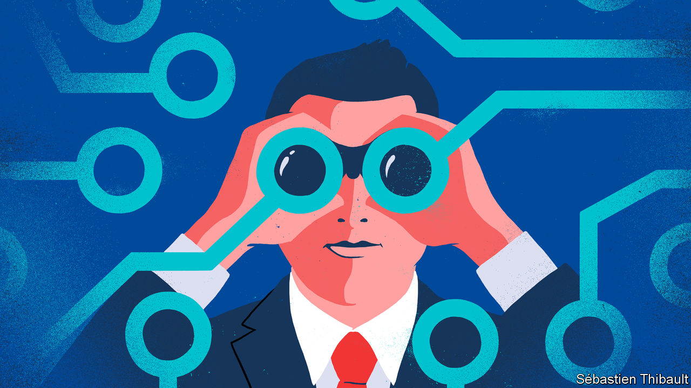
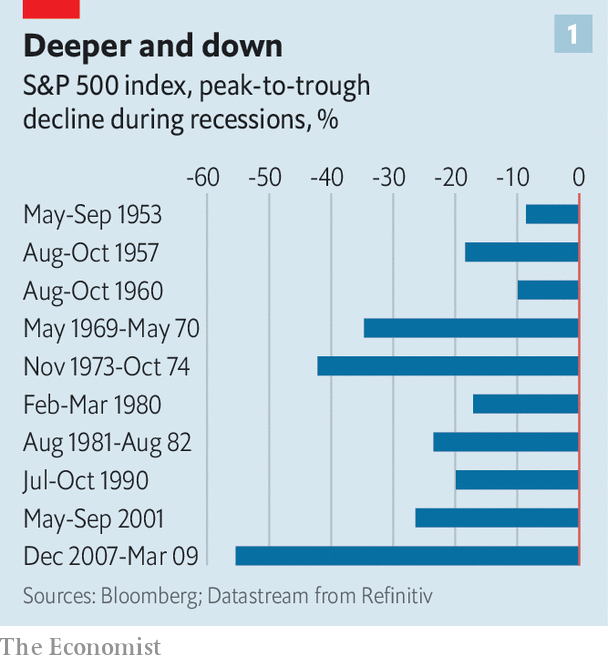
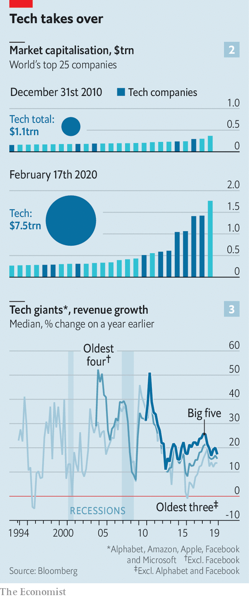
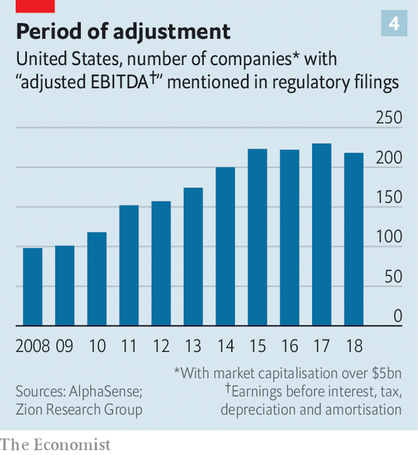

## Downturn, disrupted

# Business and the next recession

> When economies change, so do recessions. What will the next one look like?

> Feb 20th 2020PARIS

CAST YOUR mind back to 2007. Flashy types were showing off their first-generation iPhones. Netflix sent DVDs through the post for people who did not have the time to drop into a branch of Blockbuster. The biggest firms in the world were old-economy stalwarts such as General Electric and Royal Dutch Shell. Myspace ruled online. That seemingly distant era was when America, followed by Europe and most of the rich world, last fell into recession. Since then the way people buy products, entertain themselves, move around and borrow money has altered and in some cases been revolutionised by a mighty band of global technology titans.

“The composition of the economy has changed since 2007, and hence so will the nature of recessions,” says Douglas Elliott of Oliver Wyman, a consultancy. Working out the impact of the next recession is important because one is on the way, sooner or later. Past recessions have been costly. The Economist calculates that in the most recent downturn 11m people lost their jobs in rich economies and profits of big listed firms in Europe and America dropped by 51% and 30%, respectively. Stockmarkets always take a battering when the economy turns (see chart 1). Recessions matter to governments and central banks, which must work out how to respond, and to firms and investors, because downturns sort the wheat from the chaff. In the past three recessions the shares of American firms in the top quartile of each of ten sectors rose by 6% on average, while those in the bottom quartile fell by 44%.

In some important ways the corporate world looks similar to the picture in 2007. American firms are big earners, with corporate profits steady at 8.5% of GDP, and many industries are relatively highly concentrated. In Europe profitability and concentration remain lower. As in 2007, Western firms remain highly globalised despite the trade war. Big listed firms in America make 31% of their sales outside their home market, while for large European companies the figure is 53%.

Much has also changed. First, the digital world is more dominant. An economic bounceback has fuelled the rise of global tech giants that have disrupted incumbents in retail, taxis, hotels and many other businesses. The example of tech upstarts has seeped through to non-tech firms, which are now more asset-light. Managers have shifted IT spending from buying servers to renting them through the cloud, for example. The second change is that bosses may have less room to cut costs. Third, some firms have heaped on debt and engaged in accounting puffery, increasing what John Kenneth Galbraith, an economist, called “the bezzle”: money no one is aware has gone missing. Boom times paper over cracks, for instance by allowing firms to delay writing down the value of misfiring acquisitions.

Start with the first change, the rise of digital technology. The most visible difference is in the nature of the largest firms: seven of the ten most valuable firms in the world are now tech outfits, up from two in 2010 (see chart 2). In America the top five —Alphabet, Apple, Amazon, Facebook and Microsoft—account for 13% of the profits of S&P 500 firms. This is forecast to rise to about 20% in five years’ time. At less than 5%, their share of S&P 500 employment is small but they have become America’s largest investors, ploughing $189bn into the economy last year (including research and development), equivalent to 17% of investment by big publicly listed companies.

How the tech giants weather a recession is thus of great importance. Investors may view these firms as impregnable, but they are heavily exposed to revenues that are cyclical (see chart 3), including advertising, consumer spending and business IT spending, which were all sensitive to the economic mood in the pre-digital age. Novel business models may offer some protection. Perhaps Facebook users will spend more time online if they lose their job? Maybe advertisers will slash spending on TV, newspaper and billboard advertising before taking the knife to digital spending.

There is evidence that the pain could be acute. In downturns in 2000-02 and 2007-08 sales growth at Amazon and Microsoft slowed sharply. Smartphone sales have already slowed. A recession may see consumers hanging on to devices for longer rather than trading up to the newest handset. Fortress balance-sheets offer a measure of safety: the big five tech firms have $270bn of net cash.

Beyond the giants, insurgents have emerged. Airbnb and Uber have turbocharged the matching of buyers and sellers. Financial innovators such as LendingClub and SoFi facilitate millions of loans by connecting people who need money with those with some to spare. Subscription offerings have flourished, delivering anything from ready-made meals to makeup. For many this will be their first downturn; for some it may be their last.

Not all will be hit as badly as might be expected. A recession in Brazil in 2015-16 hit demand for Uber rides hard, but higher unemployment meant more cash-strapped drivers were available, reducing costs and improving service. Likewise a downturn could help Airbnb win market share from hotels if it means more people make their homes available for rent in search of cash. A crisis may not so much impact tech companies as accelerate the decline of the “old”, non-digital economy.

The tech darlings that look most vulnerable are those that offer “micro-luxuries”: discretionary spending consumers can quickly forgo. Expect Deliveroo (food delivery), Bird (electric-scooter rentals) and Peloton (subscription exercise bikes) to feel the pinch. Those with high fixed costs will be especially exposed as demand falls. WeWork, a tech-tinged property firm, is committed to $47bn of lease payments over the next 15 years or so. Such firms may not be good at retreating. “If you’re a 30-year-old tech founder, who has never been through a recession, you think things grow forever. Cutting costs isn’t part of your playbook,” says Tom Holland of Bain, another consultancy.

While it is not Silicon Valley’s forte, ruthless cost-cutting has always been part of the playbook for companies outside the tech industry when the economy slumps. In the last recession the labour costs of American firms dropped by 7% in total as they laid off workers and squeezed wages to protect shareholders and avoid default.

Room for manoeuvre is now more limited. In some cases this is because cost structures have changed. Over $200bn of annual corporate IT spending, for example, has shifted to cloud-computing providers such as AWS and Microsoft. Costs that used to come in lumps (on a big server once a decade) now arrive as a quarterly bill for software-as-a-service. This could help. If a firm is going bust it may find it easier to pay its cloud bill than to flog unwanted hardware. But firms are losing flexibility to preserve cash by delaying capital spending.

Meanwhile the social context has shifted. In 2019 the heads of 181 of the largest firms in America said they shared a “fundamental commitment” not just to their owners but to their customers, employees, suppliers and communities, too. Many CEOs privately regard these kinds of declarations as decorative fluff. This will be tested in a downturn as laying off workers and outsourcing jobs abroad come under more political fire. “You don’t want to be seen firing people, especially if you’re still profitable,” says one European boss. “It will be more of a last resort. We may have to take a bit more pain before announcing lay-offs.”

The final change is that a long period without a downturn has encouraged bad habits that mean some firms are too indebted, or are hiding nasty secrets. Such problems are usually spotted once it is too late to fix them. The Asian crisis of 1997 featured crony-capitalists crippled by debt-currency mismatches; in 2000-01 it was imploding dotcom firms and frauds at Enron and WorldCom; and in 2007-09 banks built on rotten foundations crumbled.

Predicting these fiascos is hard but there are some general warning signs. After a long bout of dealmaking, goodwill (the difference between what the acquirer pays for a target and its book value) is at a record high of $3.6trn for S&P 500 firms. This can indicate trouble. In 2000-01 and 2007-09 firms made huge goodwill write-offs as they confessed to dodgy deals.

In America 97% of firms in the S&P 500 in 2017 presented at least one metric of their performance in a way that was inconsistent with Generally Accepted Accounting Principles, or GAAP, up from 76% before the last downturn, according to Audit Analytics, a consultancy. The number of large American firms mentioning “adjustments” to profits has more than doubled since the last recession (see chart 4).

Over 60% of American mergers and acquisitions were financed last year with loans that include “add-backs”, a rapidly rising accounting phenomenon. These allow buyers to ignore inconvenient expenses more or less at will, for example by assuming merging firms will successfully cut costs once combined. Loan documents are drawn up using the fiddled profit figures as a baseline.

Often the losers are firms with too much debt. If a recession is triggered by rising interest rates they get hit just before the downturn begins and again once it is in full swing, as sales slide and they struggle to meet interest costs or refinance loans. Since 2007 overall corporate debt has risen. In Europe non-financial corporate debt now stands at nearly 110% of GDP, compared with under 90% in 2007. In America businesses are now borrowing more than households for the first time since 1991.

Much of the money has gone to companies with far less ability to repay their current debts, let alone when a downturn strikes. In the rich world one in eight established companies makes too little profit to pay the interest on their loans, let alone the principal. That is up from one in 14 in 2007, according to the Bank for International Settlements. A recession half as bad as the 2007-09 slump would result in $19trn of corporate debt—nearly 40% of the total—being owed by such straitened companies, according to the IMF. Janet Yellen, a former chair of the Federal Reserve, has warned that “if we have a downturn in the economy, there are a lot of firms that will go bankrupt, I think, because of this debt. It would probably worsen a downturn.”

Optimists argue that the structure of debt has become more flexible. Banks are in better shape thanks to new (albeit largely untested) regulations enacted since 2008, and so should be able to keep lending if the economy sours. Businesses have been able to secure loans with fewer strings attached, for example if they look like they may struggle to repay the money. In America, businesses now borrow increasingly from lenders outside the banking system, such as the private offices of rich families, or pension funds. These, some say, can knock heads together quickly and help firms recover. It is best to take such statements with a pinch of salt. A mini-panic in late 2018 saw the price of many private-debt instruments plunge, suggesting the system is fragile.

Who will be the winners? Every recession has them. Warren Buffett picked up assets on the cheap in 2007-09, while JPMorgan Chase cemented its place as America’s leading bank as the industry retrenched. Firms that thrive in downturns tend to have the clarity of purpose and financial muscle to keep investing and growing as others pull back, says Martin Reeves of the BCG Henderson Institute. It is a test of management and culture but also requires strong balance-sheets: 15% of firms in the S&P 500 have more cash than debt, including Apple and Monster Beverage. Investors with money are watching and waiting. The private-equity industry has some $2trn of cash. Mr Buffett sits on $128bn.

A recession will come, eventually. When it does it will batter companies that have been sustained only by low interest rates. The churn as those businesses are sold, restructured or dissolved will extract an economic and human toll. Recriminations will fly, then abate. In time, the more productive firms that survived will think of ways to invest money profitably. That will lead to new jobs, then economic growth, then exuberance—and the cycle will start all over again. ■

## URL

https://www.economist.com/business/2020/02/20/business-and-the-next-recession
