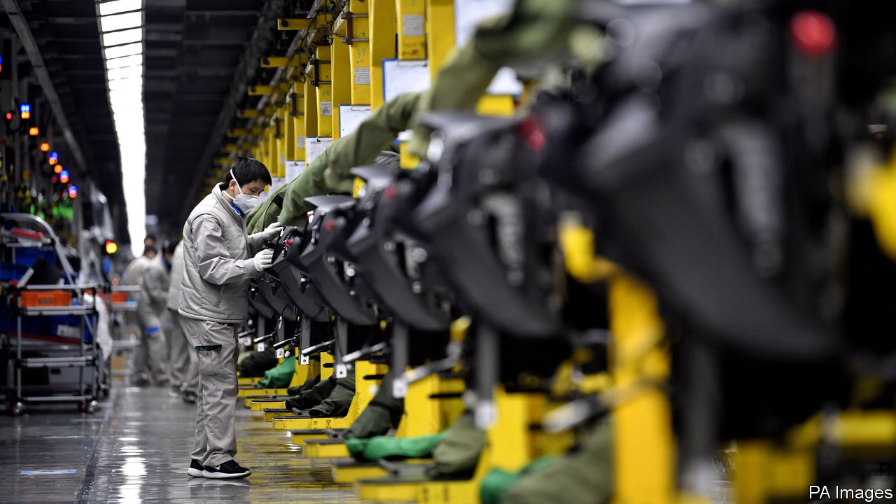

## A force to be reckoned with

# Chinese firms use obscure legal tactics to stem virus losses

> The virus has led to firms trying to get out of contracts

> Feb 22nd 2020NEW YORK

“IT IS GOING to be an almighty legal mess for months and years to come.” That grim prognosis of the potential legal and business consequences of the viral outbreak in China comes from a veteran of the country’s business scene. Dan Harris of Harris Bricken, an American law firm, worries that today’s trickle of mainland suppliers declaring force majeure (FM), an obscure legal manoeuvre used to get out of contracts, could turn into a tidal wave.

The crisis has certainly put many firms in a bind. If this were a normal year, most factories would have shut for a week or so in early February so that migrant workers could return to their villages to celebrate Chinese new year. By now, plants would be roaring at full capacity. But because of a lockdown of a large area around Wuhan, the outbreak’s centre, and ongoing restrictions on travel, workers are only slowly trickling back. Morgan Stanley, an investment bank, reckons that production may reach only 60% to 80% of normal levels by the end of February.

The result is that the supply chains of global firms, which often rely on “just in time” deliveries of stocks, are being disrupted. Chinese buyers of imported commodities are also hurt, thanks to weak local demand. Nomura, a Japanese bank, thinks Chinese year-on-year economic growth could plunge to 3% in the first quarter, down from 6% the previous quarter.

China Inc is panicking. Firms are starting to invoke FM to avoid paying non-performance penalties on contracts. On February 17th, the China Council for the Promotion of International Trade (CCPIT), an official body, revealed that it has already issued over 1,600 “FM certificates” to firms in 30 sectors covering contracts worth over $15bn. These give official support to its invocation. More are likely to come.

All this raises several questions. First, since this clause typically refers to “acts of God” like earthquakes and hurricanes, does it really apply to an epidemic probably caused by humans eating exotic animals and to the heavy-handed government response to it? Second, even if deemed relevant, will FM really work in practice? And finally, is a lengthy legal tangle inevitable?

On the first question, common sense suggests no but precedent and officialdom say yes. David Buxbaum of Anderson & Anderson, a lawyer who has worked in China since 1972, reports that some suppliers successfully invoked FM in local courts in the wake of the SARS virus outbreak of 2003. On February 10th, the National People’s Congress ruled that policies implemented to control the virus (such as production curbs and city lockdowns) that interfere with contracts should be considered FM.

On whether invoking this clause will really work, legal opinion is divided. Many trading contracts fall under international jurisdictions less friendly to this claim than China with courts not overly impressed by FM certificates. Earlier this month, CNOOC, a Chinese state-run oil firm, invoked FM in refusing to accept a shipment of liquefied natural gas from Royal Dutch Shell and Total—a claim rejected by the European oil giants. Traders whisper that mainland firms are using the viral outbreak to try to renegotiate terms, a tactic they deride as “price majeure.”

“FM is a recognised doctrine in civil-law systems like that of China but is not a doctrine of common-law systems, like English law,” observes Simmons+Simmons, a British law firm. It is typically only respected by courts in London and Hong Kong if the contract has a specific FM clause. So local firms are likely to get a more sympathetic hearing in mainland courts. Mr Harris thinks that even if a foreign firm gets a favourable ruling overseas, it may still need to get it enforced by a Chinese court. That court will see the FM certificate and likely rule for the mainland firm.

Tobias Larsson of Resilience360, a German supply-chain consultancy, thinks that invocation of FM could help make the fallout from the virus the “biggest supply-chain disruption since Japan’s earthquake.” Mayer Brown, an American law firm, worries that use of FM and other legal tactics “may be passed along supply chains around the world, causing firms based in other jurisdictions to seek similar relief.”

Still, there is a reason to think legal chaos might be avoided. Unlike during the SARS epidemic, when multinationals could easily shift sourcing, Chinese firms are now critical (and sometimes the only) suppliers of vital parts to many industries. John Hoffecker of Alix Partners, a consultancy, says that his clients are more concerned about being the first to receive parts as factories restart than about FM. So foreign bosses may agree to renegotiate terms with certificate-waving vendors through gritted teeth rather than risk losing them altogether through bitter legal battles.■