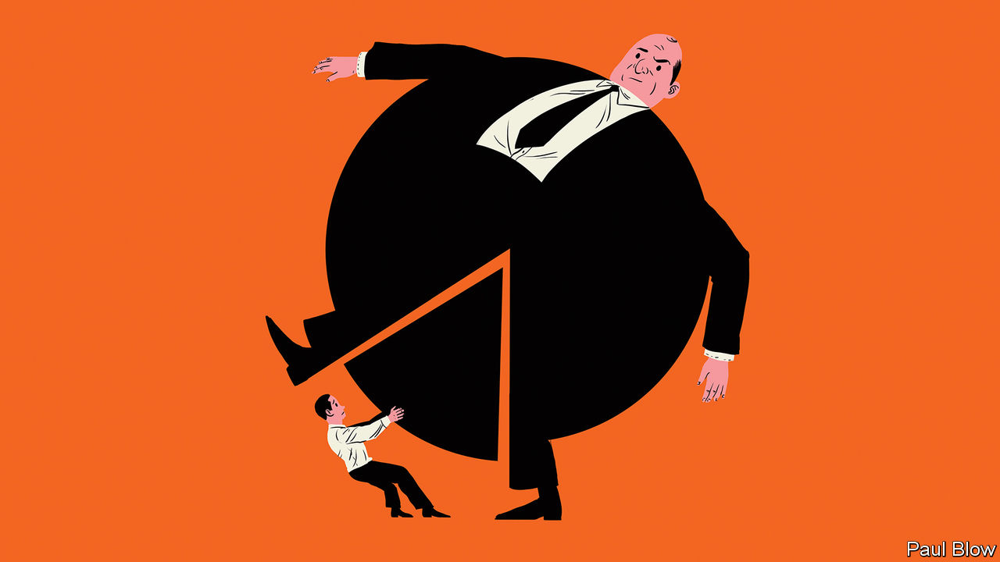

## Cutting the pie

# Executives are rewarded handsomely

> Is there a better way of dividing the corporate spoils?

> Feb 20th 2020

ONE OF THE issues at the centre of the debate about inequality is the meteoric rise of executive pay. The ratio between the pay of American CEOs and ordinary workers rose from 20:1 in 1965 to 278:1 in 2018, according to the Economic Policy Institute, a think-tank. The London Business School (LBS) recently held a conference on what caused the rise, and whether it is justified.

At the conference, Dirk Jenter of the London School of Economics pointed out that the pay of chief executives in America was largely flat between the 1940s and the 1970s. It then rose spectacularly in the 1980s and 1990s before flattening out. What changed in the 1980s was that executive rewards began to be more focused on company performance and share options. The performance-related element rose from 16% of executive salaries in the 1970s to 26% in the 1980s and 47% in the 1990s.

This shift coincided with the great equity bull market of the 1980s. As Western economies recovered from the stagflationary problems of the 1970s, shares were repriced. The cyclically adjusted price-earnings ratio (a measure which compares share prices with a 10-year average of profits) rose from less than 9 at the start of 1980 to 44 in 1999. Little wonder that executives with share options made out like bandits. But was this down to their skill, or to the policies of Alan Greenspan and Ronald Reagan?

Most investors were doing extremely well during this period, so executive pay seemed a matter of little consequence to them. Even now, if CEOs were to work for free, this would not represent a huge boost to shareholder returns. Average CEO pay of S&P 500 companies in 2018 was $14.5m, meaning that executives collectively took home $7.25bn. In contrast, the companies they worked for returned $1.26trn to investors in dividends and buy-backs that year.

The principal-agent problem plays a key role. Most shares are owned by professional investors who work for big fund-management groups and are well paid themselves. They have little incentive to demand big changes in pay structure, unless salaries look particularly egregious.

The underlying investors—ordinary savers—have not always done so well. Take, for example, members of corporate pension funds. Stockmarket gains have not been shared equally with them. When share prices were booming, many companies stopped making pension-fund contributions. Then in the 2000s, when markets fell and the cost of funding final-salary pensions soared, companies closed such schemes and switched to “defined contribution” plans. These are much less generous to workers. It is not just that workers’ pay has not kept pace with that of executive remuneration over the past 40 years; their pension rights have deteriorated.

A broader justification for high CEO pay might be that businessmen have been able to make their companies more efficient and thus transform economic growth. However, the fastest period of economic and productivity growth in the Western world was in the 1950s and 1960s when CEO pay was much lower than it is today. As CEO pay has rocketed, productivity growth has slowed down.

In a thoughtful new book, “Grow the Pie; How great Companies Deliver Both Purpose and Profit”, Alex Edmans of LBS argues that the wealth accrued by a boss does not necessarily come at the expense of others. “Visionary leaders can transform a company, growing the pie for the benefit of all” he writes.

This makes perfect sense at the level of the individual firm but is it true in aggregate? Executives may have prospered since 1980 but this has not always trickled down to workers. Real median household income in America grew at an average annual pace of just 0.5% between 1979 and 2016, before taxes and transfers.

Mr Edmans’s view of pie-growing is nuanced. He advocates an approach to business with the primary aim of creating value for society. Profits are not the main goal but a welcome side effect.

It is not pie in the sky. Mr Edmans conducted research about the companies ranked the “best to work for”, a measure of whether firms are looking after the interests of employees as well as investors. Shares in the firms with the best rankings outperformed in subsequent years, even when controlling for factors like business size and industrial sector.

It is still going to be a big challenge to persuade companies to reward their executives on the social value they add. If that ever happens, the list of best-paid CEOs might be a completely different from the one today.