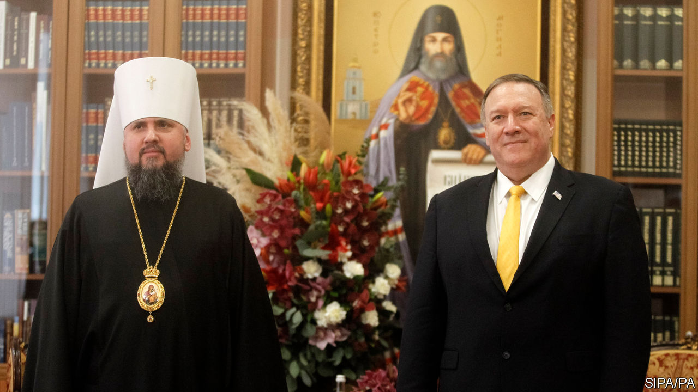

## Thundering canons

# An Orthodox Christian schism in Ukraine echoes around the world

> A Kiev-Moscow split ropes in Washington, Athens and Jerusalem

> Feb 20th 2020

ORTHODOX CHRISTIANS across the globe are bracing themselves for the Lenten fast, a seven-week period of vegan fare and prayer that starts on March 2nd. But few expect this annual ritual to close the rift that runs through eastern Christendom. A dispute that flared a year ago over the proclamation of an independent church in Ukraine has ricocheted across all the other countries where Orthodox Christianity is practised. Diplomats in Moscow, Washington and elsewhere are watching, because behind the arcane arguments over history and canon law lies a geopolitical standoff.

From the beginning, President Vladimir Putin and his supporters have denounced the new Ukrainian body as an encroachment on Russia’s spiritual sphere of influence and a machination of American diplomacy. The United States backs Ukraine’s right to ecclesiastical independence. Mike Pompeo, the American secretary of state, made a point of meeting the new Ukrainian primate, Metropolitan Epifaniy, when visiting Kiev on January 31st. Both deplored religious persecution in Russian-controlled bits of Ukraine and laid flowers in memory of slain Ukrainian soldiers.

The global row formally pits Bartholomew I, the Istanbul-based Patriarch of Constantinople who inaugurated the new Ukrainian body, against Patriarch Kirill of Moscow. The former has a historic role as “first among equals” in the Orthodox world; the latter boasts geopolitical heft. Bartholomew insists that he is the only legitimate Orthodox authority in Ukraine.

Both camps have had successes and disappointments as they work to influence the remainder of the Orthodox world. In a boost for Bartholomew, the churches of Greece and the Patriarchate of Alexandria, which is responsible for Africa, have followed his line over Ukraine and incurred the wrath of Moscow. Bishops in the ancient church of Cyprus are divided.

Russia seemed to score a point by inducing the Patriarch of Jerusalem, a Greek, to invite his fellow primates to a deliberation in Jordan scheduled for February 26th, in open defiance of Bartholomew. But the invitation has had fewer takers than expected, and most of the world’s senior ethnic Greek hierarchs will probably stay away. Prelates closer to Moscow, such as those in Belgrade and Damascus, are more likely to attend.

In the background is a chill in relations between Russia and Greece, whose common Orthodox faith has served over the centuries either as a bond or a point of competition. Recently, Greece has been disappointed by Russia’s pragmatic dealings with Turkey, including arms deliveries, and has drawn much closer to America and Israel in energy projects and military matters.

Greece’s foreign minister, Nikos Dendias, insisted on February 6th that efforts were being made to mend ties with the Russians, but he also ruffled their feathers by noting the persistence of their medieval aspiration to be the Third Rome (that is, the guardian of Christian dogma in succession to Rome and Byzantium). Meanwhile Moscow’s embassy in Greece this week complained that America is sponsoring a “schismatic construct” in Ukraine that is dividing the Orthodox family.

Russo-Greek rumblings are affecting parts of Greece where pious Russians venerate holy sites. The Patriarchate of Moscow has published a list of Greek dioceses, including Athens, which Russian pilgrims have “no blessing” to visit. These are the areas whose local bishops have signalled support for the new church in Ukraine.

In Ukraine itself, some ordinary churchgoers feel less passionate about the split than their spiritual masters do. A recent poll (excluding the Russian-held areas) found that 34% of Ukrainians identify with the new independent Orthodox church and 14% with the Moscow-aligned one. Another 28% say they are simply Orthodox and refuse to pick sides. ■

## URL

https://www.economist.com/europe/2020/02/20/an-orthodox-christian-schism-in-ukraine-echoes-around-the-world
