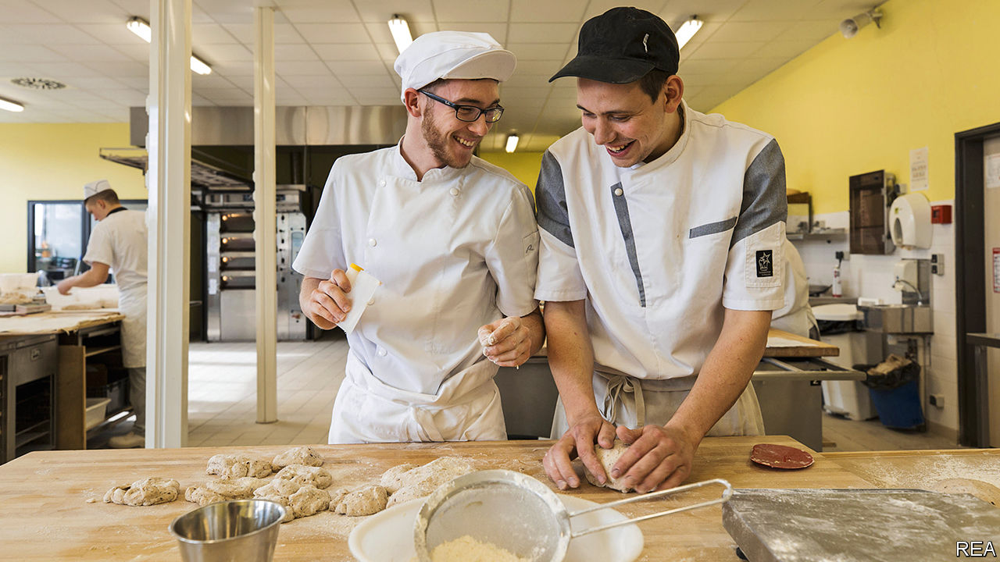
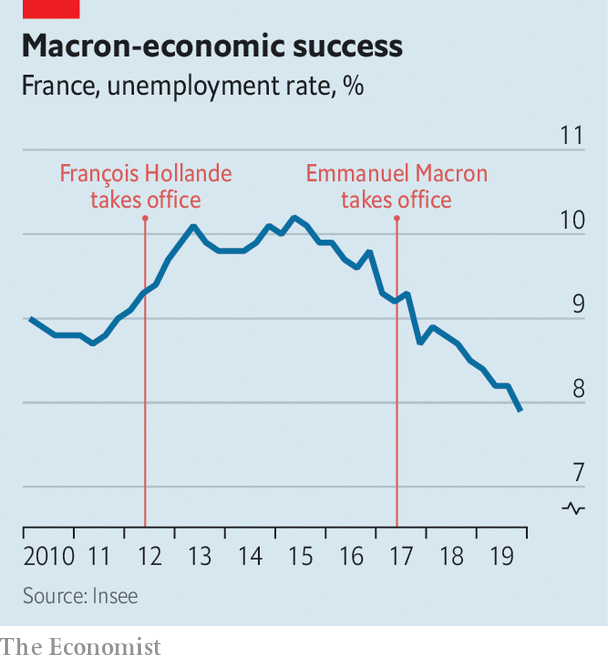

## The president’s paradox

# Emmanuel Macron’s reforms are working, but not for him

> Unemployment in France is falling. So are the president’s poll ratings

> Feb 20th 2020SEINE-SAINT-DENIS

A BROAD GRIN spreads across Aboubacar Koumbassa’s face as he displays the result of his morning’s class: a tray of oven-hot pains-aux-raisins (currant pastries), which he and his classmates have baked for the first time. The 18-year-old, in a white chef’s cap and apron, had originally hoped for an apprenticeship as an electrician. But it was easier to secure one at a bakery. He now spends one week in three in the classroom, travelling over an hour by train. The other two weeks he is learning on the job. “I made the right choice,” he says, carefully inspecting his pastry, “because this is teamwork. Here we learn the theory, and at my firm we are really working.”

Apprenticeships offer a much-needed path out of France’s highly academic school system and into the world of work. The Campus des Métiers, where Mr Koumbassa studies, lies in the Paris suburb of Seine-Saint-Denis, a neighbourhood of brutalist tower blocks with a poverty rate twice the national average. The centre trains some 1,400 apprentices, in subjects ranging from car mechanics and plumbing to hairdressing and patisserie.

On the building’s first floor, hairdressing students are practising basic trimming and advanced colouring techniques on plastic model heads. “Whatever your level, what matters is your motivation,” the teacher they call Madame tells them: “If you want to, you will succeed.” Downstairs in the workshop for apprentice electricians, Souleymane is wiring an electrical-lighting circuit. When asked what he was doing before his apprenticeship, he looks up and grins: “I slept.” The course, says his tutor, “really opens the door to jobs, and makes people feel valued in a way they were not at school.”

Traditionally, French educationalists have looked down on such vocational courses, which are open to pupils from the age of 16. Just 7% of young people are in apprenticeships in France, half the share in Germany. Last year, however, following a reform of the rules by Emmanuel Macron’s government, the total number of French apprentices increased by 16%, to a record high of 491,000. Anybody under the age of 30 can now apply. Part of the idea, said Muriel Pénicaud, the labour minister, was to change “negative stereotypes” associated with such contracts. She says that 70% of apprentices find jobs within seven months of completing their course.

Nearly three years after Mr Macron was elected president, the first results of his reforms seem to be coming through. Between 2017 and 2019, his government loosened labour-market rules to encourage hiring, redesigned professional training, expanded apprenticeships, and reworked benefit incentives to encourage the unemployed to return to work. These followed corporate tax cuts, a reduction in company payroll charges, and a big international marketing push, to persuade investors that France was open to business.

Since then, economic growth has been solid rather than stellar. French GDP grew last year by 1.2% (faster than in Germany), though it contracted in the fourth quarter. The French economy has been creating jobs and new businesses apace. In the year to September 2019, a net 260,000 jobs were created, up from 188,000 the previous year. Unemployment in the fourth quarter of 2019 fell to 7.9% in mainland France, its lowest level for 11 years.

French airwaves are no longer filled with relentless news of factory closures and redundancies. The number of new companies created surged to 815,000 in the fourth quarter of 2019, a 38% increase on the same period in 2017. Fully 84% of foreign investors now have a positive image of France, up from 36% in 2016, according to Ipsos, a polling group. Perhaps most important, disposable income grew last year by 2%, its fastest pace for 12 years.

Mr Macron can hardly take credit for all of this. France’s economy outperformed Germany’s partly because it is less export-dependent and more sheltered from trade volatility. One boost to growth was €17bn ($18.4bn) of income-support measures, implemented only as an emergency response to the gilets jaunes protests. Unemployment began to fall under the previous president, François Hollande. Much of the rich world is enjoying a jobs boom. Still, the turnaround is arresting. “The coincidence in timing between Macron’s labour-market reforms and the increase in job creation and the quality of jobs created strongly suggests they are a big part of the story,” says Philippe Martin, who heads the government’s Council of Economic Analysis.

All this should help Mr Macron improve his dismal approval ratings. Yet in January they fell another four points to 30%, according to Ifop, a pollster. The president has struggled to shake off a reputation for arrogance and for favouring the rich. His government has bungled the piloting of its last big domestic reform, that of the pensions system. Legislation to merge 42 regimes into a single system went to parliament on February 17th, even though its financing has yet to be agreed. Periodic strikes and protests continue.

Above all, Mr Macron has failed to craft a convincing and positive narrative around such results. It may be that his technocratic policymaking simply fits awkwardly with today’s debate. The birthplace of Enlightenment rationalism is proving as vulnerable as any country to distrust in facts, and to the populists who manipulate it. When INSEE, the official statistics body, unveiled the latest drop in unemployment, Marine Le Pen, a nationalist leader, tweeted: “What if we stopped lying to the French?” At a time when gut feelings trump bar charts, Mr Macron finds it hard to persuade people that his reforms are beginning to work. ■