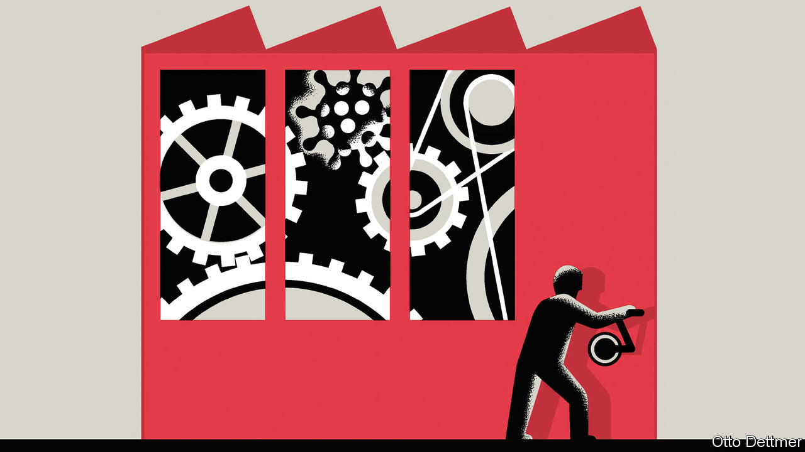

## Free exchange

# Covid-19 presents economic policymakers with a new sort of threat

> It mixes demand and supply effects

> Feb 22nd 2020

THE ONLY thing we have to fear is fear itself, or so reckoned Franklin Roosevelt. In many an economic downturn that is true—an anxiety-induced reluctance to spend is the main threat to prosperity. For now, the world is treating the outbreak of covid-19, a disease caused by a coronavirus that is now responsible for more than 2,000 deaths, as no exception. Central banks across Asia are easing monetary policy while governments prepare spending programmes to limit the economic damage.

Covid-19, however, is not a conventional economic threat. Efforts to contain the virus are limiting activity by shutting factories and disrupting supply-chains. Such shocks to supply are harder to manage than anxiety-induced frugality among firms and investors. When people stop spending, growth slows and inflation falls. But when supply is constrained, prices can accelerate even as the economy wobbles. Economists first grappled with supply shocks in the 1970s, when reductions in food and oil supplies ended three decades of unprecedented growth and ushered in “stagflation”. Supply shocks divided the profession. Predictably, there was a row over whether governments should prioritise fighting rising unemployment or high inflation. In a victory that would shape central banking for decades, the inflation hawks eventually won.

Like the oil and food shocks of the 1970s, the covid-19 epidemic poses an unexpected threat to a mainstay of global production. For as long as the mobility of Chinese workers is limited, shops, offices and factories in the world’s largest exporter will sit idle. As a result, firms dependent on supplies from China are running down inventories and curtailing operations. On February 17th Apple warned investors that supply-chain problems were limiting iPhone production and would reduce its revenues (see [article](https://www.economist.com//business/2020/02/20/apples-chinese-troubles)). Hyundai, a carmaker, has cut production in South Korea because of parts shortages. On February 18th Jaguar Land Rover, a British carmaker, said that it could start to run out of parts in two weeks’ time, and that it had flown in emergency supplies from China in suitcases.

But whether the understanding of supply shocks forged in the 1970s still applies is unclear. In practice, the distinction between shocks to demand and those to supply is fuzzy. In a paper published in 2013 that revisited the era of stagflation, Alan Blinder of Princeton University and Jeremy Rudd of the Federal Reserve argue that supply alone cannot explain the soaring unemployment of the 1970s. In fact, they say, price increases had demand effects that mattered more. They raised uncertainty, reduced households’ disposable income and eroded the value of their savings.

Subsequent experience supports this more nuanced view of the effect of supply shocks. Soaring oil prices in 2007 gutted household consumption in America and helped push its economy into recession. The earthquake, tsunami and resulting nuclear disaster that struck Japan in 2011 dealt a blow to Japanese industry which, like China’s, occupies important supply-chain niches. The catastrophe led to a sharp decline in output and exports (and a long-term shift in economic activity away from the most affected regions), but despite the disruptions Japan remained in deflation. Higher tariffs should, in theory, disrupt supply and boost prices. But to date the main economic effect of the trade war being fought by America and China has been dented confidence, derailed business investment and tumbling interest rates. The covid-19 outbreak is hitting China’s demand for commodities and its tourists’ travel plans. Both effects drag down global demand in a conventional way, as they did after the outbreak of SARS in 2003.

Circumstances today are also very different from the 1970s. Crucially, global inflation remains oddly subdued. That means policymakers can provide stimulus without exacerbating an ongoing inflation problem. Support seems warranted in China, where lost sales could give way to lay-offs, further cuts to spending, and a deep slump. Economies with close links to China are also moving, rightly, to shore up spending. Japan’s decision to raise consumption tax last year, a move that contributed to an annualised decline in GDP of 6.3% in the fourth quarter of 2019, looks spectacularly ill-timed in hindsight.

Should covid-19 sweep across the world, the global economy as a whole will surely need a dose of stimulus, much as China does today. The main complication then would be a lack of central-bank ammunition, as interest rates are already low. But even if the virus stays contained, governments of less affected countries could have their hands full. Policymakers facing temporary supply shocks must reassure the public that growth and inflation will eventually return to normal—as modern central banks now try to do when oil prices spike. Continued disruption, though, requires adjustment. New suppliers must be tracked down, new contracts written and new customers found. Frustrated firms could decide the time is right to wash their hands of China. The effects of such changes are hard to predict.

If China’s economy slumps further in response, it could exert a deflationary pull on economies in the West. But if decades of economic integration, which many economists credit with holding down global inflation for the past two decades, goes into reverse, then dormant price pressures could awaken. Macroeconomic policymakers could once again be confronted with the painful decision of whether or not to fight rising inflation during an economic downturn.

For policymakers beset by unknowns, both overreaction and underreaction present serious risks. The time to build more resilience into production chains and financial systems has sadly passed. Perhaps the most important lesson of the 1970s is one the world ought to have appreciated before the arrival of the epidemic—shocks happen, and can transform well-worn economic terrain into something less familiar with frightening speed. ■

Read more of our coverage of the covid-19 outbreak:[Experts predict that covid-19 will spread more widely (February 22nd)](https://www.economist.com//international/2020/02/22/experts-predict-that-covid-19-will-spread-more-widely)[In China, newly confirmed cases of coronavirus infection are falling (February 20th)](https://www.economist.com//china/2020/02/22/in-china-newly-confirmed-cases-of-coronavirus-infection-are-falling)[How China’s coronavirus epidemic could hurt the world economy (February 13th)](https://www.economist.com//leaders/2020/02/15/how-chinas-coronavirus-epidemic-could-hurt-the-world-economy)