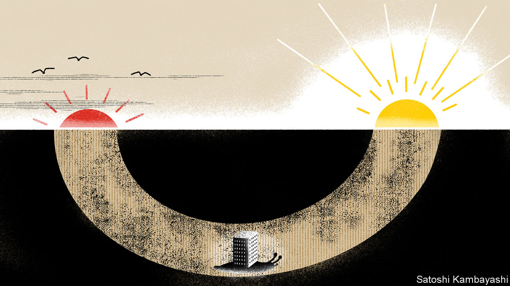
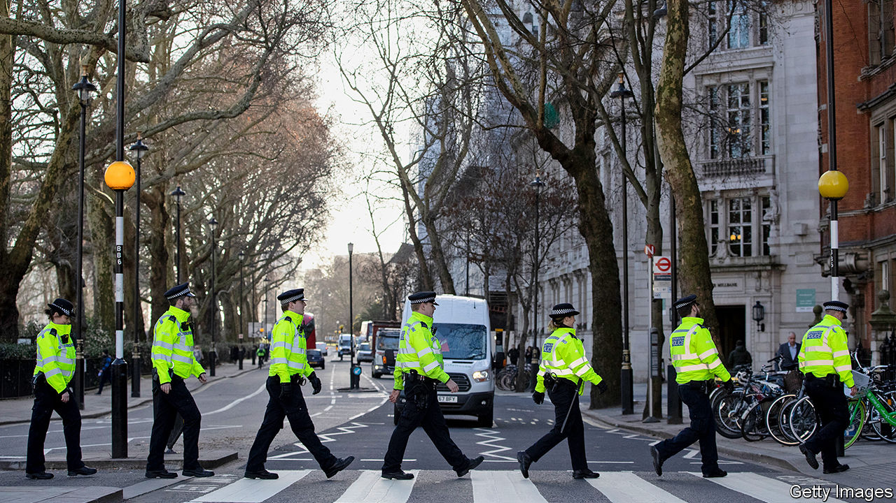
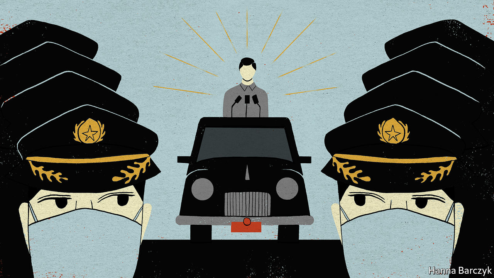

## On Clayton Christensen, Bernie Sanders, puberty blockers, private equity, police, China, sad songs

# Letters to the editor

> A selection of correspondence

> Feb 22nd 2020

Letters are welcome and should be addressed to the Editor at letters@economist.com

Schumpeter’s otherwise worthy encomium for Clayton Christensen makes the mistaken claim that he asserted a monopoly on disruptive wisdom ([February 1st](https://www.economist.com//business/2020/01/30/clayton-christensens-insights-will-outlive-him)). After his seminal “The Innovator’s Dilemma”, Clayton only ever wrote with co-authors, and he took every opportunity to attribute the staying power of the theory to other writers, for he valued work that challenged the theory even more than work that confirmed it.

Furthermore, claiming that Clayton “shrugged off” Apple and “brushed off” Tesla and Uber is also mistaken. Clayton pointed out, correctly, that these companies were not following a disruptive path to success over rivals. Apple disrupted the personal computer, but it did not disrupt Nokia or BlackBerry: it out-competed them in good old-fashioned Michael Porter style. Clayton’s mistaken prediction that Apple would fail led him to develop a more careful specification of the limits of disruption theory, which places his work within the context of other theories that explain different phenomena. Subsequent analyses of Tesla and Uber (neither of which have followed disruptive paths with regards to relevant competitors) reflect this. That is a story of learning and progress to which we should all aspire.

MICHAEL RAYNORMississauga, Canada

The answer to Lexington’s question “Could it be Bernie?” is a resounding no ([January 25th](https://www.economist.com//united-states/2020/01/25/could-it-be-bernie)). It is inconceivable to me, a life-long Republican who will not be voting for Donald Trump, that the Democrats could choose the only person whom Mr Trump could beat. When Bernie Sanders jumped to the lead, Mr Trump tweeted nice things about him. He knows he can beat Bernie with an impeached arm tied behind his back. The Democrats’ mantra should be electability, plain and simple. Choosing Bernie would only show that they can screw up the sleeves on a vest.

STEPHEN COONEYPottstown, Pennsylvania

Regarding puberty blockers for transgender children (“[Pill-pushers](https://www.economist.com//leaders/2020/01/30/what-to-do-about-puberty-blockers)”, February 1st), it broke our hearts to watch our brilliant, funny kid descend into a deep depression once puberty started. It took every ounce of courage she had to tell us she was transgender. We took her at her word, and have supported her these past two years as she began her transition. We were told of the risks of hormone therapy, but for us there was never any question. On hormones, our child has a chance for a happy and fulfilling life. Without them, we might have lost her, and that is a risk we simply were not willing to take.

JESSICA VETERDundas, Canada

Your otherwise excellent report on private markets repeated a well-known shibboleth in private equity (“[Privacy and its limits](https://www.economist.com//finance-and-economics/2020/01/30/everyone-now-believes-that-private-markets-are-better-than-public-ones)”, February 1st). This is the idea that buy-outs use high external debt levels to sharpen the performance of operating managers, which is sometimes called the “discipline of debt”.

For 30 years the story has been that high debt levels give buy-out managers a financial incentive to focus on maximising cashflow. On the face of it that sounds plausible. The flaw in the argument where private equity is concerned is that buy-out firms already have all the financial incentive they need: their “carried interest” typically pays them 20% of the profits they generate. The idea that buy-out firms need high interest payments as well as this incentive to focus on cashflow defies belief.

High debt levels in private equity are not just logically redundant. At least one empirical example shows high debt is unnecessary in practice, too. Melrose Industries, a publicly listed company, follows a strategy which it calls “Buy, Improve, Sell”. This is private equity in all but name. Melrose has generated high returns and its market capitalisation is now almost £12bn ($15.5bn). But Melrose has not needed high leverage. It makes a point of using the lower debt levels seen in quoted companies.

It suits buy-out insiders and investors to suggest that their use of high debt involves more than just financial engineering. Unfortunately, this idea fails to pass muster either in theory or in practice.

PETER MORRISLondon

Without more resources, you say, increasing the number of police officers in Britain will result in more of the accused in courts and more prisoners (“[What’s going wrong here?](https://www.economist.com//britain/2020/01/16/britains-20000-new-cops-wont-get-the-justice-ministry-celebrating)”, January 18th). But there is also an opportunity cost. Bobbies on the beat are associated with crime prevention. Potential criminals feel more restrained if detection rates improve and they think they could get caught. So if 20,000 extra police are put on the streets and into detection and technology channels, a lot of crime could be prevented.

DEEP SAGARFormer chairAudit and assurance boardNational Police Chiefs’ CouncilBerkhamsted, Hertfordshire

You hold a prejudice against China’s political system when reporting on the country’s fight against the coronavirus epidemic ([Chaguan](https://www.economist.com//china/2020/01/30/xi-jinping-wants-to-be-both-feared-and-loved-by-chinas-people), February 1st). The Communist Party puts a priority on people’s lives and health. President Xi Jinping has set up a task force to lead effective prevention and control, describing the coronavirus as a “devil”, which “we will not let hide”. Under strong leadership China has taken swift and concerted action to contain the disease. Information has been released in an open and transparent manner. China has closely co-operated with the WHO and the wider international community to safeguard the safety of people in Hubei province, in China and in the world.

Tedros Adhanom Ghebreyesus, the WHO’s director-general, has hailed the speed and scale of China’s actions. He has said that other countries should learn from China’s experience, pointing out that President Xi’s personal guidance and deployment show his great leadership capability.

Turning a blind eye to China’s hard efforts and their effective results and trying to politicise the issue is not conducive to the prevention and control of the novel coronavirus epidemic. The Chinese people are united and have full confidence that we can win this battle.

ZENG RONGSpokesperson of the Chinese EmbassyLondon

The Graphic detail on why people listen to sad songs in February ([February 8th](https://www.economist.com//graphic-detail/2020/02/08/data-from-spotify-suggest-that-listeners-are-gloomiest-in-february)) brought to mind “The Saddest Music in the World”. Directed by Guy Maddin, known for his homages to Russian and German Expressionist films, it stars Isabella Rossellini as a brewery heiress with plexiglass prosthetic legs (filled with beer, of course). She holds a contest to find which country has the saddest music, parodying the Olympics. Great fun.

KEITH CARLSONBelmont, Massachusetts

Missing from your analysis was the Valentine’s Day factor. That’s the time when broken hearts get to see their ex-partner Instagramming cuddly pictures with their new catch. There’s no happiness in that.

ZUMME MPHATSO CHIRWABlantyre, Malawi

## URL

https://www.economist.com/letters/2020/02/22/letters-to-the-editor
