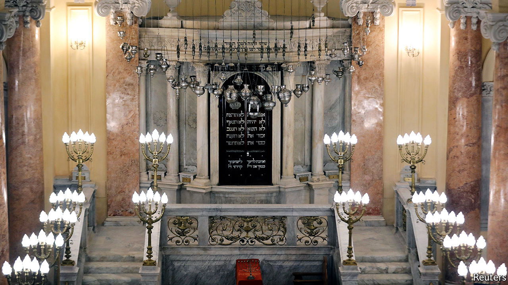

## Welcome back, sort of

# The Egyptian government is sending Jews mixed signals

> The authorities have restored an old synagogue. But do they want it filled?

> Feb 22nd 2020ALEXANDRIA

WHEN IT COMES to Egypt’s Jewish community, President Abdel-Fattah al-Sisi says all the right things. Only a minuscule fraction of the 80,000 Jews who once lived in Egypt remain in this Arab, Muslim country. Nonetheless, Mr Sisi promises a resurgence of local Jewry. He has invited back Jews who were pushed out after Israel’s invasion in 1956. He has listed dilapidated Jewish cemeteries as heritage sites and spent millions of dollars restoring what was once the world’s largest synagogue, Eliyahu HaNavi, in Alexandria.

On February 14th about 180 Jews of Alexandrian origin returned to rededicate the synagogue. They hammered a mezuzah onto its walls, danced with the Torah scrolls and sang psalms to the tune of “Inta Omri”, the anthem of Egypt’s most famous diva, Umm Kulthum. Old men sipped espressos at nearby Café Delice, still playing Edith Piaf’s “Non, je ne regrette rien”, and swapped faded wedding photos taken on the synagogue’s steps. They cried over memories of leaving Egypt, surrendering their passports and signing documents promising not to return. The service that followed was the largest in the synagogue for 60 years. The men promised to return a year later for a wedding—the first step to rebuilding a community which a century ago attracted more Jews than Palestine.

Security was tight at the event, for good reason. In recent years jihadists with links to Islamic State have targeted another religious minority: Christians. A phalanx of security vehicles with blaring sirens followed the Jews wherever they went. But the authorities also seemed keen to tamp down the celebration. Goons in balaclavas carrying machineguns kept the Jews more or less quarantined. They denied access to Muslims hoping to join their former classmates for the rededication. The American ambassador, who is Jewish, was prevented from attending the Torah reading.

Having spent so much money restoring the synagogue, it may seem odd for the government to mute its reopening. But, despite Mr Sisi’s words, the authorities remain ambivalent towards Jews and their sites. Egypt’s synagogues and Jewish cemeteries are perpetually locked. Over a decade ago the government restored the yeshiva of Moses Maimonides, a revered Torah scholar who led Egypt’s Jewish community in the 12th century (and served as Saladin’s physician), but it is closed to the public. There are no signs directing people to the site. Many Egyptians with Jewish ancestry remain fearful of disclosing their origins.

Morocco, another Muslim country, offers an alternative model. Its Jewish community also shrank when the Arab-Israeli conflict was at its peak. But the Jews who remained now practise openly. King Muhammad VI has restored scores of synagogues and regularly hosts the diaspora at festivals where imams and rabbis sing together. Last month he inaugurated a Jewish heritage centre by touching the Torah and praying. “It was a first for a commander of the faithful [the royal title] in Islam,” says Andre Azoulay, the king’s Jewish adviser. ■

Correction (March 20th 2020): This article originally stated that Moses Maimonides founded Orthodox Judaism in Cairo in the 12th century. Maimonides developed principles that have become widely held by Orthodox Jews, but he did not found Orthodox Judaism.

## URL

https://www.economist.com/middle-east-and-africa/2020/02/22/the-egyptian-government-is-sending-jews-mixed-signals
