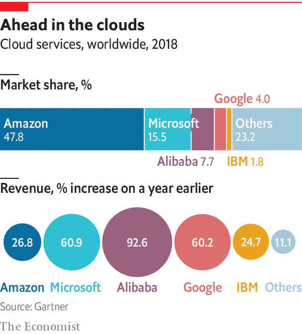

## Infrastructure

# Should data be crunched at the centre or at the edge?

> “Edge computing” is on the rise

> Feb 20th 2020

ONCE A YEAR the computing cloud touches down in Las Vegas. In early December tens of thousands of mostly male geeks descend on America’s gambling capital in hope not of winnings but of wisdom about Amazon Web Services (AWS), the world’s biggest cloud-computing provider. Last year they had the choice of more than 2,500 different sessions over a week at the shindig, which was called “Re:Invent”. The high point was the keynote featuring AWS’s latest offerings by Andy Jassy, the firm’s indefatigable boss, who paced the stage for nearly three hours.

But those who dare to walk the long city blocks of Las Vegas to the conference venues can connect to the cloud, and thus the mirror worlds, in another way. Push a button to request a green light at one of thousands of intersections and this will trigger software from SWIM.AI, a startup, to perform a series of calculations that may influence the traffic flow in the entire city. These intersections do not exist just in the physical realm, but live in the form of digital twins in a data centre. Each takes in information from its environment—not just button-pushing pedestrians, but every car crossing a loop in the road and every light change—and continually predicts what its traffic lights will do two minutes ahead of time. Ride-hailing firms such as Uber, among others, can then feed these predictions into their systems to optimise driving routes.

AWS represents a centralised model where all the data are collected and crunched in a few places, namely big data centres. SWIM.AI, on the other hand, is an example of what is being called “edge computing”: the data are processed in real time as close as possible to where they are collected. It is between these two poles that the infrastructure of the data economy will stretch. It will be, to quote a metaphor first used by Brian Arthur of the Santa Fe Institute, very much like the root system of an aspen tree. For every tree above the ground, there are miles and miles of interconnected roots underground, which also connect to the roots of other trees. Similarly, for every warehouse-sized data centre, there will be an endless network of cables and connections, collecting data from every nook and cranny of the world.

To grasp how all this may work, consider the origin and journey of a typical bit and how both will change in the years to come. Today the bit is often still created by a human clicking on a website or tapping on a smartphone. Tomorrow it will more often than not be generated by machines, collectively called the “Internet of Things” (IOT): cranes, cars, washing machines, eyeglasses and so on. And these devices will not only serve as sensors, but act on the world in which they are embedded.

Ericsson, a maker of network gear, predicts that the number of IOT devices will reach 25bn by 2025, up from 11bn in 2019. Such an estimate may sound self-serving, but this explosion is the likely outcome of a big shift in how data is collected. Currently, many devices are tethered by cable. Increasingly, they will be connected wirelessly. 5G, the next generation of mobile technology, is designed to support 1m connections per square kilometre, meaning that in Manhattan alone there could be 60m connections. Ericsson estimates that mobile networks will carry 160 exabytes of data globally each month by 2025, four times the current amount.

The destination of your average bit is changing, too. Historically, most digital information stayed home, on the device where it was created. Now, more and more data flow into the big computing factories operated by AWS, but also its main competitors, Microsoft Azure, Alibaba Cloud and Google Cloud. These are, in most cases, the only places so far with enough computing power to train algorithms that can, for instance, quickly detect credit-card fraud or predict when a machine needs a check-up, says Bill Vass, who runs AWS’s storage business—the world’s biggest. He declines to say how big, only that it is 14 times bigger than that of AWS’s closest competitor, which would be Azure (see chart).

What Mr Vass also prefers not to say, is that AWS and other big cloud-computing providers are striving mightily to deepen this centralisation. AWS provides customers with free or cheap software that makes it easy to connect and manage IOT devices. It offers no fewer than 14 ways to get data into its cloud, including several services to do this via the internet, but also offline methods, such as lorries packed with digital storage which can hold up to 100 petabytes to ferry around data (one of which Mr Jassy welcomed on stage during his keynote speech in 2016).

The reason for this approach is no secret. Data attract more data, because different sets are most profitably mined together—a phenomenon known as “data gravity”. And once a firm’s important data are in the cloud, it will move more of its business applications to the computing skies, generating ever more revenue for cloud-computing providers. Cloud providers also offer an increasingly rich palette of services which allow customers to mine their data for insights.

Yet such centralisation comes with costs. One is the steep fees firms have to pay when they want to move data to other clouds. More important, concentrating data in big centres could also become more costly for the environment. Sending data to a central location consumes energy. And once there, the temptation is great to keep crunching them. According to OpenAI, a startup-cum-think-tank, the computing power used in cutting-edge AI projects started to explode in 2012. Before that it closely tracked Moore’s law, which holds that the processing power of chips doubles roughly every two years; since then, demand has doubled every 3.4 months.

Happily, a counter-movement has already started—toward the computing “edge”, where data are generated. It is not just servers in big data centres that are getting more powerful, but also smaller local centres and connected devices themselves, thus allowing data to be analysed closer to the source. What is more, software now exists to move computing power around to where it works best, which can be on or near IOT devices.

Applications such as self-driving cars need very fast-reacting connections and cannot afford the risk of being disconnected, so computing needs to happen in nearby data centres or even in the car itself. And in some cases the data flows are simply too large to be sent to the cloud, as with the traffic lights in Las Vegas, which together generate 60 terabytes a day (a tenth of the amount Facebook collects in a day).

How far will the pendulum swing back? The answer depends on whom you ask. The edge is important, concedes Matt Wood, who is in charge of AI at AWS, but “at some point you need to aggregate your data together so that you can train your models”. Sam George, who leads Azure’s IOT business, expects computing to be equally spread between the cloud and its edge. And Simon Crosby, the chief technologist at SWIM.AI, while admitting that his firm’s approach “does not apply everywhere”, argues that too much data are generated at the edge to send to the cloud, and there will never be enough data scientists to help train all the models centrally.

Even so, this counter-movement may not go far enough. Given the incentives, big cloud providers will still be tempted to collect too much data and crunch them. One day soon, debates may rage over whether data generation should be taxed, if the world does not want to drown in the digital sea.■

## URL

https://www.economist.com/special-report/2020/02/20/should-data-be-crunched-at-the-centre-or-at-the-edge
