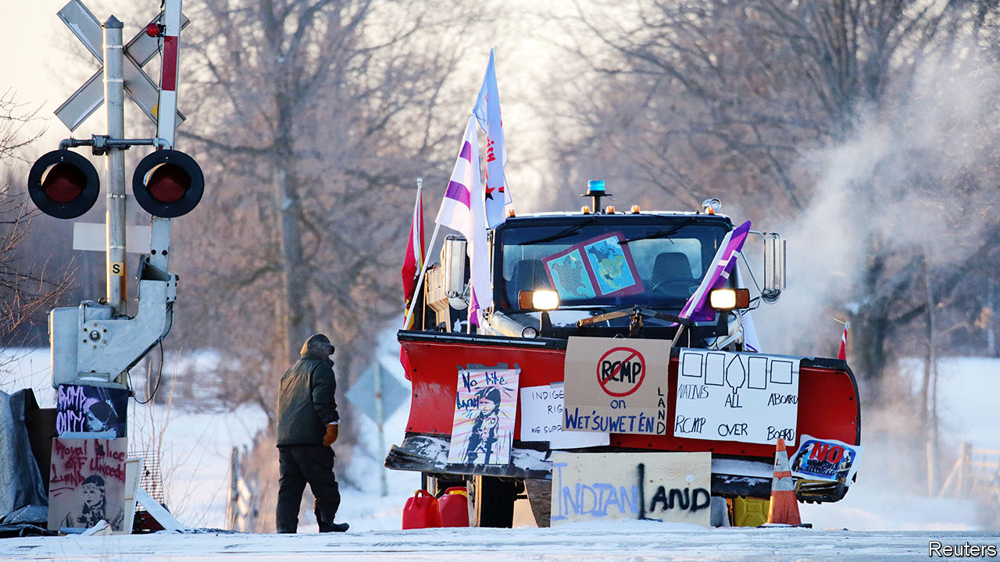
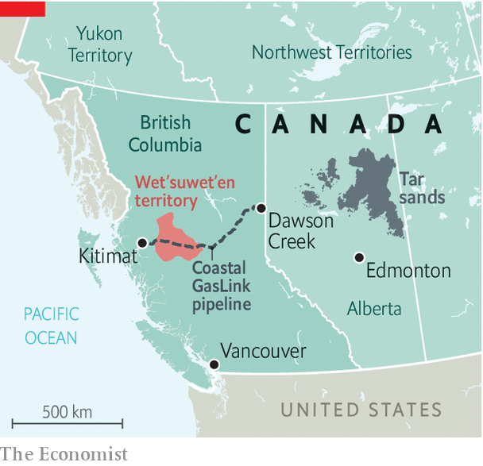

## Pipe of discord

# A pipeline through historically native land has sparked protests in Canada

> Prime Minister Justin Trudeau has no good options

> Feb 20th 2020VANCOUVER

“STOP THE INVASION! No pipelines on stolen native land!” So chanted dozens of protesters on a chilly afternoon this week in Vancouver. With placards in hand, they blocked traffic on a busy thoroughfare, doing their part to “shut down Canada”. That has become the rallying cry against the Coastal GasLink pipeline, a C$6.6bn ($5bn) project which will transport natural gas 670km (420 miles) across British Columbia to the Pacific coast, where a liquefied natural gas (LNG) plant is under construction.

The pipeline is an “invasion”, detractors say, because about a quarter of its route passes through land traditionally belonging to the Wet’suwet’en, a First Nations people. Since early February, when police broke up a blockade (with an injunction to do so) local disputes have escalated to national unrest. Allies of the Wet’suwet’en have organised copycat demonstrations far away from the pipeline itself.

None of this has scuppered the plans, but it has disrupted the economy and embarrassed the Liberal government. Canadian National Railway (CN) shut down lines in the east of the country and temporarily laid off about 450 workers; Via Rail, a passenger service, is doing the same to nearly 1,000. Food, heating fuel, farm exports and commodities are gridlocked. Cars and ships have been unable to get through bridges, ports and the border with the United States. Public sentiment is against the protesters, reckons Janice, a regular rail rider who missed work because of cancellations. A court granted CN an injunction against demonstrators on its rail line in Alberta; fed-up counter-protesters have tried to dismantle blockades themselves.

Justin Trudeau, the prime minister, has asked for patience. He missed the first week or so of chaos because he was abroad, lobbying for a seat on the UN Security Council. Mounting pressure forced him to cancel his next stop, to Barbados, and hold crisis talks in Ottawa. This is a thorny issue for Mr Trudeau, because he must juggle a trio of promises. He has promised to promote reconciliation with indigenous people—he calls their relationship with the government Canada’s most important. But he has yet to unveil a new set of rules for that relationship that was expected before last year’s election. He has promised to protect the environment, but the pipeline will carry a fossil fuel, which many greens would rather leave in the ground. And he has promised to boost economic growth, which exporting gas would obviously help.

Mr Trudeau’s timing is unlucky. He has inherited this problem from successive governments which have failed to resolve tensions between national and indigenous laws. Worse, past attempts have contributed to present confusion. An act in 1876 artificially divided the First Nations into elected “band” councils. Hereditary leaders still dispute elected representatives’ authority. In the pipeline debate, even as some hereditary chiefs have refused to consent, all 20 elected bands along the route of the Coastal GasLink signed C$338m in benefit agreements with TC Energy, the company sponsoring the pipeline, plus C$620m in contract work for indigenous businesses. Protesters (many of them non-indigenous) may jeopardise such investment.

Mr Trudeau has ruled out force, despite pressure from Conservatives, who accuse him of weakness, to send in police. Hansen Lee, a retired engineer in Vancouver, worries that such passivity has turned Canada into a “laughing stock”. Lawmakers are wary of repeating past showdowns with indigenous leaders that turned bloody. In a dispute over a plan to build a golf course near Oka in 1990 a policeman was killed; in the Ipperwash Provincial Park in 1995 a protester was shot.

A deal to resolve the conflict would probably mean the Canadian government trading land, power and money for an end to protests, claims and court action. Future projects, such as a planned expansion of the Trans Mountain oil pipeline, are sure to reignite debate even if the particulars of the Coastal GasLink are resolved. Mr Trudeau now has a choice: he can exercise power or cede more of it. So far he seems unwilling to do either.■

## URL

https://www.economist.com/the-americas/2020/02/20/a-pipeline-through-historically-native-land-has-sparked-protests-in-canada
