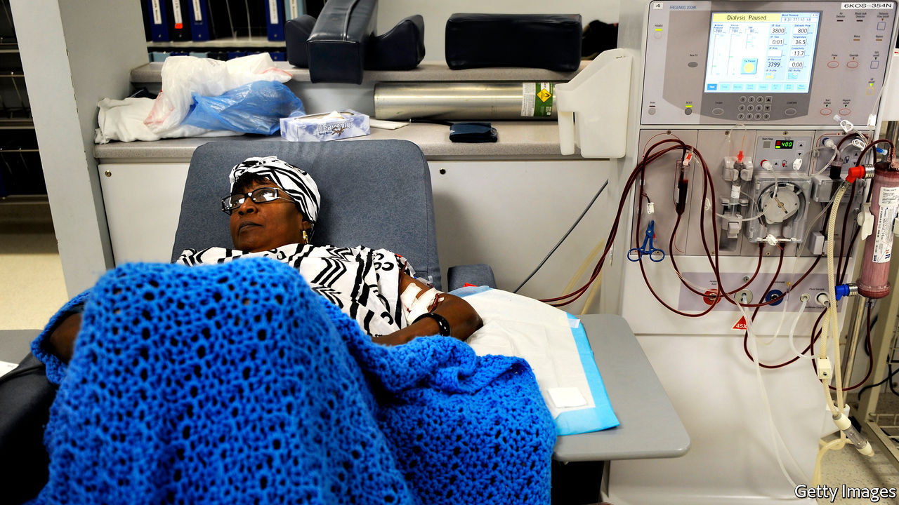

## Kidney failure

# A quirk in the law means that America’s kidney shortage costs taxpayers

> Lightening regulation on organ transplants could save lives and money

> Feb 20th 2020

IN 1971, AN unemployed salesman named Shep Glazer upended the typically somnolent hearings of the House Ways and Means Committee by giving a live demonstration of dialysis before aghast congressmen. The shock seemed to pay off. Mr Glazer’s goal—to ensure that all patients reliant on blood-filtering dialysis machines, because of failing kidneys, would be covered by a then-newfangled programme called Medicare, the government health-insurance scheme for the elderly, regardless of age—soon became law. Through the new end-stage renal disease (ESRD) programme, Medicare for All became a reality for a certain portion of the sick, and has remained so for nearly 50 years.

What seemed like a small exemption then has morphed into something much larger. Originally designed to cover 10,000 patients, the ESRD programme now includes 512,000. Dialysis is expensive: a machine must filter out toxins and excess fluids from the blood, often for several hours a day and several times per week. It is a life-or-death treatment. Still, two-thirds of patients with ESRD die within five years. A year of treatment in a specialised centre costs $91,000. The small programme created in the 1970s now costs over $35bn, or roughly 6% of all Medicare spending.

Much of this is due simply to rising need. Diabetes and high blood pressure, which have been rising, are precursors of chronic kidney disease. Because Medicare sets prices, costs for dialysis have grown more slowly than for other health-care procedures. The operation of dialysis centres has nonetheless become brisk business (in part because private-insurance companies pay more). A near-duopoly controls 70% of the market, earning net profits of 18%.

For many patients a kidney transplant is a much better option than several years of dialysis before death—life expectancy is much longer, and that life is of higher quality. It also saves money for the taxpayer, notes Mario Macis of Johns Hopkins University. “The math is such that every kidney transplant generates savings for Medicare of about $150,000,” says Mr Macis.

The problem is that there are almost 100,000 people on the waiting list, and the typical waiting time is more than four years, meaning thousands die before their turn. Incentivising organ donations is morally fraught. But at present, there are strong disincentives to living organ donations. Though there is no medical bill for giving up a kidney, costs for transport, lodging and lost wages during recovery are not reimbursed. For three-quarters of prospective donors, these can amount to one month of income. Research from Mr Macis and two colleagues shows that Americans are much more keen on reimbursement if it is offered by a public agency—as opposed to direct purchase—and if it meaningfully increases the supply of organs.

The curious case of the kidney gives a few insights into the larger workings of the American health-care system. Small, fossilised provisions morph into huge programmes decades later. Government influence over prices may limit overall growth in costs, but can coincide with abnormally high profits for a few operators. And comparatively clear ideas for reducing billions in costs while improving thousands of lives can go ignored for years.■