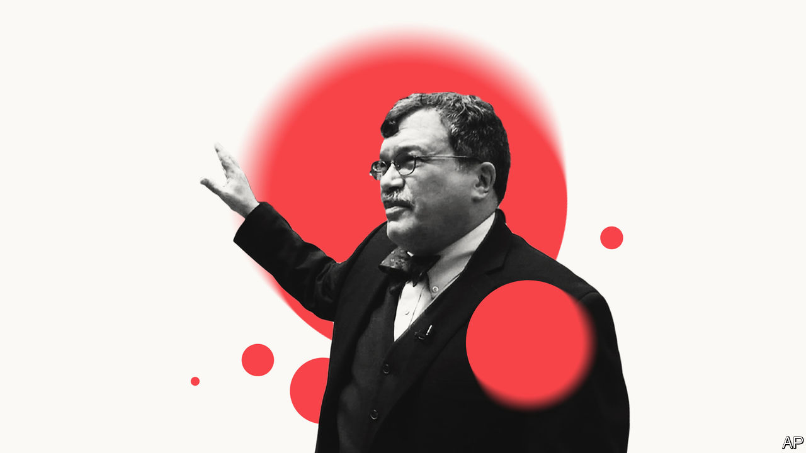

## Peter Hotez, vaccine campaigner

# Anger in a time of autism

> A prominent scientist wants to lead a campaign against anti-vaxxers

> Feb 22nd 2020

AS A BOY, Peter Hotez was drawn to roadside puddles and stagnant ponds in Connecticut. After squeezing sample water droplets on glass slides, he spent hours with his eye glued to a microscope. Another world would emerge as protozoa and rotifers wiggled into focus. He dreamed of more exotic micro-organisms, of finding one new to science.

Boyhood pursuits foreshadowed his life’s work. Mr Hotez studied how parasitic diseases infected hundreds of millions of people in China. His knowledge of that part of the world helps explain his frequent appearances on cable TV this year, discussing how covid-19 may spread and the hopes, one day, for a vaccine. He helped develop vaccines that, if current clinical trials succeed, could eradicate hookworm (thought to infect some 500m-700m people globally) and bilharzia. He can also talk: he helped persuade George W. Bush’s administration, in 2004, to fund global vaccinations globally that benefit 1bn people.

Inspired by Britain’s two schools of tropical medicine, in Liverpool and London, he helped to found America’s first: the National School of Tropical Medicine, part of Baylor College of Medicine, in Houston. It is a modest affair, so far, but he has persuaded a dozen scientists to move there, to work on vaccines against half a dozen other illnesses, such as chagas and leishmaniasis, mostly ones that afflict the poor.

He also campaigns, reminding Americans, lest they forget, how vaccines protect them. As a paediatrician in the 1980s he recalls the horror of diagnosing children with “invasive Hib”, an aggressive strain of meningitis. Recovery was agonising, and parents would be traumatised. Worse, it killed some 1,000 American children a year. Then a Hib vaccine was licensed in 1987 and almost magically, within a few years, it had all but gone. Now barely 40 cases are identified in America each year.

The problem is that people forget, within a generation or two, the illnesses that once stalked them. In America he counts at least 14 vaccines that have eradicated, or nearly, diseases including tetanus, diphtheria, mumps and rubella, polio, hepatitis and smallpox. He points out how, before mass vaccinations in the 1960s, measles sent 50,000 infected children to hospital each year, and typically killed 500 of them.

Yet anti-vaxxers brush aside measles as trivial (though in 2018, around the world, the disease killed over 140,000 people). In the past decade the anti-vax movement has only grown stronger, warns Mr Hotez. Though most American parents still vaccinate their children, pockets of scepticism and vaccine refusal are growing. Misinformed celebrities are stirring up fear—none more than Robert F. Kennedy junior, a charismatic environmental campaigner turned vaccine obsessive. Online, companies profit by seeding doubts about science, then selling homeopathic and “natural” remedies. Firms like Amazon and Facebook meanwhile fail to discourage those who spread lies on their platforms.

He worries that a new outfit, the Children’s Health Defence, founded by Mr Kennedy, looks especially slick and able to stir mistrust of vaccines. A study this year by Vaccine, an academic journal, found just two anti-vax campaigns, including Mr Kennedy’s, paid for over half of all Facebook ads that were tracked as spreading misinformation on vaccine safety.

Officials, doctors and scientists do push back, hoping to educate parents by sharing worthy statistics on vaccine safety. That has limited impact. Tara Smith, at Kent State University, who studied how to address the spectrum of outright vaccine deniers, the vaccine-hesitant and merely curious “lurkers”, says parents almost never lack facts. Instead they are stirred by emotional anecdotes, especially the most egregious tales of patient harm. Mr Hotez argues for fighting back harder. “We need people to get emotionally involved,” he says. He equates anti-vaxxers to a destructive, religious cult and wants scientists to deliver direct, “declarative”, even confrontational messages against them. Worried parents remember and share stories, not statistics, he says. Mr Hotez, whose own daughter is autistic, has written a memoir explaining that vaccines did not cause the condition, as a large number of parents have come to believe.

Ideally, he says, someone would fund his plan for a pro-vaccine group to counter outfits like Mr Kennedy’s, and to press tech firms and online retailers to act. Anti-vax books, films, posters and other merchandise proliferate online. Until The Economist pointed it out last week, Amazon was taking payment to promote the sale (for $7.95) of a sponsored sticker that urged “Just say no to vaccines.” Amazon removed that, but also says it will not censor free speech. Mr Hotez calls the site the source of the “most pervasive and active” misinformation that helps anti-vaxxers. ■