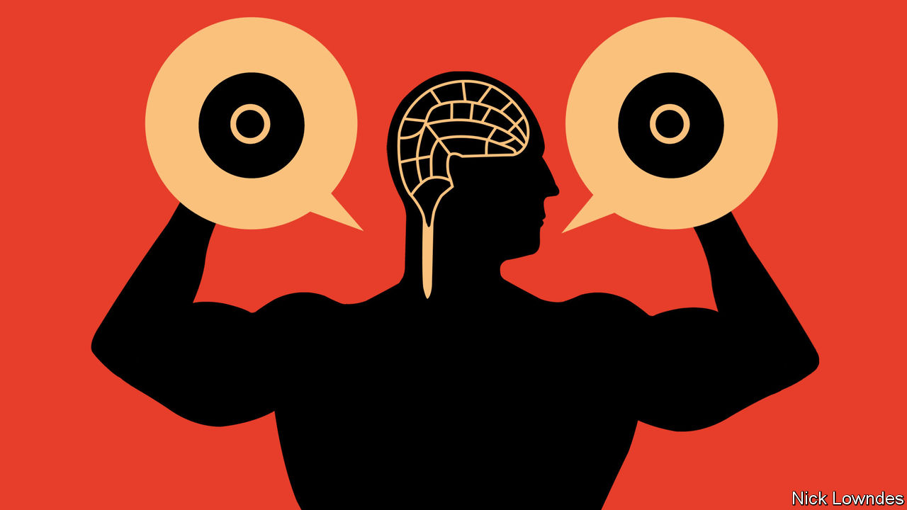

## Johnson

# The advantages of speaking a second language

> They are hard to measure. But it is a good idea anyway

> Feb 29th 2020

JUST A FEW generations ago, speaking two languages was supposed to be bad for you. Tests in America found that bilingual people had lower IQs, which seemed evidence enough. Later it became clear that those surveys were really measuring the material poverty of immigrants; members of such families were more likely to be undernourished and understimulated, not to mention the obvious fact that they often sat the tests in a language that was not their best.

How things have changed. In the past decade it has become almost common knowledge that bilingualism is good for you—witness articles such “Why Bilinguals are Smarter” and “The Amazing Benefits of Being Bilingual” by the New York Times and the BBC. Stacks of research papers have suggested that two-tongued people enjoy a variety of non-linguistic advantages. Most notably, they have shown that bilinguals get dementia on average four years later than monolinguals, and that they have an edge in “executive control”—a basket of abilities that aid people doing complex tasks, including focusing attention, ignoring irrelevant information and updating working memory.

Why bilingualism would enhance these capabilities is unclear. Researchers hypothesise that having two languages means suppressing one when speaking the other, a kind of constant mental exercise that makes the brain healthier. This in particular is thought to be behind the finding of a later onset of dementia.

But as intellectual pendulums do, this one has begun to swing again, against the “bilingual advantage”. Though many papers have identified such a bonus, many more have tried and failed to replicate those studies. Roberto Filippi of University College London and his colleagues have spent five years testing more than 600 people, from seven to 80 years old and including some who oscillate between two languages. They could find no statistically significant advantage in any age cohort.

In response to the scepticism, researchers who believe in the advantage have refined their studies—now acknowledging that, beneath their common trait, bilingual people use their languages in varying ways that may account for the incongruent previous results. Does speaking two very distinct languages have a different effect from speaking two very similar ones? What about two dialects? Does speaking more than two provide any additional benefit? Does it matter if subjects live among people who speak their first language or their second?

A recent study by four researchers at the University of the Balearic Islands is a good example. They studied 112 bilinguals using three criteria: the age they acquired a second language; fluency in their two languages (most are not equally adept in both); and the frequency with which they switch between the two options. Frequency of switching, it turned out, was the variable that correlated best with improved executive control. Unlike Mr Filippi’s, other studies have hinted that frequent switching may be a good predictor of the bilingual advantage.

On balance, it seems that if the dividend is real, it is subtle and affected by many other factors. Though wealthy parents have been taken by the notional leg-up, hiring foreign nannies for their offspring and so on, it may be poorer individuals who get the biggest benefit. A study in Hyderabad, for instance, reproduced the finding of a four-year delay in the onset of dementia among bilinguals—except that the gap was six years for those test cases who were illiterate. If switching languages is healthy mental exercise, other highly skilled, cognitively demanding kinds of labour are likely to provide good work-outs, too. People who do other forms of mental multitasking all the time may not get such a big lift from bilingualism, if they get any at all.

The bottom line is that learning another language (or teaching a child one) sometimes confers an intellectual boost, though not always. But that has never been the main reason to do it. A second language expands the number of people you can talk to. It adds to the ways you can say things, and so offers a second point of view on the whole business of expression. Bilingualism may help you understand other people; one study found that bilingual children are better at grasping other perspectives, perhaps because they are always keeping track of who speaks what, a regular reminder that everyone is different. Finally, speaking a second language less well than your first supplies another kind of useful practice: it is a constant exercise in humility.