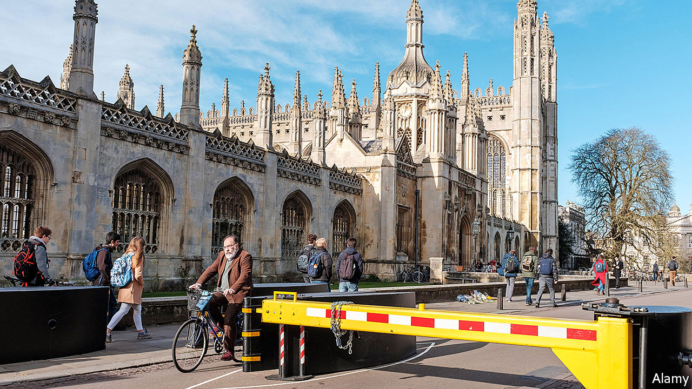

## Beauty or safety?

# Anti-terror barricades spread beyond big cities

> And the government wants still more

> Feb 27th 2020CAMBRIDGE

THE CORPUS CLOCK is a mechanical marvel. Plated with 24-carat gold, the 1.5m-wide timepiece is accurate once every five minutes. The rest of the time tourists are able to enjoy the macabre grasshopper which sits atop it, munching the minutes as they pass. At least, that is, when they are not having to dodge vans making three-point-turns near the recently installed barrier at the bottom of King’s Parade, designed to stop terrorists from targeting the centre of Cambridge.

Common for years in big cities, such protection is spreading across the country. Cambridge is one of a number of smaller towns and cities—including Canterbury, Windsor and York—that have recently installed it. They may be ahead of the trend. On February 24th the government opened a consultation on a new duty to protect, which would require businesses and public authorities to put in place measures to guard the public from attacks.

The government also wants to make public spaces more beautiful. The Cambridge example suggests reconciling these two desires may prove difficult. Susan Grossey, a local resident, accepts the need for security measures, but not for a large, ugly barrier in the centre of town: “I mean, King’s is our most beautiful street. And that view of King’s College is iconic. Why? Why would they do that?” Many worry that “temporary” protections have a habit of turning into permanent measures. A petition calling for the barrier’s removal or replacement swept past 1,000 signatures, prompting a debate at the local council.

Yet the choice between beauty and safety is not always so stark. At their best, barriers may not be beautiful, but they are invisible. Local authorities can choose from any obstacle that meets standards set by the International Organisation for Standardisation. And many newer ones are designed to be as surreptitious as possible. Marshalls, a manufacturer, specialises in less off-putting barricades, including the Rhinoguard Giove Protective Planter, which is, in effect, an enormous plant pot able to withstand an unladen 7.5-tonne lorry travelling at 50mph. The firm says revenues from its unobtrusive obstacles have risen by more than 50% since 2017.

It is easier to combine beauty with security when designing from scratch. The “hostile vehicle mitigation measures” around the Welsh Assembly in Cardiff are, for instance, mostly disguised as steps. All of England’s police forces have at least one “designing-out crime” officer to advise local planners on how to integrate security measures. Their job is harder when it comes to adapting existing spaces, says Paul Jeffrey of the Perimeter Security Suppliers Association, a trade group. “Retrofitting is an absolute nightmare,” he notes. It is something many other places, besides Cambridge, may be about to discover. ■