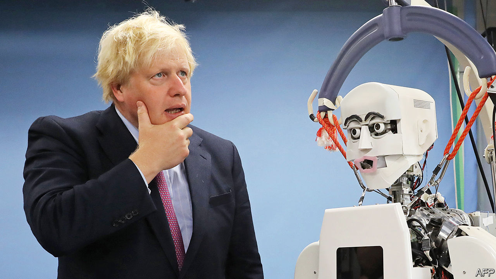
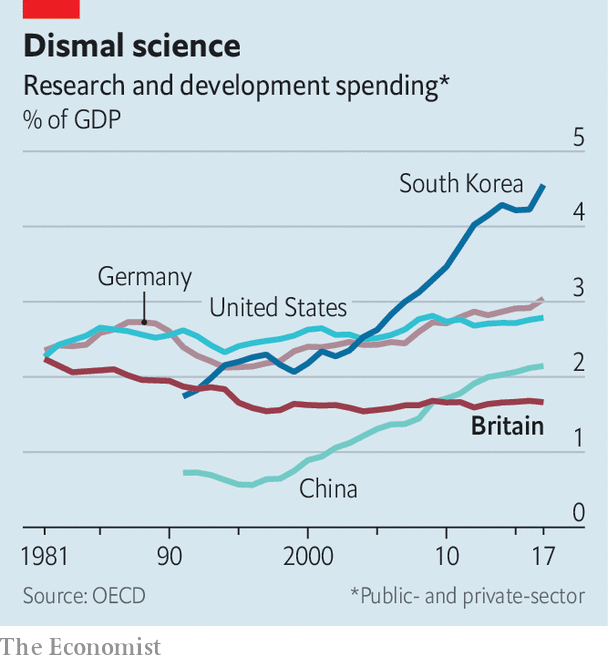

## The £18bn question

# Britain’s great research bonanza

> The government has promised to double funding. How should it spend the dosh?

> Feb 27th 2020

SINCE HE BECAME prime minister, Boris Johnson’s speeches have been studded with references to the glory of British science. Sometimes they are to cutting-edge facilities (“a place in Oxfordshire that could soon be the hottest place in the solar system”), sometimes to those who work in them (Britain will become a “supercharged magnet to attract scientists like iron filings”) and sometimes to the “colossal” investment his government will deliver. The last, at least, is not Johnsonian hyperbole: during the general election, the prime minister promised to more than double annual spending on research and development (R&D) to £18bn ($23bn, or roughly 0.7% of GDP) by 2024-25—a figure that may rise further still in the forthcoming budget.

The decision to splurge on research is part of the government’s attempt to answer the central question it faces: What next? Downing Street believes that for Britain to be successful outside the European Union it will have to build on its assets, not least its excellent science and research. On the basis of the citation impact calculated by Scopus, researchers in Britain are the most influential in the world. Despite accounting for just 7% of global publications, they produce more than 14% of the most highly-cited work. The government has loosened visa rules for foreign researchers and plans to cut the red tape they face. As Dominic Cummings, the prime minister’s chief adviser, has put it, the aim is to make “Britain the best place in the world to be for those who can invent the future.”

To make this happen, the government could just do what it is doing now but on a grander scale. UK Research and Innovation (UKRI) gives most of the government’s money to the best universities and people. The highest-ranked research receives four times as much cash as the next best under the main funding stream. This makes the system particularly susceptible to the “Matthew Effect”, meaning the best research attracts more funding, becoming better still, thus attracting more funding, and so on. Nearly half of public R&D money ends up in the “Golden Triangle”, as Oxford, Cambridge and London’s best universities are commonly known. As a result, Britain has three universities in the Times Higher Education global top ten, a league table determined largely by research quality. That is more than twice as many, per person, as America has.

And yet research excellence is not the government’s only aim. As he announced the extra money, Mr Johnson promised it would unleash a “new wave of economic growth” and “level up” industry in the regions. The goal, as a Tory MP puts it, is not to “to tip a load of money into telescopes to explore the outer regions of space, which will do fuck all for our economy”. Instead, it is to increase Britain’s dismal productivity growth, particularly in the regions, thus delivering jobs and higher wages.

Until relatively recently, British policymakers believed it was better left to the private sector to turn academic ideas into marketable products. Government spending on applied research, it was argued, would not only direct taxpayers’ money towards an area in which decisions were best made by the private sector, but also risked crowding out private investment. So although Britain spends around the average in the OECD club of mostly-rich countries on basic research, with excellent results, it is unusually frugal when it comes to the applied variety; spending just 0.1% of GDP on it, compared with 0.3% in America and 0.4% in Germany.

But as David Willetts, a former Conservative universities and science minister, has written, low R&D investment in the public and private sectors provides a strong argument for raising spending on applied research, to which the top universities will have a weaker claim. Britain’s poor productivity—around a fifth lower than Germany, France and America—provides another one. The example of countries like South Korea and Germany suggests that, rather than repelling private investment, well-directed public money can in fact prompt businesses to increase R&D spending.

Some Tory think-tankers have suggested the government should establish research institutes across the country—and particularly in towns that have just turned blue—in an attempt to give them a sense of purpose. Such an approach would create jobs supported by public money, but it would not do much else. Richard Jones, a science-policy expert at the University of Sheffield whose writing has influenced Downing Street, cites government nanotechnology investment in the mid-2000s as an example of how not to do things. Some £50m was split between 24 centres to bring the technology to market. Unsurprisingly, none went on to do anything of note.

There are better ways to spread the cash. As Mr Jones notes, the regions that currently have higher levels of private R&D than public R&D, and thus where there is probably scope to increase public spending, include the Midlands and the north-west. These parts of the country have the additional benefit of cheaper property and looser planning regimes than Oxford, Cambridge and London, thus lowering the cost of expansion. The National Audit Office, an official watchdog, has criticised the government for not taking into account the running costs of new research facilities when deciding where to place them. Those decisions dictate where funding goes for decades to come. Cities in these regions will have a good claim to new institutions.

Doubling the research budget provides a lot of money to experiment with. A number of existing schemes are likely to grow. UKRI’s drearily-named “Strength in Places” fund, a £236m pot which is disbursed on the basis of academic excellence and economic considerations, could easily be beefed up. Another likely beneficiary, despite a decidedly mixed record so far, is the “catapult” programme. Based on Germany’s Fraunhofer Institutes, albeit with considerably smaller budgets, Catapults require a mixture of business, university and government investment. The most successful one—the AMRC in Sheffield—is home to the local university, as well as Boeing, Rolls-Royce and McLaren Automotive.

Putting more money into applied research outside the golden triangle is unlikely to supercharge Britain’s ability to win Nobel prizes or suck in the world’s top scientists. But done the right way, it might just fulfil other ambitions more relevant to voters, and thus to the government’s re-election chances. ■

## URL

https://www.economist.com/britain/2020/02/27/britains-great-research-bonanza
