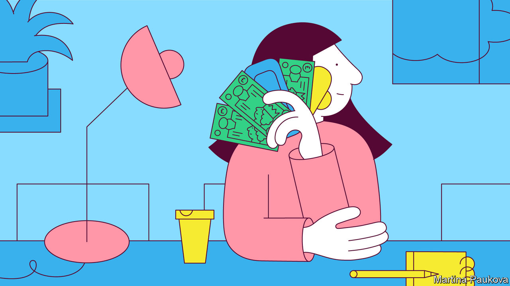

## Menstruation

# Free period products in Scotland

> Another way in which the difference between Scotland and England is growing

> Feb 27th 2020

WHEN MICHELLE FISHER was a teenager, money was tight, and she had to ration the number of tampons she used. Despite experiencing extremely heavy periods, she would use only one or two a day. Once, she bled through onto a chair at school. “Even to this day when I’m buying products it still feels like I need to ration myself as an after-effect of being so restricted growing up.”

Ms Fisher shared her experiences in the course of a consultation on a bill that would make Scotland the first country in the world to offer free period products to all women. The Period Products Bill has just passed its first legislative hurdle, and if it becomes law, which looks likely, the Scottish government will be obliged to provide free sanitary pads and tampons to “anyone who needs them”. Many countries have cut taxes on sanitary products, and Scotland is not the only place to give them out free in schools. But this bill offers the widest provision of pads in the world, costing £24m a year, according to the government.

The woman behind the bill is Monica Lennon, a Labour member of the Scottish Parliament. She initiated the first conversation about the cost of periods in the Scottish chamber’s history; in 2020 she has grey-haired male MSPs talking about bloody tampons. Earlier this month the ruling Scottish National Party abandoned its concerns about period tourism flooding over the English border, so the bill has the support of all parties and looks set to cycle through Parliament.

The prevalence of women in Scottish politics seems to be one reason why Scotland looks like achieving a world first on this issue. The Scottish cabinet is more than half female (compared with a quarter at Westminster’s top table), and Scotland has had a female first minister, Nicola Sturgeon, for five years. She championed the introduction of free period products in schools in 2018.

The measure is also an indication of the Scottish government’s appetite for radical social legislation, points out Mark Diffley, an independent polling consultant in Edinburgh. Scotland has provided free university tuition and personal care, banned smoking in public places and set a minimum price on alcohol. Such measures are increasing the distance between Scotland and England—which, as far as the SNP is concerned, is all to the good.

## URL

https://www.economist.com/britain/2020/02/27/free-period-products-in-scotland
