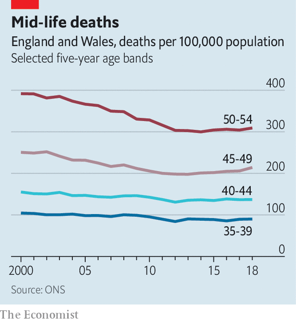

## Groundhog Day

# Health inequality in England was bad. It has got worse

> The Marmot Review revisited ten years on

> Feb 27th 2020

TEN YEARS ago the Marmot Review, a study commissioned by the government, asked a big, complicated question: why do some people in England live longer, healthier lives than others, and what can be done to reduce the gap? The answer it found was simple. Some people lived longer because they were better-off. To change this, it concluded, the government would have to reduce social inequality.

A new report by its author, Sir Michael Marmot of University College London, reviews the past decade’s changes. The numbers speak for themselves. In the three decades leading up to the first report, life expectancy at birth for men increased by a year every four years. Between 2011 and 2018 that rate slowed to a year every 15 years. For women the decline was even starker, from a year every five-and-a-half years to one every 28 years. And for the very poorest women, things have gone backwards. Life expectancy for those in the most deprived areas has declined by 0.3 years from 2010-12 to 2016-18. All women born later in the past decade are expected to have fewer healthy years than those born at the start of it.

Moreover, both men and women under the age of 50, particularly between 45 and 49, have seen mortality rates tick up (see chart). Sir Michael suggests that this could be related to suicide, alcohol use and rising drug toxicity, making it the British version of rising mortality rates among poor Americans, termed “deaths of despair” by Anne Case and Sir Angus Deaton, two economists who study the phenomenon.

What happened? The report stops short of putting the blame squarely on austerity, though it notes government spending has declined sharply in the past decade. One reason women may have suffered more than men is that spending cuts hit them harder. Research by the House of Commons library found that the majority of reductions have been borne by women, because the benefits they were likelier to receive saw deep cuts. Regional differences matter too. Poorer areas in the north are even more likely to have worse health than those in the south-east. “I invite you to speculate that it is highly likely that some of these [cuts] will have had an adverse effect on health,” says Sir Michael.

Yet the link between austerity and poor health is hard to pin down. David Sinclair of the International Longevity Centre, a think-tank, points out that several European countries underwent a period of austerity in the 2010s without drastically worsening health outcomes. And increases in life expectancy have slowed across the rich world, notes David Buck of The King’s Fund, another think-tank, though the slowdown in Britain has been sharper than most. Both Davids agree with Sir Michael that to improve public health governments must spend not just on health services but also on education, child support and community services. The health secretary, Matt Hancock, also welcomed the report. “He said ‘we’re committed to levelling up’, and levelling up, and levelling up. He said levelling up four times I think,” says Sir Michael, referring to the government’s plan to boost poor parts of the country. “And in case I hadn’t got it: ‘levelling up’.” ■

## URL

https://www.economist.com/britain/2020/02/27/health-inequality-in-england-was-bad-it-has-got-worse
