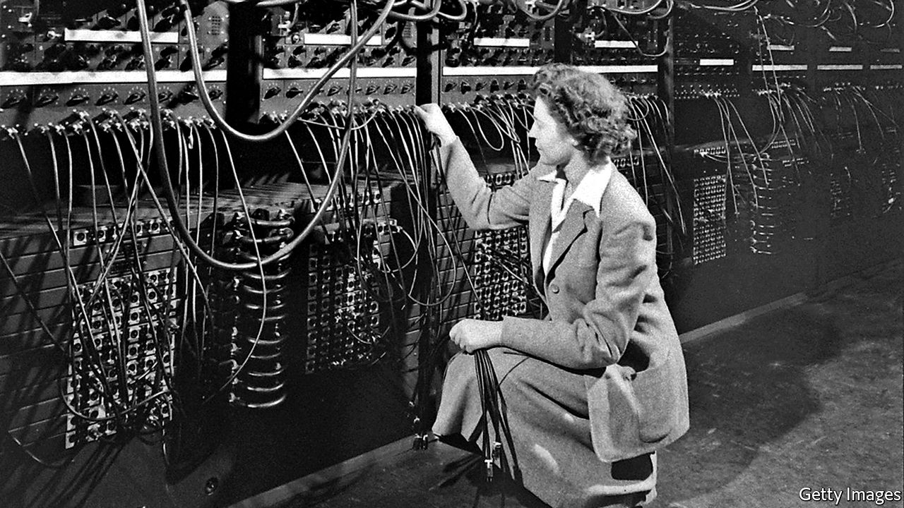

## The information economy

# Rethinking how we value data

> Looking at the world’s most precious resource through new eyes

> Feb 27th 2020

EVERYONE KNOWS that data are worth something. The biggest companies in the world base their businesses on them. Artificial-intelligence algorithms guzzle them in droves. But data are not like normal traded goods and services, such as apples and haircuts. They can be used time and again, like public goods. They also have spillover effects, both positive, such as helping to improve health care, and negative, such as breaches of personal information. That makes them far from easy to value.

A new report, led by Diane Coyle, an economist at the University of Cambridge, attempts to address this by understanding the value of data and who stands to benefit from it. She says market prices often do not ascribe full value to data because, in many cases, trading is too thin. Moreover, while much of society’s emphasis is on the dangers of misuse of personal data, the report chooses to highlight data’s contribution to “the broad economic well-being of all of society.” That gives it a much deeper value than a simple monetary one.

She outlines a variety of data types and uses. Some may be more useful in aggregate, others for individual purposes. For example, a patient’s medical records may be most valuable when they are combined with everyone else’s, while web-browsing history has value when it is used individually to bombard a person with advertisements. Timeliness also matters: phone-location records flowing in real-time for a car GPS-navigation system are useful for ten minutes, while today’s retail-sales transactions help forecast next year’s demand.

As yet the data economy does not distinguish such features well. Ms Coyle argues that a new mindset is needed, as well as institutions, such as data trusts, to ensure information is fairly distributed. Personal information should not be regarded through the lens of “ownership” but “access rights,” she says. Hence, people may control how it is used, but should not treat it as a winning ticket to be monetised.

That should apply more broadly, she argues. For governments, the right strategy may be to make data freely accessible. Estimates for the value of open government data range from less than 0.1% to more than 7% of GDP. Companies also should consider privileging access to personal data above ownership of it. Try telling that to the tech giants, though. However data are valued, they have no doubt about how valuable exclusive control is to them.

## URL

https://www.economist.com/finance-and-economics/2020/02/27/rethinking-how-we-value-data
