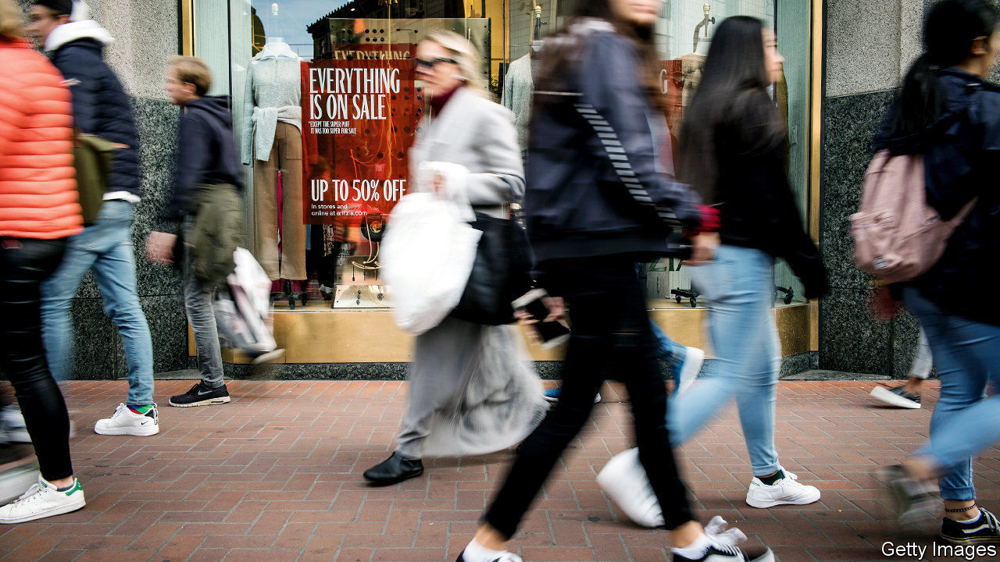
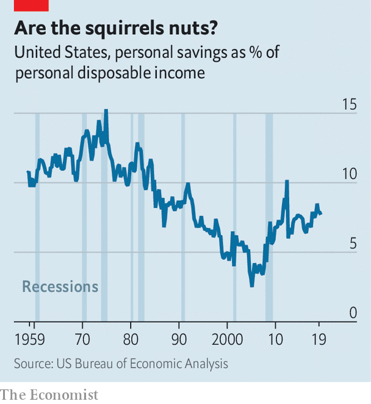

## Household savings in America

# Why America’s personal-saving rate is unusually high

> Land of the frugal

> Feb 27th 2020SAN FRANCISCO

NO WONDER advertisements implore Americans to spend, spend, spend. These days they are positively Swabian, saving a much bigger share of their post-tax incomes than they have done for most of the past three decades (see chart). This is more than just an economic curiosity. Many households’ savings end up in Treasury bonds, reducing the government’s borrowing costs. Savings allow households to consume more later or to cushion the blow of a misfortune. But why is their propensity to save so high today?

Saving typically rises during the bad times and falls during the good. The financial crisis of 2007-09 prompted Americans to pull back on spending and pay down debts. The share of disposable income squirrelled away rose from 3% in 2005 to 8% in 2010-12. These days the economy is much stronger. The unemployment rate, at 3.6%, is at a five-decade low, while consumer confidence is high. As other countries have recovered from the crisis, their personal-saving rates have tumbled. But America’s remains high, and has risen in recent years. Goldman Sachs, a bank, says that the personal-saving rate is four percentage points higher than it “should” be, given the strength of the economy.

One commonly heard explanation for higher saving relates to inequality. Poorer people may save little or nothing—research from the Federal Reserve suggests that 12% of adults would be unable to cover a $400 emergency expense. Rich people, by contrast, tend to save a big share of their income. A body of evidence suggests that in recent years the rich have taken a greater share of total income, thereby dragging the overall personal-saving rate upwards. Still, rising inequality is at best an incomplete explanation for America’s savings puzzle. As the chart shows, saving was far higher in the 1970s, yet inequality was lower.

The financial system may play a more important role. In recent years many Americans have found it more difficult to access credit. From 2008 banks tightened lending standards on consumer and credit-card loans. The median credit score for both mortgages and car loans is higher than it was before the crisis. It is now more difficult for middle-income households to spend beyond their means.

Another possible factor is that, despite a strong economy, households remain deeply uncertain about the future. There is good evidence that Americans are worried about the threat to their jobs from automation and import competition. The on- and off-again trade war may be another source of anxiety. A widely watched measure of economic uncertainty, based on analysis of newspaper articles, last year hit an all-time high—and it may rise further if the covid-19 outbreak worsens. All this encourages prudent behaviour. According to the Fed, the share of people saying that “liquidity” (in plain English, having rainy-day money) is the most important reason for saving has been rising since the mid-2000s. Americans could be stashing the cash for some time yet. ■