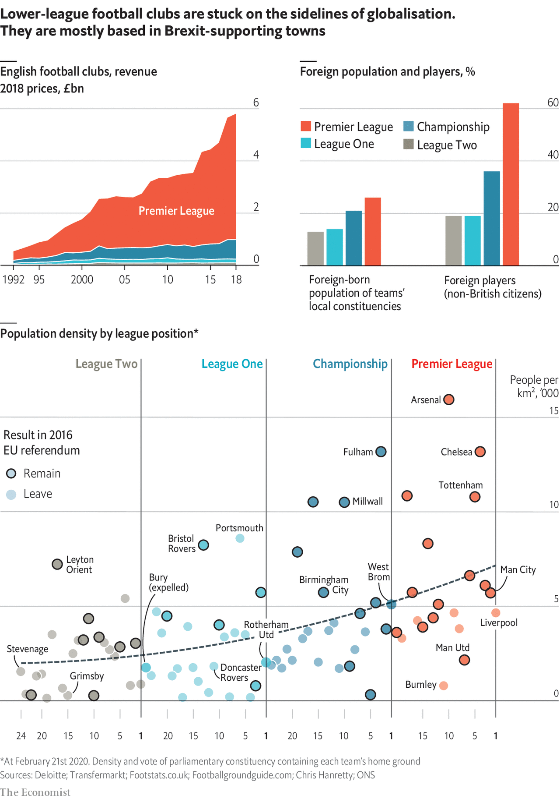

## A game of two halves

# Globalisation has left lower-league football clubs behind

> They are mostly based in Brexit-supporting towns

> Feb 29th 2020

POPULISTS OFTEN decry a “rigged system”, where global “elites” break rules while everyone else falls behind. Their tale got a recent boost from an unlikely source.

On February 14th UEFA, which runs Europe’s continental football contests, said it would expel Manchester City from those events for the next two years. The club, largely owned by Emirati royalty, won the English Premier League (EPL) last year with a costly, star-laden squad. On paper, it complied with rules that ban teams from making big losses, by paying wages using revenue from Emirati corporate sponsors. But UEFA said those firms had improperly subsidised the club, by paying above the market rate. City says the deals were not inflated, and has appealed against the decision.

Meanwhile, English teams without access to foreign capital or accountants have fallen on hard times. Just north of Manchester is Bury, whose local club, Bury FC, was set to start this season in League One. (Confusingly, English football’s second, third and fourth divisions are known as the Championship, League One and League Two.) In August Bury was kicked out of professional football after it failed to service its debts. On February 21st fans entered a new club into the amateur tenth tier.

The diverging paths of Manchester City and Bury reflect a widening economic gap between the top of England’s football pyramid and its base. An investigation by the Times found that 52 of the 72 teams in the second, third and fourth divisions recorded a loss in their most recent accounts. According to Deloitte, a consultancy, in 1992-2018 the revenues of teams in Leagues One and Two grew only a quarter as quickly as those in the Premier League did.

This separation owes in part to differences in regulation. Whereas UEFA’s financial rules have forced elite teams to be profitable, those for lower-ranked clubs are weaker. Many small teams have made big, unwise gambles trying to reach the top division, driving them into the red.

Immigration law has exacerbated the divide, because only stars who regularly represent their national teams can get work permits. That hinders lower-division sides in signing non-Europeans, and limits their appeal to foreign fans. When Grimsby plays Mansfield, audiences in Colombia, Nigeria and Japan have few of their own nationals to support.

Growing inequality in football has mirrored broader trends in British society. EPL teams sit in parliamentary constituencies more than twice as densely populated as those of Leagues One and Two. Economic output per person is 20% higher around such areas. The locals are younger and more likely to be immigrants. Predictably, these differences align with political preferences. In the EPL 70% of teams play in constituencies that voted to remain in the EU. For League Two, that figure is just 29%.

Fans of struggling teams have noted the parallel between their hometowns and football clubs that once served as a pillar of community. “The system...always lets people down at the bottom,” says Zoë Hitchen, a Bury supporter. “It never lets down the people at the top...You can’t split this from what’s happening in the UK at the moment. You can’t split it away from Brexit.” ■

Sources: Deloitte; Transfermarkt; Footstats.co.uk; Footballgroundguide.com; Chris Hanretty; ONS