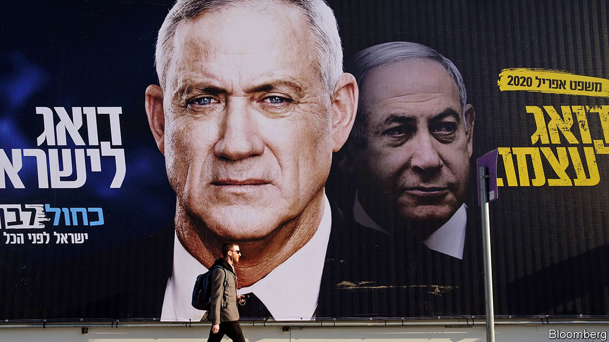

## Take three

# Will Israel’s third election in a year at last produce a government?

> The polls predict more deadlock

> Feb 29th 2020JERUSALEM

THE BLUEPRINTS had been gathering dust for 25 years. No Israeli leader, not even Binyamin Netanyahu, prime minister for the past decade, was willing to face the international criticism that would follow from building 3,500 new homes near Jerusalem, in the occupied West Bank. The new district would cut off the Palestinian part of Jerusalem from the rest of the West Bank, ending any possibility of a viable Palestinian state with Jerusalem as its capital. So the plans were put on the shelf—until February 25th, when Mr Netanyahu publicly dusted them off.

It is no mystery why Mr Netanyahu changed his mind. Israel is holding a general election on March 2nd, its third in a year. The last two, in April and September 2019, failed to produce a government. The prime minister thinks the only way for his bloc of nationalist and religious parties to eke out a majority this time is by mobilising the base. He is under pressure from his main rival, Benny Gantz. The former general and leader of Blue and White, Israel’s largest party, has been pursuing “soft-right” voters by matching many of Mr Netanyahu’s campaign promises.

Israelis appear exhausted by a campaign that has been running, on and off, since December 2018, when the first of the three elections was called. That one left Mr Netanyahu one seat short of a majority. His coalition lost seats in the September re-run, which produced a majority opposed to his rule. Still, Mr Gantz was unable to form a government. Since then, despite Mr Netanyahu’s gimmicks, such as promising to decriminalise the recreational use of cannabis, and Mr Gantz’s rightward shift, the polls have hardly budged.

The main issue is still Mr Netanyahu himself. Israel’s longest-serving prime minister is a polarising figure. He has kept Israel safe, forged closer ties to Arab states and overseen a flourishing economy. But in November he was indicted on charges of bribery and fraud for allegedly receiving illegal gifts and trading political favours for positive news coverage. His trial will begin on March 17th. Mr Netanyahu denies any wrongdoing and blames his legal troubles on lefty prosecutors, police and journalists (though he appointed the police chief who investigated him and the attorney-general who charged him). Critics accuse him of sowing division and demonising Arabs for political gain.

Mr Gantz, a bland campaigner, has struggled to fire up voters—or bring the opposition together. The parties that want to see Mr Netanyahu go range from Yisrael Beitenu, a fiercely nationalist outfit, to the Joint List, an alliance of Arab-majority parties. There is no prospect of them sitting together in a coalition. Mr Gantz says Arab parties “won’t be a part of my government”. He failed even to convince the right-wingers in his own party to serve in a minority government with outside support from the Joint List. Their antipathy to Arab-Israeli politicians, who are eager to play a bigger role (see [article)](https://www.economist.com//middle-east-and-africa/2020/02/27/a-growing-number-of-jews-are-voting-for-arabs-in-israel), apparently outweighs their animus against Mr Netanyahu.

On other issues, Mr Netanyahu and Mr Gantz are not so far apart. Both candidates say they will implement Donald Trump’s peace plan for Israel and the Palestinians, which was prepared in close co-ordination with the prime minister’s advisers and allows Israel to annex West Bank settlements and the Jordan Valley. Mr Netanyahu has already met American officials to draw up new maps. Once that task is completed, he will “immediately” apply sovereignty over the land in question. Mr Gantz says he would move forward “in co-ordination with the international community”. But annexation may be put on hold if the election produces another stalemate.

Israel’s election commission is already preparing for a possible fourth vote, in September. That might suit Mr Netanyahu, who would like to show up in court as a sitting prime minister. But most Israelis, including many of Mr Netanyahu’s allies, want to avoid another election. Though things have been running smoothly under the interim government, it cannot pass a budget or make big decisions. The monthly outlays for government ministries have automatically reverted to those in the 2019 budget, making it harder to build new infrastructure, fund social programmes or raise taxes to shrink a deficit that reached 3.7% of GDP last year. The lack of a budget “will not only affect government offices, but also the entire economy”, warned the accountant-general in November.

If they cannot form a government on their own, Mr Netanyahu and Mr Gantz will come under pressure to team up. A unity government featuring Likud and Blue and White was discussed after the last election. Mr Netanyahu agreed to split the prime minister’s term with his rival, but insisted on going first. Mr Gantz has ruled out serving under Mr Netanyahu while he is facing criminal charges. The prime minister’s allies could force him to the sidelines—though it is just as likely that the indomitable Mr Netanyahu will defy the odds, and hang on to his office. ■