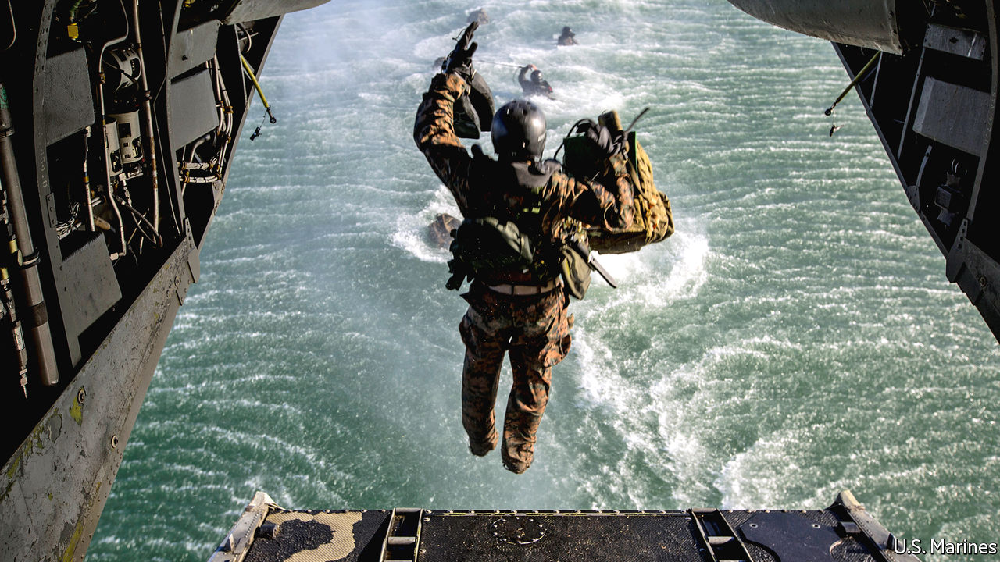

## Training elite marines

# How to decide in advance who will pass advanced military training

> Physical toughness is important. Personality more so

> Feb 27th 2020

IT GOES WITHOUT saying that to be a marine you have to be tough, both physically and mentally. But which is more important? And, more specifically, which is the bigger obstacle to successful training? Working on behalf of America’s marine corps, Leslie Saxon, of the Keck School of Medicine of the University of Southern California, has been trying to find out.

The elite of the marine corps is a group called Force Reconnaissance. These troops are employed in special operations, both “green” (in which having had to engage the enemy is deemed a failure) and “black” (where such engagement is the whole point). Initial training to join the force, open only to those already marines or naval doctors, lasts 25 days. Among other things it requires volunteers to tread water for nearly an hour, to run eight miles (12km) while carrying more than 50lb (about 23kg) of equipment, and to swim 100 yards (90 metres) with their hands and feet bound. Only half of those who volunteer for this training complete it. Of those who do not, roughly half are failed by the judges for posing a safety risk or for having a medical problem that stops them completing the course. The other half, though, drop out of their own volition.

That high drop-out rate is both expensive and vexing for Force Reconnaissance’s recruiters. They therefore turned to Dr Saxon to find out what is happening, so that they can take steps to reduce the losses.

To gather the relevant data she picked 121 trainees and provided each of them with two devices: an iPhone and an Apple Watch (a wrist band that both tells the time like a conventional watch and watches what the wearer gets up to). She loaded the phones with an app that asked participants a range of demographic and psychological questions at the start of their training. From the answers to these she generated, for each volunteer, scores for the five main personality traits recognised by psychologists—openness, conscientiousness, extroversion, agreeableness and neuroticism—and also for ego resilience (ability to control anger and to control impulses when stressed), positive affect (a person’s tendency to experience positive emotions when facing challenges), satisfaction with life and level of psychopathy. The watch, meanwhile, monitored the number of steps its wearer took, and kept track of both heart rate and calorie expenditure.

Once volunteers began training they received further, daily questionnaires on their phones. They were asked to rate their pain, both mental and physical, on a scale of one to five. They were asked if they thought of quitting and if they thought their instructors wanted them to graduate. They were also asked about their sleep, their hydration, their nutrition and their own confidence that they would graduate.

Dr Saxon’s sample proved pretty representative in their rates of completion of the course. As she reports in the Journal of Medical Internet Research, 56% were successful, 23% dropped out of their own volition and 21% were removed for a mixture of medical, safety and performance reasons. Analysing the data for those who dropped out, Dr Saxon found that neither performance on physical standards, such as hikes or aquatic training, nor physiological measures of heart rate, work output, hydration, nutrition and sleep duration predicted who would throw in the towel. Nor, among psychological factors, were conscientiousness, neuroticism, openness or agreeableness relevant. But extroversion (or, rather, introversion) was. Using scores for that parameter and also for positive affect, Dr Saxon was able, retrospectively, to predict with 70% accuracy who would drop out.

She also showed when the towel was most likely to be thrown. A majority of droppings out happened just before a series of timed drills, conducted in a deep-water pool, in full uniform. These drills are designed to test candidates’ ability to perform tasks underwater, holding their breath, in a chaotic environment.

What the marine corps’ trainers will do with this information is not yet clear. They could use it to winnow out likely failures before the course starts, though that might seem unfair to introverts who would nevertheless have made it. Or they might choose to identify those who need a bit of encouragement to throw themselves into both the literal and metaphorical deep end, on the presumption that, having done so, they will then take the rest of the course in their stride. Either approach would, presumably, reduce the drop-out rate. What you can be sure of, though, is that the course itself will not be made any easier.■

## URL

https://www.economist.com/science-and-technology/2020/02/27/how-to-decide-in-advance-who-will-pass-advanced-military-training
