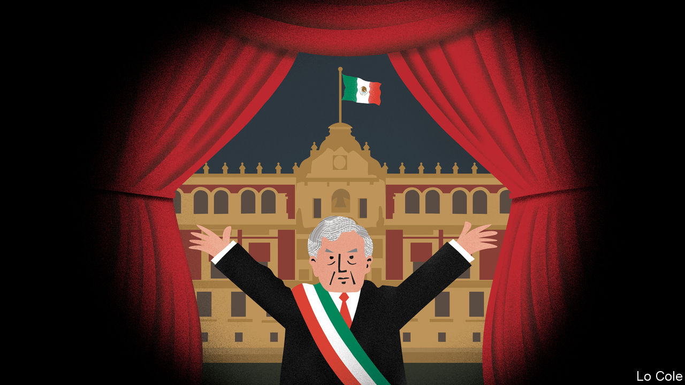

## Bello

# Mexico needs statecraft, yet its president offers theatre

> AMLO shows little ability to get to grips with governing

> Feb 27th 2020

MEXICANS HAVE been outraged this month by two brutal murders: one of a woman whose body was mutilated by her partner, the other of a seven-year-old girl who was kidnapped and seemingly tortured. Needless to say, neither of these cases was the fault of Mexico’s president, Andrés Manuel López Obrador (known as AMLO). But he is the man in charge. When questioned at his early-morning press conferences about the wave of violence against women in his country, his first response was to blame a “progressive degradation [in Mexican society] which had to do with the neoliberal model” that he accuses his predecessors of adopting. He then claimed that feminist groups, who blame the violence on patriarchy and lawlessness, had been infiltrated by conservatives, and tried to change the subject.

This episode conforms to the pattern of AMLO’s 15 months in the presidency. If the motto of Porfirio Díaz, Mexico’s dictator from 1877 to 1911, was “little politics, much administration”, AMLO’s guiding formula seems to be almost the opposite. He inherited three big problems: rampant crime, including violence against women; slow economic growth; and corruption. On the first two issues, Mexico is at best treading water.

A 12-year war with drug gangs drove the murder rate up and helped spread insecurity across the country. AMLO promised to stop this and tackle the causes of crime, offering “hugs, not bullets”. His government has given scholarships to some 800,000 young dropouts, but there is little sign that this will help them get jobs. More significant is a new paramilitary National Guard, 70,000-strong and due to rise to 150,000 troops by 2021. When the new force was first conceived of a decade ago, the idea was that it would work to take back control of violent rural areas from the drug gangs. AMLO is spreading it thinly across the country (and using it to stop migrants crossing the southern border, at Donald Trump’s behest). It is replacing the federal police, whom he distrusts.

Although the number of murders rose last year to 34,582, a record since statistics began in 1990, the peak came in the third quarter of 2018. AMLO appears to have given instructions to the security forces to minimise the use of lethal force, according to Eduardo Guerrero, a security consultant, writing in Nexos, a magazine. The problem is that this may reduce violence, but not crime. “Between half and two-thirds of the country is not under the effective control of the state,” says a foreign security specialist. Two incidents last year illustrated that. In October troops in the city of Culiacán were ordered to release the son of Joaquín “El Chapo” Guzmán, a notorious drug trafficker, after his arrest triggered a battle. In November three Mormon women and six children with dual Mexican and American citizenship were murdered when gunmen shot at their vehicles near the northern border.

The economy is no brighter. It shrank slightly last year, the worst performance since 2009. Many economists blame AMLO’s policies. One of his first acts was to cancel a $13bn half-built airport in Mexico City. He has stalled private investment in energy, on nationalist grounds. The government will pay for AMLO’s pet $7.4bn railway in the south-east, after it failed to interest investors.

AMLO argues, correctly, that incomes of poorer Mexicans rose sharply last year, through handouts and an increase in the minimum wage. But there is little reason to believe that investment or growth will revive. The president promised not to increase taxes in his first three years. But this month he invited business leaders to a frugal dinner and asked them to buy tickets for a “lottery” whose proceeds would be used for medical equipment. This shakedown raised $80m and distracted attention from femicides, but will do nothing for business confidence.

This poor policy performance is bad for Mexico, but not necessarily for the president. Polls put his approval rating at between 55% and 72%. Many poorer Mexicans see him as honest and on their side. His potential Achilles heel is crime and insecurity. His remedy is likely to be more political theatre, at which he is a master. The undoubted corruption of the previous government of Enrique Peña Nieto may give him plenty of material. This month the former head of Pemex, the state oil company, was arrested in Spain. The Wall Street Journal then reported that prosecutors are investigating Mr Peña. (Both men deny wrongdoing.) AMLO claimed no knowledge of that. But it is hard to imagine that the showman will miss an opportunity like this.

## URL

https://www.economist.com/the-americas/2020/02/27/mexico-needs-statecraft-yet-its-president-offers-theatre
