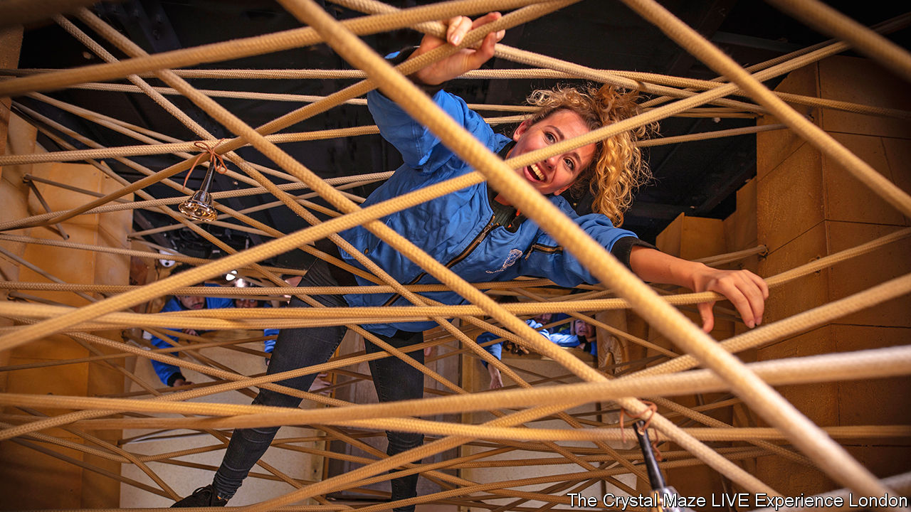

## Retail

# A new role for Britain’s high streets

> Selling experiences instead of stuff

> Mar 5th 2020

“BEAUTIFUL! CUTE! Now kill each other,” orders the instructor as a couple face off, axes aloft, for the post-date photoshoot after a night on the town throwing hatchets. The choice of unusual options for a London date is vast these days—battling a zombie apocalypse in Greenwich, escaping a haunted Pirate Ship on the Holloway Road and tossing tomahawks with friends in Vauxhall.

Competitive socialising, as this trend is known, sounds like a social-media peer-pressure nightmare, but loosely translates as doing an activity with your friends. It ranges from the traditional (go-karting, crazy golf and ping-pong) to the futuristic (virtual-reality Everest climbing and AI-led murder mysteries). It is being cautiously embraced as a lifeline by high-street landlords ravaged by e-commerce.

Both new-school and old-school pursuits are thriving. Between 2013 and 2019, the number of escape rooms in Britain leapt from 13 to more than 1,400 according to Mintel, a market-research firm. Over the same period revenues from ten-pin bowling, which along with cinema has anchored retail developments for decades, have grown by a third.

Several factors have caused this. First, there has been a demographic shift to what consultancies call “the experience economy”. Younger people increasingly prefer experiences to goods, inspired by social media and “fear of missing out”, and from a sense that, in the West at least, people have reached “peak stuff”. A recent survey of British adults showed that two-thirds would rather spend their money on experiences than possessions, rising to three-quarters for millennials.

The second factor is the rise of online shopping, whose growth has taken its toll on bricks and mortar. In the first half of 2019 shop closures across Britain’s top 500 high streets reached the highest rate for five years. Department stores in shopping centres have been hit particularly hard, shedding nearly a quarter of units since 2013, and rents are projected to continue falling for the next five years.

As high-street chains collapse into administration or close stores en masse and shoppers move online, retail space is increasingly being used for socialising. This doesn’t just prop rents up: it also benefits an area by encouraging shoppers to linger. For games operators, the glut of floor space and cheap rents in areas of high footfall is perfect. “Everything has changed from five years ago,” says Ben Hodges, co-founder of the Crystal Maze live experience. “It feels like the stars are aligning.”

The sector’s rapid growth has not gone unnoticed. Merlin and Centre Parcs, two of the country’s largest leisure operators, have added escape rooms to their offerings, while private-equity firms are snapping up stakes in the industry’s hottest prospects. Puttshack, a tech-infused golf outfit with four venues, attracted £30m from investors and talks of opening another 64 venues by 2024. Flight Club, which offers “darts for the 21st century” (much the same as the old-fashioned variety, but with electronic boards that do the maths for you), received a £15m investment in 2018 and has expanded to eight locations in Britain and America. High-street landlords should embrace the axe-throwers, or prepare for the chopping block.

## URL

https://www.economist.com/britain/2020/03/05/a-new-role-for-britains-high-streets
