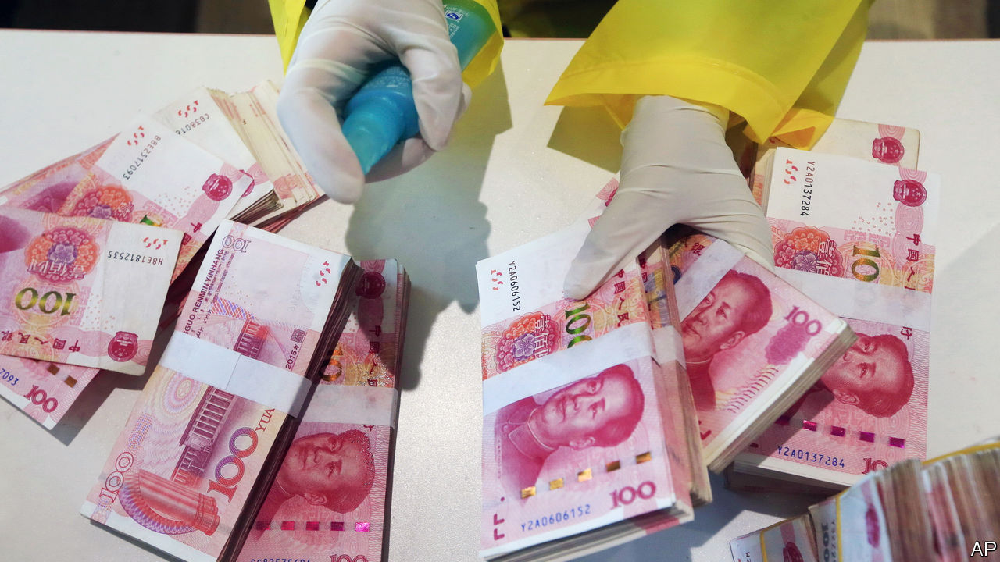
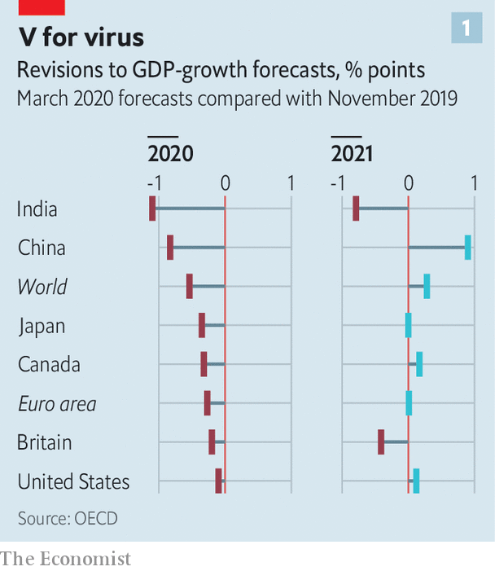
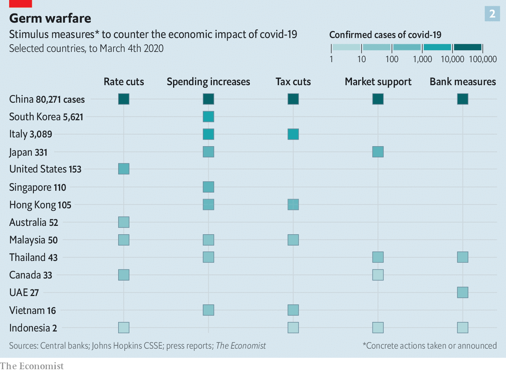

## How to revive the world economy

# A recession is unlikely but not impossible

> Covid-19 infects the world economy

> Mar 5th 2020SAN FRANCISCO AND SHANGHAI

IF THE FINAL week of February saw financial markets jolted awake to the dangers of a covid-19 pandemic, the first week of March has seen policymakers leaping into action. The realisation that global GDP will probably shrink for part of this year, and the looming risk of a financial panic and credit-crunch, has led central banks to slash interest rates at a pace last seen in the financial crisis of 2007-09.

On March 3rd the Federal Reserve lowered its policy rate by 0.5 percentage points, two weeks before its scheduled monetary-policy meeting. Central banks in Australia, Canada and Indonesia have also cut rates. The European Central Bank and the Bank of England are expected to follow. If the money-markets are right, more Fed cuts are in store. A composite measure of the global monetary-policy rate, compiled by Morgan Stanley, a bank, is expected to fall to 0.73% by June, from 1% at the start of the year and 2% at the start of 2019.

Yet there is an uneasy feeling that a flurry of rate cuts may not be the solution to this downturn. In part that reflects the fact that they are already so low. A golden rule of crisis-fighting is that in order to be credible you should always have more ammunition available. In 2008-10 the global composite policy rate fell by three percentage points. Today, outside America, rich-world interest rates are close to, at, or below zero. Even the Fed has limited scope to cut much further—one reason, perhaps, why share prices failed to revive in the hours after its latest move.

The tension also stems from the peculiarity of the shock that the economy faces—one that involves demand, supply and confidence effects. The duration of the disruption mainly depends on the severity of the outbreak and the public-health measures undertaken to contain it. Given those uncertainties, policymakers know that while interest-rate cuts are an option, they also need fiscal and financial measures to help business and individuals withstand a temporary but excruciating cash crunch.

One way the virus hurts the economy is by disrupting the supply of labour, goods and services. People fall ill. Schools close, forcing parents to stay at home. Quarantines might force workplaces to shut entirely. This is accompanied by sizeable demand effects. Some are unavoidable: sick people go out less and buy fewer goods. Public-health measures, too, restrict economic activity. Putting more money into consumers’ hands will do little to offset this drag, unlike your garden-variety downturn. Activity will resume only once the outbreak runs its course.

Then there are nasty spillovers. Both companies and households will face a cash crunch. Consider a sample of 2,000-odd listed American firms. Imagine that their revenues dried up for three months but that they had to continue to pay their fixed costs, because they expected a sharp recovery. A quarter would not have enough spare cash to tide them over, and would have to try to borrow or retrench. Some might go bust. Researchers at the Bank for International Settlements, a club of central banks, find that over 12% of firms in the rich world generate too little income to cover their interest payments.

Many workers do not have big safety buffers either. They risk losing their incomes and their jobs while still having to make mortgage repayments and buy essential goods. More than one in ten American adults would be unable to meet a $400 unexpected expense, equivalent to about two days’ work at average earnings, according to a survey by the Federal Reserve. Fearing a hit to their pockets, people could start to hoard cash rather than spend, further worsening firms’ positions.

Modelling the resulting hit to economic activity is no easy task. In China, which is a month ahead of the rest of the world in terms of the outbreak, a survey of purchasing managers shows that manufacturing output in February sank to its lowest levels since factory bosses were first surveyed in 2004. It seems likely that GDP will contract in the first quarter for the first time since the death of Mao Zedong in 1976.

Forecasters are pencilling in sharp falls in output elsewhere (see chart 1). Goldman Sachs, a bank, reckons global GDP will shrink at an annualised rate of 2.5% in the first quarter. With luck the slump will end once the virus stops spreading. But even if that happens the speed and size of the economic bounce-back also depends on the extent to which those costly spillovers are avoided.

That is why central bankers and finance ministries are turning to more targeted interventions (see chart 2). These fall into three broad categories: policies to ensure that credit flows smoothly through banks and money markets; measures to help companies bear fixed costs, such as rent and tax bills; and measures to protect workers by subsidising wage costs.

Start with credit flows. Central banks and financial regulators have tried to ensure that markets do not seize up, but instead continue to provide funds to those who need them. On March 2nd the Bank of Japan conducted ¥500bn ($4.6bn) of repo operations to ensure enough liquidity in the system. The People’s Bank of China has offered 800bn yuan ($115bn, or 0.8% of GDP) in credit to banks so long as they use it to make loans to companies badly hit by the virus. Banks have been asked to go easy on firms whose loans are coming due.

Governments are also helping firms with their costs, the second kind of intervention. Singapore plans corporate-tax breaks, and rental and tax rebates for commercial property. Korea will give cash to small firms struggling to pay wages. Italy will offer tax credits to firms that experience a 25% drop in turnover. In China the government has told state landlords to cut rents and given private-sector landlords subsidies to follow suit.

The final set of measures is meant to protect workers by preventing lay-offs and keeping incomes stable. China’s government has enacted a temporary cut to social-security contributions. Japan will subsidise wages of people who are forced to take time off to care for children or for sick relatives. Singapore has announced cash grants for employers of affected workers.

Today these policies are being sporadically announced, and their implementation is uncertain. As the virus spreads, expect more interest-rate cuts—but also the systematic deployment of a more complex cocktail of economic remedies. ■

## URL

https://www.economist.com/finance-and-economics/2020/03/05/a-recession-is-unlikely-but-not-impossible
