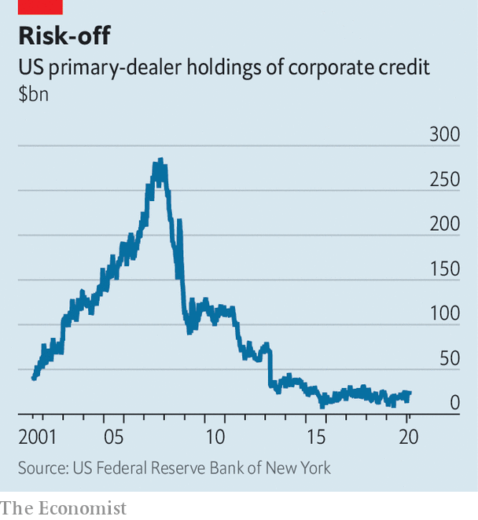

## Corporate-bond trading

# Electronic platforms are challenging bond broker-dealers

> Their success is key to providing liquidity in stressed markets

> Mar 5th 2020

ONE OF THE minor miracles of financial markets is that, in volatile periods such as these, sellers of securities can be readily matched with buyers. Though the direction of prices is uncertain, trading volumes are solid. Yet worrywarts say that while liquidity is plentiful at first when volatility rises, it cannot be relied on if markets stay jumpy for a while.

Corporate bonds cause the biggest headaches. A cheap and convenient way to hold them is via exchange-traded funds, or ETFs, low-cost vehicles that hold baskets of bonds and trade on stock exchanges. Part of the appeal of bond ETFs is the ease with which they can be bought or sold. But the corporate bonds held in such funds are typically less liquid than shares. Bonds are not as standardised; a company may issue them at varying maturities. Investors may still think they can sell them at a moment’s notice. There have long been concerns about a shortage of willing traders should the markets become stressed.

The broker-dealers who have traditionally stood between buyers and sellers of corporate bonds have scaled back their role as risk-takers (see chart). New forms of market-making are emerging. Slowly at first, and lately more quickly, the corporate-bond market is embracing trading on electronic platforms. Bloomberg is one of the main players. Another is Tradeweb, a venue favoured for the trading of government bonds. A third platform, MarketAxess, is the one best known for corporate-bond trades. A big question is, can such platforms make up for the diminution of old-school sources of liquidity?

Until 2008, the ease with which investors could trade corporate bonds relied on the willingness of big investment banks to hoard securities. These telephone-based dealers would buy bonds during periods of heavy selling and warehouse them for when investors were willing to bid for them again. But new rules since the financial crisis have made it expensive for banks to use capital for trading activities of any kind. The stockpile of corporate bonds they held dropped like a stone.

Enter the trading platforms. MarketAxess started 20 years ago as a way for pension funds and insurers to trade with the big dealer-brokers in an efficient way. After the financial crisis, it became clear that its clients needed something more. The firm started a programme to bring smaller, regional dealers and other liquidity providers into the fold. Individually none could match the muscle of the big Wall Street banks. But put them together and they provide meaningful liquidity for MarketAxess’s big clients. The firm has over 1,700 users, including mega-funds such as BlackRock and Legal & General. Volumes have risen for 11 years in a row. It handles a fifth of trading in investment-grade bonds in America. By far the fastest volume growth in the year to the end of February was in less-liquid securities, such as high-yield and emerging-market bonds.

The wonder is that it has taken so long for electronic trading to take hold in bond-land. It seems rather quaint that some deals are still brokered by traders with a phone glued to each ear. Screen-based trading is more transparent and far more efficient. But old habits die hard. A challenge for any platform—whether it is a dating website or an online-trading venue—is to persuade customers that there will be plenty of other customers to transact with. The barriers to “open trading” were high; traders were at first chary of advertising their bids and offers to all and sundry for fear that prices would move against them. But that has changed, says Rich Schiffman, head of Open Trading at MarketAxess. “They have come to realise that the benefits far outweigh the risks.” The more people who see your order, the better chance someone will fulfil it. Renewed market volatility might even attract more arbitrageurs to the platform.

Big tests lie ahead. Half of all investment-grade bonds have a credit rating of BBB. In a deep recession some of those bonds will be downgraded to junk. A lot of mutual funds can hold only investment-grade bonds. If big blocks of bonds have to change hands quickly, it might overwhelm the market’s liquidity. A lot rests on the further success of the electronic platforms.■

## URL

https://www.economist.com/finance-and-economics/2020/03/05/electronic-platforms-are-challenging-bond-broker-dealers
