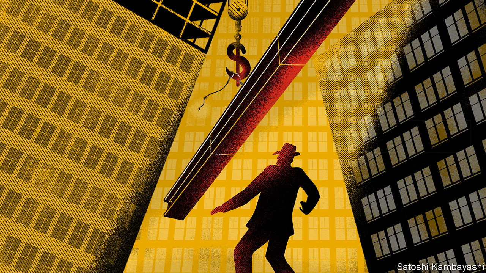

## Buttonwood

# Share prices fall hard in recessions. It is tricky to take advantage

> Seeing through a falling stockmarket

> Mar 5th 2020

SAM SPADE, the detective in “The Maltese Falcon”, a crime novel by Dashiell Hammett, recounts a story of a missing-person case. Flitcraft, an everyman, is nearly killed by a falling beam. Confronted with the randomness of life, he decides—randomly—to vanish. After drifting for years, he settles into a new life much like his old one: marriage, kids, and golf at four. “He adjusted himself to beams falling,” says Spade. “And when no more of them fell, he adjusted himself to them not falling.”

The covid-19 virus has dropped from the sky, much like the girder that narrowly missed Flitcraft. Investors are shaken. Many are still adjusting to a world of falling beams. It will be a while before they adjust to them not falling. Meanwhile, the news on the economy gets worse. And bad economic news is generally bad for share prices.

If you are about to retire or derive your income from shares, this will hurt you. But there is a class of investor for which falls in asset values, or drawdowns, are an opportunity. Were prices to fall exactly in line with the value of lost profits, shares would be no cheaper. But in recessions, stocks tend to fall by a lot more than that. A clear-headed investor can pick up some bargains.

Economic downturns are—or should be—a fact of life for investors. A good working definition for them is a change to global GDP that causes a meaningful hit to the near-term corporate cashflows that shareholders lay claim to. A blow of this kind seems certain this year. But downturns eventually give way to recoveries. Only a fraction of firms will go bust. And equities are perpetual securities. The profits lost to recession can be thought of as an annual dividend cheque that got lost in the post and is not replaced. It hurts your wealth. But you are still entitled to payments stretching into the indefinite future. These account for most of a share’s value.

In principle, then, investors need not demand a big discount to hold stocks in recessions. But in practice they do. During the steep downturn of 2008-09, for instance, the S&P 500 index fell by almost 50% in the space of a few months. Although that was an especially brutal recession, it was not a drawdown for the ages. The peak-to-trough falls in earlier crashes were nearly as big. Clearly a lot of shareholders cannot look past the downturn. Call this panic, if you like, but it is all-too-human. When the beam hit the pavement beside him, Flitcraft “felt like somebody had taken the lid off life and let him look at the works”. Big drawdowns affect people in a similar way. Suddenly, risks seem to be everywhere—to your job, to your business, to your pension and your way of life. It seems imprudent to hold on to stocks.

The simplest, rules-based way to take advantage of lower stock prices is portfolio rebalancing. An investor who holds a portfolio split 50-50 or 60-40 between shares and bonds sells the bonds that have gone up in price, as interest rates fall, to buy shares that have fallen in price, and are now cheaper. She does this once a month or once a quarter to keep the weights constant. A bolder group of investors keeps cash in reserve so they can take advantage of bargain prices when the markets have turned away from risky shares. “There is a point when I say ‘this is getting interesting’,” says one investor. The threshold for “interesting” is a fall of at least 20%. For deep-value investors, it might be 40%.

A good stockpicker will have a watch list: a roster of company shares she would like to own should they become cheaper during the current sell-off. Market sages, tapping their nose, boast that they plan to load up on “quality stocks” at good prices when the stockmarket really tanks. If only life were that simple. Quality stocks (companies with a business model that is hard for rivals to emulate) started off dear and are only a little less so now. Meanwhile unloved value stocks, which sell for a low multiple of their profits, have become even cheaper. Such firms are in industries whose long-term prospects look bleak—banks, carmakers, oil firms and so on. Owning them has been an unrewarding experience. Their profits will be crushed by travel bans, supply-chain snarl-ups and the like. But their cheapness will push bolder investors to take a look.

Flitcraft was shocked to discover how random life can be. The hardboiled Sam Spade already understands this. Investors of the Spade kind know that beams fall, and they adjust to it. They also know that beams eventually stop falling. It is this that allows them to buy stocks when prices hit the pavement.

## URL

https://www.economist.com/finance-and-economics/2020/03/05/share-prices-fall-hard-in-recessions-it-is-tricky-to-take-advantage
