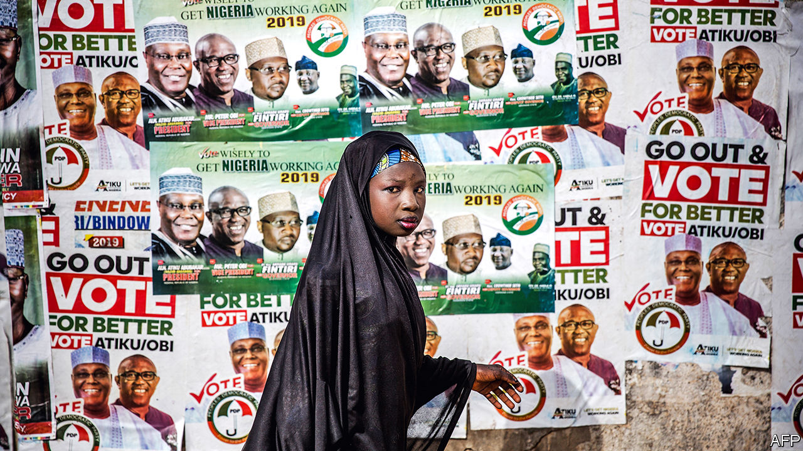
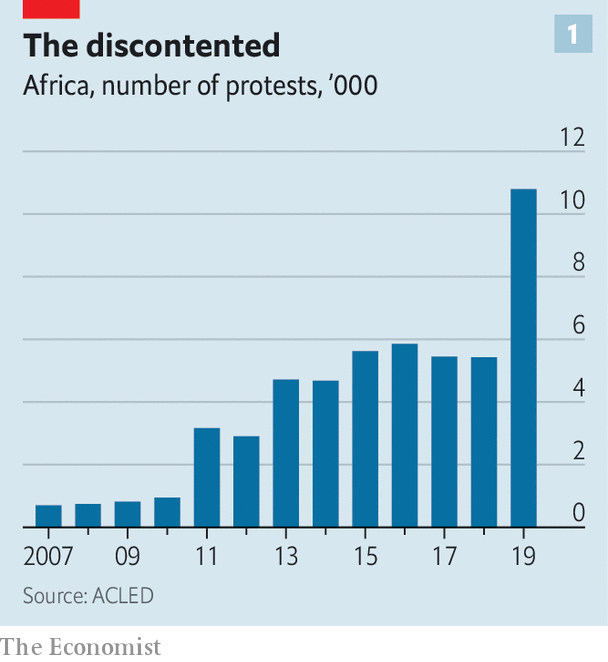
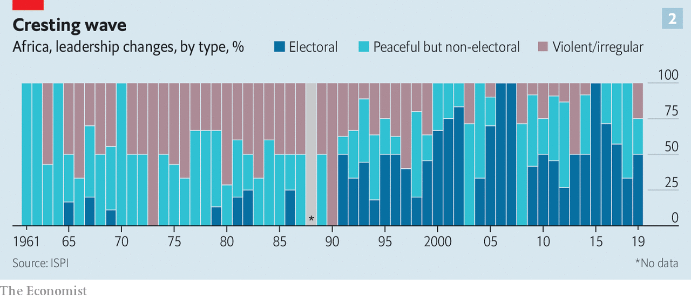

## Generation game

# Young Africans want more democracy

> Their ageing rulers are finding new ways to thwart them

> Mar 5th 2020COTONOU, KHARTOUM AND LILONGWE

ONE DAY in January Comlan Hugues Sossoukpe awoke before dawn in Lomé, the capital of Togo, and slipped across the frontier to a safe house in Benin. It was only the second time he had been in his home country since May, when he fled after being charged with “breaching public order”. His apparent crime: writing about how troops loyal to Patrice Talon, Benin’s president, shot peaceful protesters.

The 33-year-old—eloquent, passionate, tired—explains that activism is a family trait. His father spent years on the run and three uncles were sent to labour camps for opposing the dictatorship of Mathieu Kérékou, one of dozens of autocrats who bestrode Africa in the 1970s and 1980s. His relatives fought for Benin’s trailblazing shift to multi-party elections in 1991, a move that was replicated by most African countries by the end of the decade. “I consider myself a child of democracy,” he says.

Like many such offspring he is frustrated with his inheritance. Until recently Benin was a bastion of liberty. But the government of Mr Talon, a tycoon elected president in 2016, has stuffed courts with cronies, excluded opposition parties from elections, shut down the internet and arrested journalists. Each year Freedom House, a watchdog in Washington, publishes a global assessment of democracy, giving each country a score out of 100. Benin’s decline in 2019, from 79 to 66, or from “free” to “partly free”, as per the report’s categories, is one of the largest drops ever for an African country. “Now that our freedoms are being lost we realise what we had,” reflects Mr Sossoukpe.

No one story can epitomise the hopes of a country, never mind a continent. But Mr Sossoukpe is far from alone in his aspirations. Across Africa the demand for democracy is outstripping supply. Young, urban populations want the right to express themselves, vote in fair elections and hold leaders to account—at the same time as already flawed democracies are becoming more so. It is a mismatch that will shape the continent. “Younger Africans do not want to go back to one-party states or military rule,” says Chris Fomunyoh of the National Democratic Institute, another American watchdog. “They want to improve on the baseline they’ve been given.”

That is not an easy starting-point given the history of post-colonial Africa. Departing European powers made only cursory efforts to leave behind democratic institutions. Their priority was to leave quickly, keeping business and diplomatic ties. By the end of the 1970s just three countries in sub-Saharan Africa were definitively multi-party democracies (Botswana, the Gambia and Mauritius). More than two-thirds had undergone military rule. There were at least 40 coups.

The colonial legacy is one reason why nearly every country became authoritarian. Africa has more than 2,000 languages and 6,000-10,000 political groupings. Europeans drew borders with callous disregard for facts on the ground. They ruled using coercion and co-option, devolving power to tribal leaders, some of whose chiefly credentials were invented, as was the case with the Igbo in Nigeria. When they took over weak and diverse states, new leaders often adopted tools of repression and patronage.

Following colonial ways was often the easiest path. But rejecting Western-style democracy was a choice that several African leaders consciously made. Tanzania’s Julius Nyerere argued that multi-party democracy was “unAfrican”. One-party states, he said, better reflected a culture where consensus was prized.

Other leaders were less erudite. The 20th century saw a rogue’s gallery of dictators: murderous despots like Jean-Bédel Bokassa (Central African Republic) and Idi Amin (Uganda); ostentatious kleptocrats such as Mobutu Sese Seko (Congo) and Sani Abacha (Nigeria); charismatic megalomaniacs such as Kwame Nkrumah (Ghana); paranoid rulers like Daniel arap Moi (Kenya) and Hastings Banda (Malawi). Banda ran seven different security services and banned the song “Cecilia” by Simon & Garfunkel because it offended his unofficial first lady, Cecilia Kadzamira.

By the time the Soviet Union collapsed many African economies were broke. That led to protests and the fall of some tyrants previously propped up by Moscow. It also made it easier for a self-confident West to insist on elections as a condition of aid or credit. By 1994 only 35 countries in sub-Saharan Africa had held elections; by 2010 just two had not (Eritrea and Eswatini, formerly Swaziland). Academics call this era the “second wave” of democratisation, three decades after independence.

Authoritarian rulers used patronage networks to woo pliant elites, especially those of their own ethnic group. They ran what Frederick Cooper, a historian, calls “gatekeeper states” that controlled access to foreign aid, receipts from natural-resource exports and taxes on trade. Since they relied on minerals and foreigners for cash, rather than income taxes, they had little incentive to nurture an urban middle class, and little accountability to their own people. They kept the rural poor in line with handouts and threats. They prized loyalty over competence.

Dictators and military coups are now rarer than they were during the cold war. But most African countries display what political scientists call “electoral authoritarianism”, where the pageantry of voting obscures a lack of genuine democracy. Elections are regular but regularly rigged.

The picture seems to have deteriorated. Freedom House classifies just seven countries as “free”—the lowest total since 1990.

Southern and west African countries are typically more free than those in the east and central regions. A few states have liberalised in the past two years. Under Abiy Ahmed, Ethiopia’s prime minister, political prisoners have been released, among other reforms. Last year Sudanese toppled Omar al-Bashir, a genocidal dictator. New governments in Angola and Mauritania have begun to loosen up. But the overall trend is disappointing.

This is especially true of countries once seen as bright spots, such as Benin and Zambia, the first two African countries (Mauritius apart) whose presidents were ejected at the ballot box, both in 1991. In Benin Mr Talon rejects what his communications minister, Alain Orounla, calls the “Nescafé democracy” of the 1990s—instant and bitter. In Zambia President Edward Lungu has, among other moves, leant on courts to allow him to run for a third time in 2021. Under John Magufuli, president since 2015, Tanzania has arrested opposition MPs and journalists, shut media outlets and passed laws to muzzle dissidents. The government urges neighbours to snitch on gay people so they can be punished. It expels pregnant girls from school.

The closing of the public space is apparent elsewhere. Polls by Afrobarometer, a pan-African research organisation, find that the share of Africans who say they are free to say what they think declined from 79% in 2008 to 70% in 2018. From 2004 to 2018 12 African countries passed laws making it harder for NGOs to operate. Another six are planning to do so. Reporters Without Borders said that 22 out of the 48 sub-Saharan African countries were “bad” or “very bad” places for journalists: they have recently been killed (in Somalia), banned (Burundi and Congo) and arrested (Cameroon, Liberia and Tanzania, among others).

Technology is boosting Big Brother. Huawei has reportedly helped Uganda and Zambia to spy on political opponents. Rwanda’s regime has allegedly hacked messages of perceived enemies. Of the 21 countries that shut down the internet last year, 12 were African.

The international environment is making it easier for authoritarian regimes, too. Africa’s democratic backsliding is not unique. Freedom House’s average global score has declined for 14 consecutive years. And anti-democratic powers are vying for the ears of African leaders.

China is the most influential. It lends more money and sells more arms to sub-Saharan Africa than any other country. The Communist Party also runs courses for ruling parties across the continent, including those from South Africa, Angola, Namibia, Tanzania and Ethiopia.

Russia is much less powerful but more brazen. It focuses on fragile resource-rich countries. Since 2018 Russian military advisers have served President Faustin-Archange Touadéra in the diamond-rich, horribly corrupt Central African Republic.

Chinese and Russian action goes alongside Western inaction. There was no mention of “democracy” in the speech outlining the Trump administration’s “Africa strategy” in December 2018—a change from previous presidencies. Though some members of repressive regimes, such as Zimbabwe’s, have been subject to American sanctions, Donald Trump’s priority is to woo states away from Chinese and Russian influence. So in Congo, for example, America, with reluctant European backing, welcomed the election of President Félix Tshisekedi, despite copious evidence that he lost by miles to another candidate.

International institutions have been similarly weak. The World Bank is reluctant to stop aid for odious regimes even when local activists, as in Tanzania, have asked it to do so. The Southern African Development Community, a regional group, is seemingly incapable of criticising rigged elections. West Africa’s equivalent, ECOWAS, has on occasions stuck up for democracy and against coups, but has been less critical of slides towards autocracy since the election of Muhammadu Buhari as Nigeria’s president in 2015.

Outsiders may care little about African democracy. But there is no such apathy on the continent itself. In an Afrobarometer poll of 34 countries published in 2019, 68% of Africans said that democracy was the best form of government, a share that was broadly stable over the previous decade. The figure is higher when respondents are presented with specific alternatives; 78%, for example, said they would not give up multi-party elections for strongman rule. It is possible that more Americans than Africans are tempted by authoritarianism. According to the World Values Survey, a research project, 24% of Americans, and 32% of those without a degree, say that a “strong leader” who does not have to bother with Congress or elections is a “fairly” or “very” good idea. (These shares were higher before Mr Trump became president.)

Though Africans remain keen on the idea of democracy, frustration with the reality has risen. In the late 1990s only about a quarter of respondents in a sample of 14 African countries tracked by the Centre for the Future of Democracy at the University of Cambridge expressed “dissatisfaction” with democracy. By the 2010s that had risen to about a half.

Dissatisfaction is reflected in the rising number of protests. In 2019 there were 10,793 demonstrations in Africa, according to the Armed Conflict Location & Event Data Project, compared with 819 in 2009 (see chart 1). And whereas demonstrations typically lasted for days or weeks, recent cases in, say, Malawi, Sudan, Togo and Guinea have gone on for many months.

The imbalance between how much democracy young Africans want and how much they have is altering political dynamics. “The game has changed,” argues Judd Devermont of the Centre for Strategic and International Studies, a think-tank in Washington. Politics is becoming more competitive and less predictable. Or as a report by America’s National Intelligence Council put it in 2018: “This tug-of-war between leaders and their publics will become more intense.”

The winners will vary, depending on the balance of forces in each country. On one side are the electoral authoritarians, operating in a conducive international environment. On the other are trends that will make their reigns more difficult.

One is demography. Africans are young. Most were born in the 21st century (most people in the EU were born before 1978). They are also rapidly urbanising: 21 of the world’s 30 fastest-growing cities are in Africa. Both trends are disruptive for old parties run by old men that depend on old rural voters. Young Africans, like young people almost everywhere, have weaker ties to traditional parties. African city-dwellers are more likely to oppose incumbents than their rural peers, who are less well educated, have fewer sources of information and are more easily intimidated.

Africa’s young populations have inspired breathless talk of a “demographic dividend”. But because birth-rates remain high, the share of working-age people in African countries remains generally lower than in Asian countries in the 20th century. African economies are also not producing enough opportunities for young people—another destabilising force. Economic growth for sub-Saharan Africa will be about 3.4% per year over the next five years, predicts Capital Economics, a consultancy in London. That is not much faster than population growth.

And it is bad news for the 1m or so Africans who enter the labour market every month. Fewer than one in four will get a formal job, reckons the Africa Growth Initiative based at the Brookings Institution, another Washington think-tank. The rest face a more precarious future in the informal sector—precisely the type of jobs done by those who swell political protests. Data from the World Bank suggest that social mobility is lower in Africa than in almost any other part of the world.

It is no coincidence that the wellsprings of protests are slums. Some politicians are already tapping discontented young voters. Bobi Wine, the self-styled “ghetto president” running against Yoweri Museveni in next year’s presidential election in Uganda, is only the most eye-catching.

Lisa Mueller, a political scientist, argues that demonstrations are inspired by a mix of middle-class (usually older) people’s demands for political freedoms and poorer (usually younger) people’s economic grievances. The mix was apparent in Sudan, as protests sparked by rising bread prices combined with opposition to dictatorship.

There was a similar breadth to protests in Malawi against the dubious re-election of Peter Mutharika, the 79-year-old president, in May 2019. (Dollops of Tipp-Ex were used to alter tally sheets.) The demonstrations led to the Constitutional Court in February ordering a rerun, only the second time judges have done so in African history, following Kenya’s example in 2017.

For some it was mainly a victory for freedom. “We can perhaps say that our democracy has begun, 26 years after [the end of Banda’s dictatorship],” reflected Danwood Chirwa, a Malawian lawyer. Younger protesters, however, had more material things on their minds. “I hope for change of government and with that change I will start a small business because the opportunities under the current government are very limited,” said Pikilana Maliza, an unemployed 23-year-old from a township in the capital, Lilongwe.

Malawi’s doughty judges show the importance of institutions. Strong judiciaries, parliaments and the like are checks on arbitrary power. And while many are under political influence, some are willing to act as vehicles for those campaigning for greater democracy.

Take African legislatures. They are often dismissed as rubber-stamp institutions. But they have helped ensure that, since 1990, all but seven of the 47 countries in sub-Saharan Africa that have non-ceremonial heads of state have term limits. These limits are more than twice as likely to be kept as broken.

Institutions cannot always restrain a determined autocrat, but they can raise the costs of him repressing his people and clinging to power. This is one reason why there has been a rise in the number of peaceful, if not always democratic, changes of government (see chart 2). There have been 29 non-violent transfers of power since 2015, compared with just nine in the first half of the decade. Of the 49 sub-Saharan leaders in charge at the start of 2015, just 22 are in place today. Many of these changes reflect deals among elites, such as the one that brought Abiy to power in Ethiopia. But they show that political systems do respond to pressure.

The forces for and against democracy will shape African countries in different ways. Nic Cheeseman of the University of Birmingham expects there to be a “growing democratic divide” on the continent, as politics in countries such as Botswana, Ghana, Namibia and South Africa become more competitive, while authoritarian states become more repressive.

The future of more fragile democracies, like Benin, is less certain. But Mr Sossoukpe is determined to ensure that the repression unleashed by Mr Talon is temporary. Citing the role of his father who helped topple Kérékou, the dictator, he adds: “I see it as a duty to my children to keep fighting.” ■

## URL

https://www.economist.com/middle-east-and-africa/2020/03/05/young-africans-want-more-democracy
