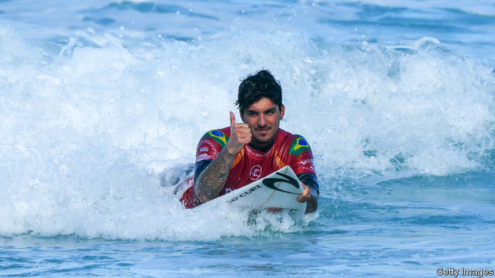

## Weathering the storm

# Brazilians dominate surfing (for now)

> But their success comes as the industry struggles

> Mar 5th 2020MARESIAS, SÃO PAULO

GABRIEL MEDINA (pictured), arguably the best surfer in the world, grew up in Maresias, a coastal town in Brazil known for its white sand and rolling waves. As a child in the early 2000s, he watched his fellow Brazilians compete in the world surf championships in Hawaii. They were known as “small-wave surfers”: scrappy but second-rate. Australians and Americans took home all the trophies. 

That changed in 2014, when Mr Medina’s daring aerials and cut-throat competitiveness led him to victory. His generation, called “the Brazilian storm”, professionalised the sport. “Fifteen years ago,” says his trainer, Allan Menache, “you got out of the water and drank a beer.” Adriano de Souza, a Brazilian surfer who went pro before Mr Medina, introduced unprecedented discipline. Cross-training (eg, swimming and yoga) gave him and his compatriots an edge. English lessons helped them secure sponsorships. Last year, Brazil clinched its fourth win in six years. 

The World Surf League (WSL) recently opened an office in São Paulo. Globo, Brazil’s largest television network, expanded its coverage of the sport in 2015 and made Mr Medina’s rags-to-riches tale into an on-demand film. More man about town than beach bum, the 26-year-old arrived at its premiere in January wearing a sleek blue suit, trailed by an entourage.

Surfing will make its Olympic debut in Tokyo in July, and more amateurs are braving the waves than ever. The WSL is trying to attract new fans through sustainability and sexual equality: beach clean-ups follow tournaments and both sexes win equal prize money, though the pro tour has 34 spots for men and only 17 for women. In Brazil, “lots of parents are putting their kids in the water and hoping they’ll be the next Gabriel Medina,” says Alfio Lagnado, the owner of Hang Loose, a surfwear brand.

But the forces behind the Brazilian storm are weakening. The global surf industry is going through a slump. Quiksilver, a beachwear brand that once sponsored hundreds of athletes, filed for bankruptcy in 2015, after trying but failing to become a mainstream fashion giant just as the retail industry hit hard times. In 2019 Hurley, another surfwear maker, announced that it would dissolve its professional team. Big brands like Corona and Jeep are “more interested in profiting off superstars than building the talent base”, says Miguel Pupo, one of 12 Brazilian surfers on this year’s pro tour. The sport’s fate depends on sponsors’ farsightedness: using the fame of this generation to invest in the next.

Caio Costa, a 15-year-old from Maresias, understands the precariousness of his chosen career. He trained at the Gabriel Medina Institute, which provides free coaching to talented adolescents. He plans to ask businessmen who holiday in Maresias for money to buy surfboards ($500) and plane tickets for qualifiers that will put him on track for the professional circuit ($15,000). He gazes at the ocean as rain begins to pelt the waves. A dozen young surfers scamper out, boards in hand. “We Brazilians make a huge effort,” he says. He hopes they can weather the storm.■