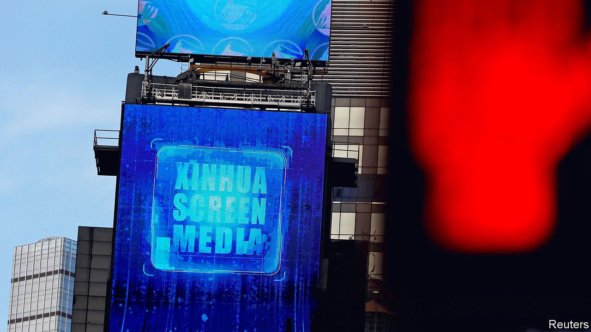

## Quid pro quo

# The White House kicks out journalists working for China’s state media

> But is a retaliation against a country that does not value a free press a good idea?

> Mar 7th 2020NEW YORK

FIFTY YEARS ago a New York correspondent for Pravda, the mouthpiece of the Soviet Communist Party, was expelled. This was in retaliation for the expulsion from Moscow of a correspondent for Time magazine, after a cover story that had displeased the Politburo. Months later a Newsweek reporter was expelled from Moscow. America retaliated by kicking out a correspondent for Tass, the Soviet news agency. The American government has not played this game since the cold war, but it is resuming now, with a different adversary.

On March 2nd, less than two weeks after China expelled three journalists for the Wall Street Journal, the State Department announced that it was placing a cap of 100 on the number of Chinese citizens who could be employed in America for five state- and Communist Party-owned media organisations—a reduction from their current total of 160. The cap, effective from March 13th, means that up to 60 Chinese nationals will be forced to leave, a diplomatic swipe that adds a new tension to the relationship.

China’s ejection of the reporters came a day after the Trump administration designated the five state- and party-owned media outlets as foreign missions of the Chinese government, to reflect their function as propaganda instruments, officials said, as opposed to independent news organisations. The five are: Xinhua, CGTN, China Daily, China Radio International and the distribution arm of People’s Daily, the party’s mouthpiece.

Administration officials said the visa caps were meant to establish “more reciprocity” with China in how the countries treat journalists. (American news organisations in mainland China employ about 75 non-Chinese citizens, including Americans.) They argued that Chinese state media employees in the United States still operate unencumbered, working and publishing as they (or their employers) please, while American journalists in China face harassment, intimidation and the threat of expulsion.

The expulsion of the Wall Street Journal reporters putatively came as punishment for a headline in the newspaper’s opinion pages that described China as the “sick man of Asia”. But the reporters had also displeased authorities in Beijing by working on stories related to Xi Jinping, China’s president, and the internment in Xinjiang of more than 1m people, mostly Uighur Muslims. The Foreign Correspondents’ Club of China, in a survey published on March 2nd, said that since 2013 the Chinese government has expelled or declined to renew visas for nine reporters and imposed tighter leashes on foreign journalists in the form of short-term visas that must be renewed frequently. More than 80% of foreign correspondents surveyed said they had encountered “interference, harassment or violence” while working.

China hawks have long advocated retaliation against state media operating in America. Some have suggested the administration’s actions do not go far enough in sending a message to Beijing. President Donald Trump could threaten to blunt China’s propaganda drive in America more directly, by taking aim at the broadcasts of CGTN, or at the practice of paying for China Daily’s reports to be published as inserts into American newspapers. That would accord with the Trump administration’s argument that the Chinese employees affected are not “journalists” but propaganda workers, like those for Pravda and Tass.

Press-freedom advocates have argued that instead America should set an example, as an open society. Raising the cost to China, albeit marginally, of treating foreign journalists poorly, may seem like a good idea. The problem for America is that, when playing this game, the side that cares about press freedom is at a disadvantage to the one that does not. On March 3rd Hua Chunying, spokeswoman for the foreign ministry, intimated in a tweet that “reciprocity” would mean tougher visa restrictions for America’s media, perhaps including single-entry visas that force journalists to reapply for entry every time they leave the country. “Now the US kicked off the game,” she wrote, “let’s play.”■